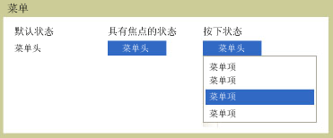

# 菜单
A<xref:System.Windows.Controls.Menu>是允许的命令或事件处理程序与关联的元素的分层组织的控件。 每个<xref:System.Windows.Controls.Menu>可以包含多个<xref:System.Windows.Controls.MenuItem>控件。 每个<xref:System.Windows.Controls.MenuItem>可以调用命令或调用`Click`事件处理程序。 A<xref:System.Windows.Controls.MenuItem>还可以有多个<xref:System.Windows.Controls.MenuItem>元素作为子级，构成子菜单。  
  
 下图显示菜单控件的三个不同的状态。 没有设备如鼠标指针停留在线上时的默认状态<xref:System.Windows.Controls.Menu>。 当鼠标指针悬停在焦点状态时发生<xref:System.Windows.Controls.Menu>并且通过单击鼠标按钮时发生按下的状态<xref:System.Windows.Controls.Menu>。  
  
   
不同状态中的菜单  
  
## 本节内容  
 [菜单概述](../../../../docs/framework/wpf/controls/menu-overview.md)  
  
## 参考  
 <xref:System.Windows.Controls.Menu>  
  <xref:System.Windows.Controls.MenuItem>  
  <xref:System.Windows.Controls.Primitives.MenuBase>  
  <xref:System.Windows.Controls.ContextMenu>  
  
## 相关章节
