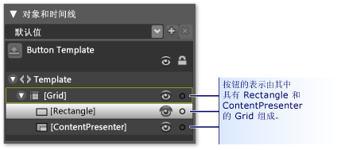
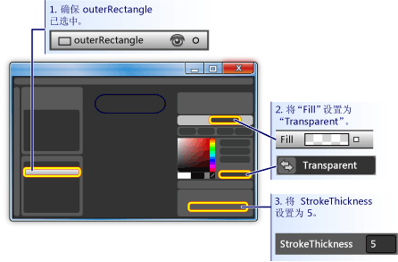
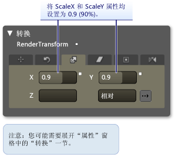

# 演练：使用 Microsoft Expression Blend 创建按钮
本演练将引导你完成创建过程[!INCLUDE[TLA2#tla_wpf](../../../../includes/tla2sharptla-wpf-md.md)]使用 Microsoft Expression Blend 的自定义的按钮。  
  
> [!IMPORTANT]
>  Microsoft Expression Blend 的工作原理是生成[!INCLUDE[TLA#tla_xaml](../../../../includes/tlasharptla-xaml-md.md)]然后编译以使可执行程序。 如果你想使用[!INCLUDE[TLA#tla_xaml](../../../../includes/tlasharptla-xaml-md.md)]直接，没有创建一个使用此条件的应用程序的另一个演练[!INCLUDE[TLA#tla_xaml](../../../../includes/tlasharptla-xaml-md.md)]使用 Visual Studio 而不是 Blend。 请参阅[创建使用 xaml 按钮](../../../../docs/framework/wpf/controls/walkthrough-create-a-button-by-using-xaml.md)有关详细信息。  
  
 下图显示的自定义的按钮，你将要创建。  
  
   
  
## 将形状转换至一个按钮  
 在本演练的第一部分中，你将创建自定义按钮的自定义外观。 若要执行此操作，你首先将矩形转换至一个按钮中。 然后添加其他形状到此按钮时，模板创建更复杂的查找按钮。 为什么不开头于常规按钮和自定义它？ 是因为按钮具有不需要; 的内置功能对于自定义按钮，很容易地开头矩形。  
  
#### 在 Expression Blend 中创建新项目  
  
1.  启动 Expression Blend。 (单击**启动**，指向**所有程序**，指向**Microsoft 表达式**，然后单击**Microsoft Expression Blend**。)  
  
2.  如果需要最大化应用程序。  
  
3.  在“文件”菜单上，单击“新建项目”。  
  
4.  选择**标准应用程序 (.exe)**。  
  
5.  将项目`CustomButton`按**确定**。  
  
 此时您已具有一个空[!INCLUDE[TLA2#tla_wpf](../../../../includes/tla2sharptla-wpf-md.md)]项目。 你可以按 F5 运行该应用程序。 如你所料，该应用程序包含一个空白的窗口。 接下来，创建一个圆角的矩形，并将其转换为一个按钮。  
  
#### 将矩形转换至一个按钮  
  
1.  **将窗口背景属性设置为黑色：**选择窗口中，单击**属性选项卡**，并设置<xref:System.Windows.Controls.Control.Background%2A>属性`Black`。  
  
       
  
2.  **在窗口上绘制的矩形大约按钮的大小：**选择左侧的工具面板上的矩形工具并将该矩形拖到窗口。  
  
       
  
3.  **倒圆角化矩形角出：**拖动矩形的控点，或者直接设置<xref:System.Windows.Shapes.Rectangle.RadiusX%2A>和<xref:System.Windows.Shapes.Rectangle.RadiusY%2A>属性。 设置的值<xref:System.Windows.Shapes.Rectangle.RadiusX%2A>和<xref:System.Windows.Shapes.Rectangle.RadiusY%2A>为 20。  
  
       
  
4.  **该矩形更改为一个按钮：**选择矩形。 上**工具**菜单上，单击**使按钮**。  
  
       
  
5.  **指定的样式/模板的作用域：**像显示以下对话框。  
  
       
  
     有关**资源名称 （键）**，选择**应用于所有**。  这将使生成的样式和按钮模板应用于所有按钮的对象。 有关**中定义**，选择**应用程序**。 这将使生成的样式和按钮模板具有在整个应用程序上的作用域。 在这两个框中设置值时，按钮样式和模板应用于整个应用程序中的所有按钮并且将应用程序中创建任何按钮，默认情况下，使用此模板。  
  
## 编辑按钮模板  
 你现在有一个已更改为一个按钮的矩形。 在此部分中，将修改的按钮模板并进一步自定义其外观。  
  
#### 若要编辑按钮模板以更改按钮外观  
  
1.  **转到编辑模板视图：**若要进一步自定义我们按钮的外观，我们需要编辑按钮模板。 我们将矩形转换按钮时，创建了此模板。 若要编辑按钮模板，请右键单击该按钮，然后选择**编辑控件部件 （模板）**然后**编辑模板**。  
  
       
  
     在模板编辑器中，请注意现在分为按钮<xref:System.Windows.Shapes.Rectangle>和<xref:System.Windows.Controls.ContentPresenter>。 <xref:System.Windows.Controls.ContentPresenter>用于呈现按钮 （例如，字符串"Button"） 中的内容。 这两个矩形和<xref:System.Windows.Controls.ContentPresenter>内布局<xref:System.Windows.Controls.Grid>。  
  
       
  
2.  **更改模板组件的名称：**右键单击要在模板清单更改的矩形<xref:System.Windows.Shapes.Rectangle>名称从"[矩形]"写入"outerRectangle"，并将"[ContentPresenter]"更改为"myContentPresenter"。  
  
       
  
3.  **Alter 矩形，使它为空内 （如一个圆环图）：**选择**outerRectangle**并设置<xref:System.Windows.Shapes.Shape.Fill%2A>到"透明"和<xref:System.Windows.Shapes.Shape.StrokeThickness%2A>为 5。  
  
       
  
     然后设置<xref:System.Windows.Shapes.Shape.Stroke%2A>的模板将是任何内容的颜色。 若要执行此操作，请单击小白色框旁边**描边**，选择**CustomExpression**，并在对话框中键入"{TemplateBinding 后台}"。  
  
       
  
4.  **创建一个内部矩形：**现在，创建另一个矩形 （将其"innerRectangle"） 并将其定位所需的内部**outerRectangle** 。 此类型的工作，你将可能想要缩放，使其更大的编辑区域中。  
  
    > [!NOTE]
    >  你矩形可能看起来比图中的一个不同 （例如，它可能有了圆形角）。  
  
       
  
5.  **移动到顶部 ContentPresenter:** 此时，很可能文本"Button"不不再可见。 如果该条件，否则这是因为**innerRectangle**之上**myContentPresenter**。 若要解决此问题，拖动**myContentPresenter**下面**innerRectangle**。 重新定位矩形和**myContentPresenter**看起来类似如下。  
  
    > [!NOTE]
    >  或者，您可以定位**myContentPresenter**通过右键单击它并按顶部**转发发送**。  
  
       
  
6.  **更改查找范围的 innerRectangle:** 设置<xref:System.Windows.Shapes.Rectangle.RadiusX%2A>， <xref:System.Windows.Shapes.Rectangle.RadiusY%2A>，和<xref:System.Windows.Shapes.Shape.StrokeThickness%2A>值为 20。 此外，设置<xref:System.Windows.Shapes.Shape.Fill%2A>为使用自定义表达式"{TemplateBinding 后台}"的模板的背景) 并设置<xref:System.Windows.Shapes.Shape.Stroke%2A>"透明"。 请注意，设置<xref:System.Windows.Shapes.Shape.Fill%2A>和<xref:System.Windows.Shapes.Shape.Stroke%2A>的**innerRectangle**是那些用于相反**outerRectangle**。  
  
       
  
7.  **在最前面添加玻璃层：**自定义按钮的外观的最后一个部分是在最前面添加玻璃层。 此玻璃层包含，第三个矩形。 因为玻璃将覆盖了整个按钮，玻璃矩形中是类似的维度**outerRectangle**。 因此，只需制作的副本创建矩形**outerRectangle**。 突出显示**outerRectangle**并使用 CTRL + C 和 CTRL + V 复制。 命名此新添加的矩形"glassCube"。  
  
8.  **如有必要重新定位 glassCube:** 如果**glassCube**是尚未定位，以便它涵盖了整个按钮，将它拖到位置。  
  
9. **提供与 outerRectangle 略有不同的形状的 glassCube:** 更改的属性**glassCube**。 首先通过更改<xref:System.Windows.Shapes.Rectangle.RadiusX%2A>和<xref:System.Windows.Shapes.Rectangle.RadiusY%2A>到 10 的属性和<xref:System.Windows.Shapes.Shape.StrokeThickness%2A>为 2。  
  
       
  
10. **使 glassCube 的外观像玻璃：**设置<xref:System.Windows.Shapes.Shape.Fill%2A>到玻璃查看使用线性渐变 75%不透明和之间交替颜色空白和透明超过 6 大约均匀地用空白分隔的时间间隔。 这是要设置为梯度停止点的内容：  
  
    -   Alpha 值为 75%的渐变停止点 1： 空白  
  
    -   渐变停止点 2： 透明  
  
    -   Alpha 值为 75%的渐变停止点 3： 空白  
  
    -   渐变停止点 4： 透明  
  
    -   Alpha 值为 75%的渐变停止点 5： 空白  
  
    -   渐变停止点 6： 透明  
  
     这将创建"波浪形"玻璃外观。  
  
       
  
11. **隐藏玻璃层：**看玻璃层如下所示，请转到**外观窗格**的**属性面板**和设置为 0%，可以将其隐藏的不透明度。 在以下各部分，我们将使用属性触发器和事件来显示和操作玻璃层。  
  
       
  
## 自定义按钮行为  
 此时，已通过编辑其模板自定义按钮的呈现方式，但按钮不响应用户操作像典型按钮那样 （例如，更改在鼠标悬停时的外观，接收焦点，然后单击。）下面两个过程演示如何生成类似这样到自定义按钮的行为。 我们从简单的属性触发器开始，然后添加事件触发器和动画。  
  
#### 若要设置属性触发器  
  
1.  **创建新的属性触发器：**与**glassCube**处于选中状态，单击 **+ 属性**中**触发器**面板 （请参阅，如下图所下一步）。 这将创建一个默认属性触发器属性触发器。  
  
2.  **请使用触发器的属性的 IsMouseOver:** 更改将属性设为<xref:System.Windows.UIElement.IsMouseOver%2A>。 这使得属性触发器激活时<xref:System.Windows.UIElement.IsMouseOver%2A>属性是`true`（当用户指向使用鼠标按钮）。  
  
       
  
3.  **IsMouseOver 触发的 glasscube 的 100%不透明度：**请注意，**触发器记录功能处于启用**（请参见前面的图）。 这意味着，对的属性值进行任何更改**glassCube**上录制时将成为操作发生时<xref:System.Windows.UIElement.IsMouseOver%2A>是`true`。 录制时，更改<xref:System.Windows.UIElement.Opacity%2A>的**glassCube**为 100%。  
  
       
  
     现在已创建你的第一个属性触发器。 请注意，**触发器面板**编辑器的已记录<xref:System.Windows.UIElement.Opacity%2A>更改为 100%。  
  
       
  
     按 f5 键以运行该应用程序，并将鼠标指针移动通过和关闭按钮。 你应看到时出现的玻璃层鼠标移到该按钮并在鼠标指针离开时消失。  
  
4.  **IsMouseOver 触发器描边，则值更改：**让我们将使用的一些其他操作相关联<xref:System.Windows.UIElement.IsMouseOver%2A>触发器。 在录制仍然存在，请切换你从选择**glassCube**到**outerRectangle**。 然后设置<xref:System.Windows.Shapes.Shape.Stroke%2A>的**outerRectangle**为"{DynamicResource {x： 静态 SystemColors.HighlightBrushKey}}"自定义表达式。 这将设置<xref:System.Windows.Shapes.Shape.Stroke%2A>到典型突出显示使用按钮的颜色。 按 f5 键以查看在你将鼠标到按钮上方时效果。  
  
       
  
5.  **IsMouseOver 触发模糊的文本：**让我们将关联到的一个更多操作<xref:System.Windows.UIElement.IsMouseOver%2A>属性触发器。 使时玻璃将显示在其显示有些模糊按钮的内容。 若要执行此操作，我们可以应用模糊<xref:System.Windows.Media.Effects.BitmapEffect>到<xref:System.Windows.Controls.ContentPresenter>(**myContentPresenter**)。  
  
       
  
    > [!NOTE]
    >  若要返回**属性面板**回它已之前未搜索<xref:System.Windows.Media.Effects.BitmapEffect>，清除中的文本**搜索框**。  
  
     此时，我们已在多个关联的操作使用属性触发器时鼠标指针进入和离开按钮区域创建突出显示行为。 按钮的另一种典型行为是在其具有焦点时突出显示 （如后单击它）。 我们可以通过添加另一个属性触发器中添加这种行为<xref:System.Windows.UIElement.IsFocused%2A>属性。  
  
6.  **为 IsFocused 创建属性触发器：**使用相同的过程<xref:System.Windows.UIElement.IsMouseOver%2A>（请参阅本部分的第一步），创建另一个属性触发器<xref:System.Windows.UIElement.IsFocused%2A>属性。 虽然**触发器记录功能处于启用**，到触发器中添加下列操作：  
  
    -   **glassCube**获取<xref:System.Windows.UIElement.Opacity%2A>的 100%。  
  
    -   **outerRectangle**获取<xref:System.Windows.Shapes.Shape.Stroke%2A>"{DynamicResource {x： 静态 SystemColors.HighlightBrushKey}}"的自定义表达式值。  
  
 作为最后一步在本演练中，我们将向按钮添加动画。 事件将触发这些动画-具体而言，<xref:System.Windows.UIElement.MouseEnter>和<xref:System.Windows.Controls.Primitives.ButtonBase.Click>事件。  
  
#### 若要使用事件触发器和动画添加交互性  
  
1.  **创建 MouseEnter 事件触发器：**添加新的事件触发器，并选择<xref:System.Windows.UIElement.MouseEnter>作为要在触发器中使用的事件。  
  
       
  
2.  **创建动画时间线：**接下来，将关联到动画时间线<xref:System.Windows.UIElement.MouseEnter>事件。  
  
       
  
     按后**确定**创建一个新的时间线，**时间线面板**出现并显示在设计面板"时间线记录功能处于启用"。 这意味着我们可以开始时间线 （动画的属性更改） 中记录属性更改。  
  
    > [!NOTE]
    >  你可能需要调整大小窗口和/或面板，以分别查看它们的显示。  
  
       
  
3.  **创建关键帧：**若要创建动画，选择你想要进行动画处理，创建两个或多个关键帧在时间线、 上以及为这些关键帧，设置你想要在其间动画的属性值的对象。 下图可引导您完成创建关键帧。  
  
       
  
4.  **收缩此关键帧处 glassCube:** 与所选第二个关键帧的情况下，压缩的大小**glassCube**为使用其完整大小的 90%**大小转换**。  
  
       
  
     按 F5 运行该应用程序。 将鼠标指针移到按钮上方。 请注意，玻璃层会缩小按钮的上面。  
  
5.  **创建另一个事件触发器并与之关联不同的动画：**让我们添加一个更多的动画。 使用你用于创建上一个事件触发器动画的类似过程：  
  
    1.  创建新事件触发器使用<xref:System.Windows.Controls.Primitives.ButtonBase.Click>事件。  
  
    2.  将关联的新时间线<xref:System.Windows.Controls.Primitives.ButtonBase.Click>事件。  
  
       
  
    1.  为此时间线，创建两个关键帧，0.0 秒时达到的一个，另一个位于 0.3 秒。  
  
    2.  突出显示的 0.3 秒时达到的关键帧后，设置**旋转变换角度**到 360 度。  
  
       
  
    1.  按 F5 运行该应用程序。 单击按钮。 请注意，玻璃层会旋转。  
  
## 结束语  
 您已经完成了自定义的按钮。 你执行此过程通过已应用到应用程序中的所有按钮的按钮模板。 如果你离开模板编辑模式 （请参阅下图） 并创建更多按钮，你将看到其外观和行为类似自定义按钮而不是类似的默认按钮。  
  
   
  
   
  
 按 F5 运行该应用程序。 单击按钮，并注意到所有的行为方式相同。  
  
 请记住，尽管您已自定义模板，你设置<xref:System.Windows.Shapes.Shape.Fill%2A>属性**innerRectangle**和<xref:System.Windows.Shapes.Shape.Stroke%2A>属性**outerRectangle**到模板背景 （{TemplateBinding 后台}）。 因此，当你设置的单个按钮的背景色时你设置的背景将用于这些各自的属性。 请尝试现在更改背景。 在下图中，使用不同的渐变效果。 因此，虽然模板很有用的控件，例如按钮的总体自定义项，使用模板的控件可以仍可修改看起来彼此不同。  
  
   
  
 总之，在自定义按钮模板的过程中，你已了解如何执行以下操作，在 Microsoft Expression Blend 中：  
  
-   自定义控件的外观。  
  
-   设置属性触发器。 属性触发器是非常有用，因为它们可以用于大多数对象，而不仅仅是控件。  
  
-   设置事件触发器。 事件触发器是非常有用，因为它们可以用于大多数对象，而不仅仅是控件。  
  
-   创建动画。  
  
-   杂项： 创建渐变添加 BitmapEffects，使用转换，并设置的对象的基本属性。  
  
## 请参阅  
 [使用 XAML 创建按钮](../../../../docs/framework/wpf/controls/walkthrough-create-a-button-by-using-xaml.md)  
 [样式设置和模板化](../../../../docs/framework/wpf/controls/styling-and-templating.md)  
 [动画概述](../../../../docs/framework/wpf/graphics-multimedia/animation-overview.md)  
 [使用纯色和渐变进行绘制概述](../../../../docs/framework/wpf/graphics-multimedia/painting-with-solid-colors-and-gradients-overview.md)  
 [位图效果概述](../../../../docs/framework/wpf/graphics-multimedia/bitmap-effects-overview.md)
