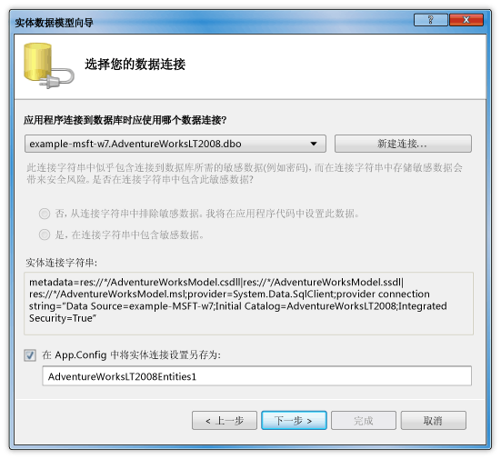
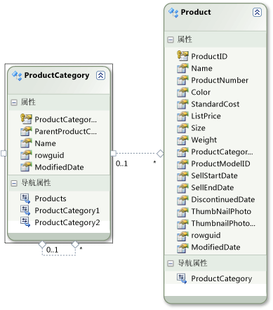

# 演练：在 DataGrid 控件中显示 SQL Server 数据库中的数据
在本演练中，将从 SQL Server 数据库检索数据并在 <xref:System.Windows.Controls.DataGrid> 控件的该数据。  您可以使用 ADO.NET entity framework 创建代表数据的实体类，并使用 LINQ 编写从实体类检索指定数据的查询。  
  
## 系统必备  
 您需要以下组件来完成本演练:  
  
-   [!INCLUDE[vs_dev11_long](../../../../includes/vs-dev11-long-md.md)].  
  
-   对 AdventureWorksLT2008 示例数据库的 SQL Server 或 SQL Server express 的正在运行的实例。  您可以从的 [CodePlex 网站](http://go.microsoft.com/fwlink/?LinkId=159848)AdventureWorksLT2008 数据库。  
  
### 创建实体类  
  
1.  创建新 WPF 应用程序项目在 Visual Basic 或 C\#，并将其命名为 `DataGridSQLExample`。  
  
2.  在解决方案资源管理器中，右击您的项目，指向 **add**，然后选择 **新建项**。  
  
     显示 " 添加新项 " 对话框  
  
3.  在已安装的模板 " 窗格中，选择 " **数据** 并在模板列表中，选择 **ADO.NET 实体数据模型 \(edm\)**l。  
  
       
  
4.  将文件命名为 `AdventureWorksModel.edmx` 然后单击 **add**。  
  
     实体数据模型向导显示。  
  
5.  在选择模型内容屏幕，选择 " **从数据库生成** 然后单击 **下一步**。  
  
       
  
6.  在 " 选择您的数据连接 " 屏幕上，提供与 AdventureWorksLT2008 数据库的连接。  有关更多信息，请参见 [选择您的数据连接 " 对话框](http://go.microsoft.com/fwlink/?LinkId=160190)。  
  
       
  
7.  确保名称是 `AdventureWorksLT2008Entities` ，并 **保存实体在 App.Config 的连接设置** 复选框，然后单击 **下一步**。  
  
8.  在 " 选择数据库对象 " 屏幕中，展开 " 表 " 节点，然后选择 **产品** 和 **ProductCategory** 表。  
  
     可以为所有的实体类表;但是，在此示例中只从这两个表检索数据。  
  
       
  
9. 单击 **完成**。  
  
     产品和 ProductCategory 实体显示在实体设计器中。  
  
       
  
### 检索并显示数据  
  
1.  打开 MainWindow.xaml 文件。  
  
2.  将 <xref:System.Windows.Window> 的 <xref:System.Windows.FrameworkElement.Width%2A> 属性设置为 450。  
  
3.  在 XAML 编辑器中，添加对于 `<Grid>` 和 `</Grid>` 标记之间添加以下 <xref:System.Windows.Controls.DataGrid> 标记将名为 `dataGrid1`的 <xref:System.Windows.Controls.DataGrid> 。  
  
     [!code-xml[DataGrid_SQL_EF_Walkthrough#3](../../../../samples/snippets/csharp/VS_Snippets_Wpf/DataGrid_SQL_EF_Walkthrough/CS/MainWindow.xaml#3)]  
  
       
  
4.  选择 <xref:System.Windows.Window>。  
  
5.  使用 " 属性 " 窗口或 XAML 编辑器中，创建名为 <xref:System.Windows.FrameworkElement.Loaded> 事件的 `Window_Loaded` 的 <xref:System.Windows.Window> 的事件处理程序。  有关更多信息，请参见 [如何：创建简单的事件处理程序](http://msdn.microsoft.com/zh-cn/b1456e07-9dec-4354-99cf-18666b64f480)。  
  
     下面显示了 MainWindow.xaml 的 XAML。  
  
    > [!NOTE]
    >  如果在 MainWindow.xaml 的第一行使用的是 Visual Basic，，请在 `x:Class="MainWindow"`替换 `x:Class="DataGridSQLExample.MainWindow"` 。  
  
     [!code-xml[DataGrid_SQL_EF_Walkthrough#1](../../../../samples/snippets/csharp/VS_Snippets_Wpf/DataGrid_SQL_EF_Walkthrough/CS/MainWindow.xaml#1)]  
  
6.  打开代码隐藏文件 \(MainWindow.xaml.vb 或 MainWindow.xaml.cs\) <xref:System.Windows.Window>的。  
  
7.  添加下面的代码联接表仅检索特定的值和设置 <xref:System.Windows.Controls.DataGrid> 的 <xref:System.Windows.Controls.ItemsControl.ItemsSource%2A> 特性添加到查询的结果。  
  
     [!code-csharp[DataGrid_SQL_EF_Walkthrough#2](../../../../samples/snippets/csharp/VS_Snippets_Wpf/DataGrid_SQL_EF_Walkthrough/CS/MainWindow.xaml.cs#2)]
     [!code-vb[DataGrid_SQL_EF_Walkthrough#2](../../../../samples/snippets/visualbasic/VS_Snippets_Wpf/DataGrid_SQL_EF_Walkthrough/VB/MainWindow.xaml.vb#2)]  
  
8.  运行此示例。  
  
     显示数据的应该看到 <xref:System.Windows.Controls.DataGrid> 。  
  
       
  
## 后续步骤  
  
## 请参阅  
 <xref:System.Windows.Controls.DataGrid>   
 [如何:我开始使用在 WPF 应用程序中 entity framework?](http://go.microsoft.com/fwlink/?LinkId=159868)