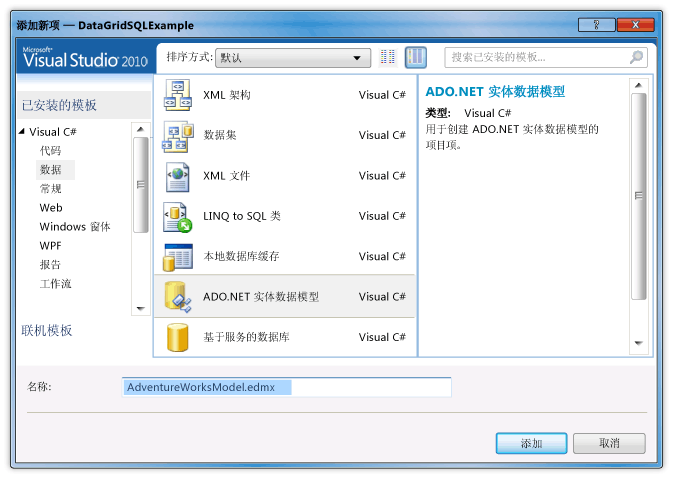
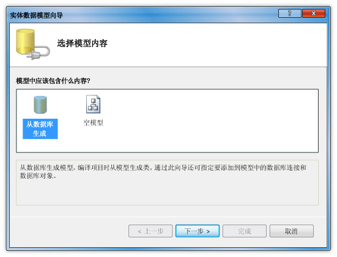
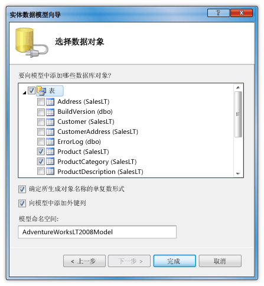

# 演练：在 DataGrid 控件中显示 SQL Server 数据库中的数据
在本演练中，可以从 SQL Server 数据库中检索数据和显示中的这些数据<xref:System.Windows.Controls.DataGrid>控件。 ADO.NET 实体框架用于创建表示数据，并使用 LINQ 编写从实体类检索指定的数据的查询的实体类。  
  
## 系统必备  
 你需要以下组件来完成本演练：  
  
-   [!INCLUDE[vs_dev11_long](../../../../includes/vs-dev11-long-md.md)]。  
  
-   对运行中实例的 SQL Server 或 SQL Server Express 包含附加到它的 AdventureWorks 示例数据库的访问。 你可以下载 AdventureWorks 数据库从[GitHub](https://github.com/Microsoft/sql-server-samples/releases)。  
  
### 若要创建的实体类  
  
1.  在 Visual Basic 或 C# 中，创建一个新的 WPF 应用程序项目并将其命名`DataGridSQLExample`。  
  
2.  在解决方案资源管理器，右键单击你的项目，指向**添加**，然后选择**新项**。  
  
     添加新项对话框。  
  
3.  在已安装的模板窗格中，选择**数据**并在模板列表中，选择**ADO.NET 实体数据模型**l。  
  
       
  
4.  命名该文件`AdventureWorksModel.edmx`，然后单击**添加**。  
  
     此时将显示实体数据模型向导。  
  
5.  在选择模型内容屏幕中，选择**从数据库生成**，然后单击**下一步**。  
  
       
  
6.  在选择你的数据连接屏幕中，提供你 AdventureWorksLT2008 数据库的连接。 有关详细信息，请参阅[选择数据连接对话框中](http://go.microsoft.com/fwlink/?LinkId=160190)。  
  
       
  
7.  请确保名称是`AdventureWorksLT2008Entities`且**将实体连接设置保存在 App.Config 作为**复选框被选中，并且然后单击**下一步**。  
  
8.  在选择数据库对象屏幕中，展开表节点中，然后选择**产品**和**ProductCategory**表。  
  
     你可以为生成实体类的所有表;但是，在此示例中你只能检索数据这些两个表中。  
  
       
  
9. 单击 **“完成”**。  
  
     在实体设计器中显示 Product 和 ProductCategory 实体。  
  
       
  
### 用于检索和呈现数据  
  
1.  打开 MainWindow.xaml 文件。  
  
2.  设置<xref:System.Windows.FrameworkElement.Width%2A>属性<xref:System.Windows.Window>为 450。  
  
3.  在 XAML 编辑器中，添加以下<xref:System.Windows.Controls.DataGrid>标记之间`<Grid>`和`</Grid>`标记，以添加<xref:System.Windows.Controls.DataGrid>名为`dataGrid1`。  
  
     [!code-xaml[DataGrid_SQL_EF_Walkthrough#3](../../../../samples/snippets/csharp/VS_Snippets_Wpf/DataGrid_SQL_EF_Walkthrough/CS/MainWindow.xaml#3)]  
  
       
  
4.  选择 <xref:System.Windows.Window>。  
  
5.  使用属性窗口或 XAML 编辑器，创建的事件处理程序<xref:System.Windows.Window>名为`Window_Loaded`为<xref:System.Windows.FrameworkElement.Loaded>事件。 有关详细信息，请参阅[如何： 创建一个简单的事件处理程序](http://msdn.microsoft.com/library/b1456e07-9dec-4354-99cf-18666b64f480)。  
  
     以下显示 MainWindow.xaml XAML。  
  
    > [!NOTE]
    >  如果使用的 Visual Basic 中，在 MainWindow.xaml 的第一行中，将`x:Class="DataGridSQLExample.MainWindow"`与`x:Class="MainWindow"`。  
  
     [!code-xaml[DataGrid_SQL_EF_Walkthrough#1](../../../../samples/snippets/csharp/VS_Snippets_Wpf/DataGrid_SQL_EF_Walkthrough/CS/MainWindow.xaml#1)]  
  
6.  打开代码隐藏文件 （MainWindow.xaml.vb 或 MainWindow.xaml.cs） <xref:System.Windows.Window>。  
  
7.  添加以下代码来联接表中检索只有特定的值和设置<xref:System.Windows.Controls.ItemsControl.ItemsSource%2A>属性<xref:System.Windows.Controls.DataGrid>到查询的结果。  
  
     [!code-csharp[DataGrid_SQL_EF_Walkthrough#2](../../../../samples/snippets/csharp/VS_Snippets_Wpf/DataGrid_SQL_EF_Walkthrough/CS/MainWindow.xaml.cs#2)]
     [!code-vb[DataGrid_SQL_EF_Walkthrough#2](../../../../samples/snippets/visualbasic/VS_Snippets_Wpf/DataGrid_SQL_EF_Walkthrough/VB/MainWindow.xaml.vb#2)]  
  
8.  运行示例。  
  
     你应该会看到<xref:System.Windows.Controls.DataGrid>显示数据。  
  
       
  
## 后续步骤  
  
## 请参阅  
 <xref:System.Windows.Controls.DataGrid>  
 [如何 i： 开始使用 WPF 应用程序中的实体框架？](http://go.microsoft.com/fwlink/?LinkId=159868)
