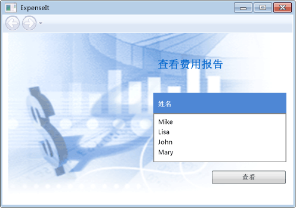

# 演练： 我第一个 WPF 桌面应用程序
本演练中提供的开发的简介[!INCLUDE[TLA#tla_wpf](../../../../includes/tlasharptla-wpf-md.md)]包括元素所共有的大多数的应用程序[!INCLUDE[TLA2#tla_wpf](../../../../includes/tla2sharptla-wpf-md.md)]应用程序：[!INCLUDE[TLA#tla_xaml](../../../../includes/tlasharptla-xaml-md.md)]标记、 代码隐藏、 应用程序定义、 控件、 布局、数据绑定和样式。 
  
 本演练将指导你通过一个简单的开发[!INCLUDE[TLA2#tla_wpf](../../../../includes/tla2sharptla-wpf-md.md)]应用程序使用以下步骤。 
  
-   定义[!INCLUDE[TLA2#tla_xaml](../../../../includes/tla2sharptla-xaml-md.md)]设计的应用程序的外观[!INCLUDE[TLA#tla_ui](../../../../includes/tlasharptla-ui-md.md)]。 
  
-   编写代码以生成应用程序的行为。 
  
-   创建应用程序定义以托管应用程序。 
  
-   添加控件和创建布局以构成应用程序[!INCLUDE[TLA2#tla_ui](../../../../includes/tla2sharptla-ui-md.md)]。 
  
-   创建样式，以便创建在整个应用程序一致的外观[!INCLUDE[TLA2#tla_ui](../../../../includes/tla2sharptla-ui-md.md)]。 
  
-   绑定[!INCLUDE[TLA2#tla_ui](../../../../includes/tla2sharptla-ui-md.md)]数据到同时填充[!INCLUDE[TLA2#tla_ui](../../../../includes/tla2sharptla-ui-md.md)]从数据并保留数据和[!INCLUDE[TLA2#tla_ui](../../../../includes/tla2sharptla-ui-md.md)]同步。 
  
 本演练结束时，您便会生成独立[!INCLUDE[TLA#tla_mswin](../../../../includes/tlasharptla-mswin-md.md)]应用程序，用户可查看所选人员的费用报销。 应用程序将包含多种[!INCLUDE[TLA2#tla_wpf](../../../../includes/tla2sharptla-wpf-md.md)]浏览器样式窗口中承载的页。 
  
 用于生成本演练的示例代码已适用于[!INCLUDE[TLA#tla_visualb](../../../../includes/tlasharptla-visualb-md.md)]和[!INCLUDE[TLA#tla_cshrp](../../../../includes/tlasharptla-cshrp-md.md)]在[生成 WPF 应用程序简介](http://go.microsoft.com/fwlink/?LinkID=160008)。 

## 系统必备  

- [!INCLUDE[vs_dev11_long](../../../../includes/vs-dev11-long-md.md)] 或更高版本

有关安装最新版本的 Visual Studio 的详细信息，请参阅[安装 Visual Studio](/visualstudio/install/install-visual-studio)。
  
## 创建应用程序项目  
 在本部分中，将创建包含应用程序定义、两个页面以及图像的应用程序基础结构。 
  
1. 在 Visual Basic 或 Visual C# 中创建名为 `ExpenseIt` 的新 WPF 应用程序项目。 有关详细信息，请参阅[如何：创建新的 WPF 应用程序项目](http://msdn.microsoft.com/en-us/1f6aea7a-33e1-4d3f-8555-1daa42e95d82)。 
  
    > [!NOTE]
    >  本演练使用<xref:System.Windows.Controls.DataGrid>是在.NET Framework 4 中可用的控件。 为确保你的项目面向.NET Framework 4 或更高版本。 有关详细信息，请参阅[如何： 面向.NET Framework 版本](/visualstudio/ide/how-to-target-a-version-of-the-dotnet-framework)。 
  
2. 打开 Application.xaml (Visual Basic) 或 App.xaml (C#)。 
  
     这[!INCLUDE[TLA2#tla_xaml](../../../../includes/tla2sharptla-xaml-md.md)]文件定义[!INCLUDE[TLA2#tla_wpf](../../../../includes/tla2sharptla-wpf-md.md)]应用程序和任何应用程序资源。 此外使用此文件来指定[!INCLUDE[TLA2#tla_ui](../../../../includes/tla2sharptla-ui-md.md)]自动显示在应用程序启动; 在此情况下，MainWindow.xaml。 
  
     你[!INCLUDE[TLA2#tla_xaml](../../../../includes/tla2sharptla-xaml-md.md)]应如下所示在 Visual Basic 中：  
  
    [!code-xaml[ExpenseIt#1_A](../../../../samples/snippets/visualbasic/VS_Snippets_Wpf/ExpenseIt/VB/ExpenseIt1_A/Application.xaml#1_a)]  
  
     或者，在 C# 中是这样：  
  
    [!code-xaml[ExpenseIt#1](../../../../samples/snippets/csharp/VS_Snippets_Wpf/ExpenseIt/CSharp/ExpenseIt/App.xaml#1)]  
  
3. 打开 MainWindow.xaml。 
  
     这[!INCLUDE[TLA2#tla_xaml](../../../../includes/tla2sharptla-xaml-md.md)]文件是你的应用程序的主窗口，并显示在页中创建的内容。 <xref:System.Windows.Window>类定义的属性窗口中，例如，其标题、 大小或图标，并处理事件，例如关闭或隐藏。 
  
4. 更改<xref:System.Windows.Window>元素<xref:System.Windows.Navigation.NavigationWindow>。 
  
     此应用程序将导航到不同内容，具体取决于用户交互。 因此，main<xref:System.Windows.Window>需要更改为<xref:System.Windows.Navigation.NavigationWindow>。 <xref:System.Windows.Navigation.NavigationWindow>继承的所有属性<xref:System.Windows.Window>。 <xref:System.Windows.Navigation.NavigationWindow> XAML 文件中的元素创建的实例<xref:System.Windows.Navigation.NavigationWindow>类。 有关详细信息，请参阅[导航概述](../../../../docs/framework/wpf/app-development/navigation-overview.md)。 
  
5. 在更改下列属性<xref:System.Windows.Navigation.NavigationWindow>元素：  
  
    -   设置<xref:System.Windows.Window.Title%2A>属性设置为"ExpenseIt"。 
  
    -   设置<xref:System.Windows.FrameworkElement.Width%2A>为 500 像素的属性。 
  
    -   设置<xref:System.Windows.FrameworkElement.Height%2A>为 350 像素的属性。 
  
    -   删除<xref:System.Windows.Controls.Grid>之间的元素<xref:System.Windows.Navigation.NavigationWindow>标记。 
  
     你[!INCLUDE[TLA2#tla_xaml](../../../../includes/tla2sharptla-xaml-md.md)]应如下所示在 Visual Basic 中：  
  
    [!code-xaml[ExpenseIt#2_A](../../../../samples/snippets/visualbasic/VS_Snippets_Wpf/ExpenseIt/VB/ExpenseIt/MainWindow.xaml#2_a)]  
  
     或者，在 C# 中是这样：  
  
    [!code-xaml[ExpenseIt#2](../../../../samples/snippets/csharp/VS_Snippets_Wpf/ExpenseIt/CSharp/ExpenseIt/MainWindow.xaml#2)]  
  
6. 打开 MainWindow.xaml.vb 或 MainWindow.xaml.cs。 
  
     此文件是代码隐藏文件，包含用于处理在 MainWindow.xaml 中声明的事件的代码。 此文件包含在 XAML 中定义的窗口的分部类。 
  
7. 如果你使用的 C#，更改`MainWindow`类以派生自<xref:System.Windows.Navigation.NavigationWindow>。 
  
     在 Visual Basic 中，当在 XAML 中更改窗口时，这种情况会自动发生。 
  
     代码应如下所示。 
  
    [!code-csharp[ExpenseIt#3](../../../../samples/snippets/csharp/VS_Snippets_Wpf/ExpenseIt/CSharp/ExpenseIt/MainWindow.xaml.cs#3)]
    [!code-vb[ExpenseIt#3](../../../../samples/snippets/visualbasic/VS_Snippets_Wpf/ExpenseIt/VB/ExpenseIt1_A/MainWindow.xaml.vb#3)]  
  
## 将文件添加到应用程序  
 在本部分中，将向应用程序添加两个页面和一个图像。 
  
1. 将新的页 (WPF) 添加到名为的项目`ExpenseItHome.xaml`。 有关详细信息，请参阅[如何： 将新项添加到 WPF 项目](http://msdn.microsoft.com/en-us/17e6b238-fc32-4385-98ef-2f66ca09d9ad)。 
  
     此页是应用程序启动时显示的第一个页面。 它将显示一个人员列表，用户可从中选择某个人员以显示其费用报表。 
  
2. 打开 ExpenseItHome.xaml。 
  
3. 设置<xref:System.Windows.Controls.Page.Title%2A>到"ExpenseIt-主页"。 
  
     你[!INCLUDE[TLA2#tla_xaml](../../../../includes/tla2sharptla-xaml-md.md)]应如下所示在 Visual Basic 中：  
  
    [!code-xaml[ExpenseIt#6_A](../../../../samples/snippets/visualbasic/VS_Snippets_Wpf/ExpenseIt/VB/ExpenseIt1_A/ExpenseItHome.xaml#6_a)]  
  
     或者，在 C# 中是这样：  
  
    [!code-xaml[ExpenseIt#6](../../../../samples/snippets/csharp/VS_Snippets_Wpf/ExpenseIt/CSharp/ExpenseIt2/ExpenseItHome.xaml#6)]  
  
4. 打开 MainWindow.xaml。 
  
5. 设置<xref:System.Windows.Navigation.NavigationWindow.Source%2A>属性<xref:System.Windows.Navigation.NavigationWindow>到"ExpenseItHome.xaml"。 
  
     这将 ExpenseItHome.xaml 设置为应用程序启动时打开的第一个页面。 你[!INCLUDE[TLA2#tla_xaml](../../../../includes/tla2sharptla-xaml-md.md)]应如下所示在 Visual Basic 中：  
  
    [!code-xaml[ExpenseIt#7_A](../../../../samples/snippets/visualbasic/VS_Snippets_Wpf/ExpenseIt/VB/ExpenseIt1_A/MainWindow.xaml#7_a)]  
  
     或者，在 C# 中是这样：  
  
    [!code-xaml[ExpenseIt#7](../../../../samples/snippets/csharp/VS_Snippets_Wpf/ExpenseIt/CSharp/ExpenseIt2/MainWindow.xaml#7)]  
  
6. 将新的页 (WPF) 添加到名为的项目`ExpenseReportPage.xaml`。 
  
     此页面将显示在 ExpenseItHome.xaml 上选择的人员的费用报表。 
  
7. 打开 ExpenseReportPage.xaml。 
  
8. 设置<xref:System.Windows.Controls.Page.Title%2A>到"ExpenseIt-View Expense"。 
  
     你[!INCLUDE[TLA2#tla_xaml](../../../../includes/tla2sharptla-xaml-md.md)]应如下所示在 Visual Basic 中：  
  
    [!code-xaml[ExpenseIt#4_A](../../../../samples/snippets/visualbasic/VS_Snippets_Wpf/ExpenseIt/VB/ExpenseIt1_A/ExpenseReportPage.xaml#4_a)]  
  
     或者，在 C# 中是这样：  
  
    [!code-xaml[ExpenseIt#4](../../../../samples/snippets/csharp/VS_Snippets_Wpf/ExpenseIt/CSharp/ExpenseIt/ExpenseReportPage.xaml#4)]  
  
9. 打开 ExpenseItHome.xaml.vb 和 ExpenseReportPage.xaml.vb，或者 ExpenseItHome.xaml.cs 和 ExpenseReportPage.xaml.cs。 
  
     创建新页面文件时，Visual Studio 将自动创建代码隐藏文件。 这些代码隐藏文件处理响应用户输入的逻辑。 
  
     代码应如下所示。 
  
    [!code-csharp[ExpenseIt#2_5](../../../../samples/snippets/csharp/VS_Snippets_Wpf/ExpenseIt/CSharp/ExpenseIt2/ExpenseItHome.xaml.cs#2_5)]
    [!code-vb[ExpenseIt#2_5](../../../../samples/snippets/visualbasic/VS_Snippets_Wpf/ExpenseIt/VB/ExpenseIt1_A/ExpenseItHome.xaml.vb#2_5)]  
  
    [!code-csharp[ExpenseIt#5](../../../../samples/snippets/csharp/VS_Snippets_Wpf/ExpenseIt/CSharp/ExpenseIt/ExpenseReportPage.xaml.cs#5)]
    [!code-vb[ExpenseIt#5](../../../../samples/snippets/visualbasic/VS_Snippets_Wpf/ExpenseIt/VB/ExpenseIt1_A/ExpenseReportPage.xaml.vb#5)]  
  
10. 将名为 watermark.png 的图像添加至项目。 可以创建自己的图像，也可以从示例代码中复制文件。 有关详细信息，请参阅[NIB： 如何： 将现有项目添加到项目](http://msdn.microsoft.com/en-us/15f4cfb7-78ab-457f-9f14-099a25a6a2d3)。 

## 生成并运行应用程序  
 在本部分中，将生成和运行应用程序。 
  
1. 生成并运行应用程序通过按 f5 键或选择**启动调试**从**调试**菜单。 
  
     下图显示具有的应用程序<xref:System.Windows.Navigation.NavigationWindow>按钮。 
  
       
  
2. 关闭应用程序以返回到[!INCLUDE[vsprvs](../../../../includes/vsprvs-md.md)]。 
  
## 创建布局  
 布局提供有序的方式来放置[!INCLUDE[TLA2#tla_ui](../../../../includes/tla2sharptla-ui-md.md)]元素，并还管理的大小和这些元素的位置时[!INCLUDE[TLA2#tla_ui](../../../../includes/tla2sharptla-ui-md.md)]一起调整大小。 通常使用以下布局控件之一来创建布局：  
  
-   <xref:System.Windows.Controls.Canvas>  
  
-   <xref:System.Windows.Controls.DockPanel>  
  
-   <xref:System.Windows.Controls.Grid>  
  
-   <xref:System.Windows.Controls.StackPanel>  
  
-   <xref:System.Windows.Controls.VirtualizingStackPanel>  
  
-   <xref:System.Windows.Controls.WrapPanel>  
  
 每个布局控件都为子元素支持特殊类型的布局。 ExpenseIt 页面可进行调整，并且每个页面均有与其他元素水平或垂直排列的元素。 因此，<xref:System.Windows.Controls.Grid>是应用程序的理想布局元素。 
  
> [!NOTE]
>  有关详细信息<xref:System.Windows.Controls.Panel>元素，请参阅[面板概述](../../../../docs/framework/wpf/controls/panels-overview.md)。 有关布局详细信息，请参阅[布局](../../../../docs/framework/wpf/advanced/layout.md)。 
  
 在部分中，你创建一个单列的表具有三个行和 10 像素边距通过添加到的列和行定义<xref:System.Windows.Controls.Grid>ExpenseItHome.xaml 中。 
  
1. 打开 ExpenseItHome.xaml。 
  
2. 设置<xref:System.Windows.FrameworkElement.Margin%2A>属性<xref:System.Windows.Controls.Grid>到对应于左侧、 顶部、 右侧和底部边距的"10,0,10,10"的元素。 
  
3. 添加以下[!INCLUDE[TLA2#tla_xaml](../../../../includes/tla2sharptla-xaml-md.md)]之间<xref:System.Windows.Controls.Grid>标记以创建行和列定义。 
  
    [!code-xaml[ExpenseIt#8](../../../../samples/snippets/csharp/VS_Snippets_Wpf/ExpenseIt/CSharp/ExpenseIt3/ExpenseItHome.xaml#8)]  
  
     <xref:System.Windows.Controls.RowDefinition.Height%2A>的两个行设置为<xref:System.Windows.GridLength.Auto%2A>，将大小调整行这意味着根据行中的内容。 默认值<xref:System.Windows.Controls.RowDefinition.Height%2A>是<xref:System.Windows.GridUnitType.Star>调整大小，这意味着将为行的可用空间的加权的比例。 例如，如果两行高度均为“*”，则它们各自的高度将会是可用空间的一半。  
  
     你<xref:System.Windows.Controls.Grid>现在应类似下面的 XAML:  
  
    [!code-xaml[ExpenseIt#9](../../../../samples/snippets/csharp/VS_Snippets_Wpf/ExpenseIt/CSharp/ExpenseIt3/ExpenseItHome.xaml#9)]  
  
## 添加控件  
 在此部分中，主页页面[!INCLUDE[TLA2#tla_ui](../../../../includes/tla2sharptla-ui-md.md)]更新以显示用户可从中以显示所选人员的费用报表的人员列表。 控件是允许用户与应用程序交互的 UI 对象。 有关详细信息，请参阅 [控件](../../../../docs/framework/wpf/controls/index.md)。 
  
 若要创建此[!INCLUDE[TLA2#tla_ui](../../../../includes/tla2sharptla-ui-md.md)]，以下元素添加到 ExpenseItHome.xaml:  
  
-   <xref:System.Windows.Controls.ListBox>（有关的人员列表）。 
  
-   <xref:System.Windows.Controls.Label>（对于列表标头）。 
  
-   <xref:System.Windows.Controls.Button>（若要单击以查看费用报表列表中选择的人员）。 
  
 每个控件所在的行中<xref:System.Windows.Controls.Grid>通过设置<xref:System.Windows.Controls.Grid.Row%2A?displayProperty=nameWithType>附加属性。 有关附加属性的详细信息，请参阅[附加属性概述](../../../../docs/framework/wpf/advanced/attached-properties-overview.md)。 
  
1. 打开 ExpenseItHome.xaml。 
  
2. 添加以下[!INCLUDE[TLA2#tla_xaml](../../../../includes/tla2sharptla-xaml-md.md)]之间<xref:System.Windows.Controls.Grid>标记。 
  
    [!code-xaml[ExpenseIt#10](../../../../samples/snippets/csharp/VS_Snippets_Wpf/ExpenseIt/CSharp/ExpenseIt4/ExpenseItHome.xaml#10)]  
  
3. 生成并运行应用程序。 
  
 下图显示了在本部分中由 XAML 创建的控件。 
  
   
  
## 添加的映像和标题  
 在此部分中，主页页面[!INCLUDE[TLA2#tla_ui](../../../../includes/tla2sharptla-ui-md.md)]更新使用的映像和页面标题。 
  
1. 打开 ExpenseItHome.xaml。 
  
2. 添加到另一列<xref:System.Windows.Controls.Grid.ColumnDefinitions%2A>带有固定<xref:System.Windows.Controls.ColumnDefinition.Width%2A>为 230 像素。 
  
    [!code-xaml[ExpenseIt#11](../../../../samples/snippets/csharp/VS_Snippets_Wpf/ExpenseIt/CSharp/ExpenseIt5/ExpenseItHome.xaml#11)]  
  
3. 添加到另一个行<xref:System.Windows.Controls.Grid.RowDefinitions%2A>。 
  
    [!code-xaml[ExpenseIt#11b](../../../../samples/snippets/csharp/VS_Snippets_Wpf/ExpenseIt/CSharp/ExpenseIt5/ExpenseItHome.xaml#11b)]  
  
4. 将控件移至第二列中，通过设置<xref:System.Windows.Controls.Grid.Column%2A?displayProperty=nameWithType>为 1。 每个控件下移一行时，通过增加<xref:System.Windows.Controls.Grid.Row%2A?displayProperty=nameWithType>1。 
  
    [!code-xaml[ExpenseIt#12](../../../../samples/snippets/csharp/VS_Snippets_Wpf/ExpenseIt/CSharp/ExpenseIt5/ExpenseItHome.xaml#12)]  
  
5. 设置<xref:System.Windows.Controls.Panel.Background%2A>的<xref:System.Windows.Controls.Grid>要 watermark.png 图像文件。 
  
    [!code-xaml[ExpenseIt#14](../../../../samples/snippets/csharp/VS_Snippets_Wpf/ExpenseIt/CSharp/ExpenseIt5/ExpenseItHome.xaml#14)]  
  
6. 之前<xref:System.Windows.Controls.Border>，添加<xref:System.Windows.Controls.Label>"查看费用报表"为页的标题的内容。 
  
    [!code-xaml[ExpenseIt#13](../../../../samples/snippets/csharp/VS_Snippets_Wpf/ExpenseIt/CSharp/ExpenseIt5/ExpenseItHome.xaml#13)]  
  
7. 生成并运行应用程序。 
  
 下图显示完成本部分的结果。 
  
   
  
## 添加代码以处理事件  
  
1. 打开 ExpenseItHome.xaml。 
  
2. 添加<xref:System.Windows.Controls.Primitives.ButtonBase.Click>事件处理程序<xref:System.Windows.Controls.Button>元素。 有关详细信息，请参阅[如何： 创建一个简单的事件处理程序](http://msdn.microsoft.com/en-us/b1456e07-9dec-4354-99cf-18666b64f480)。 
  
    [!code-xaml[ExpenseIt#15](../../../../samples/snippets/csharp/VS_Snippets_Wpf/ExpenseIt/CSharp/ExpenseIt6/ExpenseItHome.xaml#15)]  
  
3. 打开 ExpenseItHome.xaml.vb 或 ExpenseItHome.xaml.cs。 
  
4. 以下代码添加到<xref:System.Windows.Controls.Primitives.ButtonBase.Click>事件处理程序，这会导致窗口导航到 ExpenseReportPage.xaml 文件。 
  
    [!code-csharp[ExpenseIt#16](../../../../samples/snippets/csharp/VS_Snippets_Wpf/ExpenseIt/CSharp/ExpenseIt6/ExpenseItHome.xaml.cs#16)]
    [!code-vb[ExpenseIt#16](../../../../samples/snippets/visualbasic/VS_Snippets_Wpf/ExpenseIt/VB/ExpenseIt6/ExpenseItHome.xaml.vb#16)]  
  
## 为 ExpenseReportPage 创建 UI  
 ExpenseReportPage.xaml 显示在 ExpenseItHome.xaml 中选择的人员的费用报表。 本部分添加控件并创建[!INCLUDE[TLA2#tla_ui](../../../../includes/tla2sharptla-ui-md.md)]的 ExpenseReportPage.xaml。 本部分还将背景和填充颜色添加到各种[!INCLUDE[TLA2#tla_ui](../../../../includes/tla2sharptla-ui-md.md)]元素。 
  
1. 打开 ExpenseReportPage.xaml。 
  
2. 在 <xref:System.Windows.Controls.Grid> 标记之间添加以下 XAML。 
  
     此 UI 是类似于在 ExpenseItHome.xaml 上创建，但报表数据将显示在 UI <xref:System.Windows.Controls.DataGrid>。 
  
    [!code-xaml[ExpenseIt#17](../../../../samples/snippets/csharp/VS_Snippets_Wpf/ExpenseIt/CSharp/ExpenseIt6/ExpenseReportPage.xaml#17)]  
  
3. 生成并运行应用程序。 
  
    > [!NOTE]
    >  如果收到错误<xref:System.Windows.Controls.DataGrid>找不到或不存在，请确保你的项目面向.NET Framework 4 或更高版本。 有关详细信息，请参阅[如何：面向 .NET Framework 的某个版本](/visualstudio/ide/how-to-target-a-version-of-the-dotnet-framework)。 
  
4. 单击**视图**按钮。 
  
     出现费用报告页。 
  
 下图显示[!INCLUDE[TLA2#tla_ui](../../../../includes/tla2sharptla-ui-md.md)]元素添加到 ExpenseReportPage.xaml。 注意向后导航按钮已启用。 
  
   
  
## 设置控件样式  
 各种元素的外观通常可以为中的相同类型的所有元素相同[!INCLUDE[TLA2#tla_ui](../../../../includes/tla2sharptla-ui-md.md)]。 [!INCLUDE[TLA2#tla_ui](../../../../includes/tla2sharptla-ui-md.md)] 使用样式，以使外观可在多个元素上重复使用。 可重用性的样式有助于简化[!INCLUDE[TLA2#tla_xaml](../../../../includes/tla2sharptla-xaml-md.md)]创建和管理。 有关样式的详细信息，请参阅[样式和模板化](../../../../docs/framework/wpf/controls/styling-and-templating.md)。 本部分替换在以前步骤中通过样式定义的按元素划分的属性。 
  
1. 打开 Application.xaml 或 App.xaml。 
  
2. 将以下 XAML 之间添加<xref:System.Windows.Application.Resources%2A?displayProperty=nameWithType>标记：  
  
    [!code-xaml[ExpenseIt#18](../../../../samples/snippets/csharp/VS_Snippets_Wpf/ExpenseIt/CSharp/ExpenseIt7/App.xaml#18)]  
  
     这[!INCLUDE[TLA2#tla_xaml](../../../../includes/tla2sharptla-xaml-md.md)]将添加以下样式：  
  
    -  `headerTextStyle`：可设置页标题 <xref:System.Windows.Controls.Label>的格式。 
  
    -  `labelStyle`：可设置 <xref:System.Windows.Controls.Label> 控件的格式。 
  
    -  `columnHeaderStyle`：可设置 <xref:System.Windows.Controls.Primitives.DataGridColumnHeader>的格式。 
  
    -  `listHeaderStyle`：可设置列表标头 <xref:System.Windows.Controls.Border> 控件的格式。 
  
    -  `listHeaderTextStyle`： 若要设置列表标头的格式<xref:System.Windows.Controls.Label>。 
  
    -  `buttonStyle`： 若要设置格式<xref:System.Windows.Controls.Button>ExpenseItHome.xaml 上。 
  
     请注意，样式是资源和子级<xref:System.Windows.Application.Resources%2A?displayProperty=nameWithType>属性元素。 在此位置中，这些样式将应用到应用程序中的所有元素。 有关使用中的资源的示例[!INCLUDE[TLA2#tla_winfx](../../../../includes/tla2sharptla-winfx-md.md)]应用程序，请参阅[使用应用程序资源](../../../../docs/framework/wpf/advanced/how-to-use-application-resources.md)。 
  
3. 打开 ExpenseItHome.xaml。 
  
4. 替换之间的所有内容<xref:System.Windows.Controls.Grid>使用以下 XAML 元素。 
  
    [!code-xaml[ExpenseIt#19](../../../../samples/snippets/csharp/VS_Snippets_Wpf/ExpenseIt/CSharp/ExpenseIt7/ExpenseItHome.xaml#19)]  
  
     应用样式会删除和替换定义每个控件外观的属性（如 <xref:System.Windows.VerticalAlignment> 和 <xref:System.Windows.Media.FontFamily> 。 例如，`headerTextStyle`应用于"查看费用报表" <xref:System.Windows.Controls.Label>。 
  
5. 打开 ExpenseReportPage.xaml。 
  
6. 替换之间的所有内容<xref:System.Windows.Controls.Grid>使用以下 XAML 元素。 
  
    [!code-xaml[ExpenseIt#20](../../../../samples/snippets/csharp/VS_Snippets_Wpf/ExpenseIt/CSharp/ExpenseIt7/ExpenseReportPage.xaml#20)]  
  
     这会将样式添加到 <xref:System.Windows.Controls.Label> 和 <xref:System.Windows.Controls.Border> 元素。 
  
7. 生成并运行应用程序。 
  
     在添加后[!INCLUDE[TLA2#tla_xaml](../../../../includes/tla2sharptla-xaml-md.md)]在此部分中，应用程序看上去相同一样使用样式更新之前。 
  
## 将数据绑定到控件  
 在本部分中，你创建[!INCLUDE[TLA#tla_xml](../../../../includes/tlasharptla-xml-md.md)]绑定到各种控件的数据。 
  
1. 打开 ExpenseItHome.xaml。 
  
2. 在起始<xref:System.Windows.Controls.Grid>元素中，添加以下 XAML，以创建<xref:System.Windows.Data.XmlDataProvider>包含每人数据。 
  
     作为创建数据<xref:System.Windows.Controls.Grid>资源。 这通常会作为文件加载，但为简单起见数据以内联方式添加。 
  
    [!code-xaml[ExpenseIt#21](../../../../samples/snippets/csharp/VS_Snippets_Wpf/ExpenseIt/CSharp/ExpenseIt8/ExpenseItHome.xaml#21)]  
    [!code-xaml[ExpenseIt#23](../../../../samples/snippets/csharp/VS_Snippets_Wpf/ExpenseIt/CSharp/ExpenseIt8/ExpenseItHome.xaml#23)]  
    [!code-xaml[ExpenseIt#22](../../../../samples/snippets/csharp/VS_Snippets_Wpf/ExpenseIt/CSharp/ExpenseIt8/ExpenseItHome.xaml#22)]  
  
3. 在<xref:System.Windows.Controls.Grid>资源，添加以下<xref:System.Windows.DataTemplate>，它定义如何显示中的数据<xref:System.Windows.Controls.ListBox>。 有关数据模板的详细信息，请参阅[数据模板化概述](../../../../docs/framework/wpf/data/data-templating-overview.md)。 
  
    [!code-xaml[ExpenseIt#21](../../../../samples/snippets/csharp/VS_Snippets_Wpf/ExpenseIt/CSharp/ExpenseIt8/ExpenseItHome.xaml#21)]  
    [!code-xaml[ExpenseIt#24](../../../../samples/snippets/csharp/VS_Snippets_Wpf/ExpenseIt/CSharp/ExpenseIt8/ExpenseItHome.xaml#24)]  
    [!code-xaml[ExpenseIt#22](../../../../samples/snippets/csharp/VS_Snippets_Wpf/ExpenseIt/CSharp/ExpenseIt8/ExpenseItHome.xaml#22)]  
  
4. 将现有<xref:System.Windows.Controls.ListBox>使用以下 XAML。 
  
    [!code-xaml[ExpenseIt#25](../../../../samples/snippets/csharp/VS_Snippets_Wpf/ExpenseIt/CSharp/ExpenseIt8/ExpenseItHome.xaml#25)]  
  
     此 XAML 将绑定<xref:System.Windows.Controls.ItemsControl.ItemsSource%2A>属性<xref:System.Windows.Controls.ListBox>到数据源并应用数据模板作为<xref:System.Windows.Controls.ItemsControl.ItemTemplate%2A>。 
  
## 将数据连接到控件  
 在本部分中，你编写检索 ExpenseItHome.xaml 页面上的用户的列表中选择并将其引用的构造函数传递的当前项的代码`ExpenseReportPage`期间实例化。 `ExpenseReportPage` 通过传递项设置数据上下文，该项是在 ExpenseReportPage.xaml 中定义的控件要绑定到的对象。 
  
1. 打开 ExpenseReportPage.xaml.vb 或 ExpenseReportPage.xaml.cs。 
  
2. 添加获取对象的构造函数，以便传递所选人员的费用报表数据。 
  
    [!code-csharp[ExpenseIt#26](../../../../samples/snippets/csharp/VS_Snippets_Wpf/ExpenseIt/CSharp/ExpenseIt8/ExpenseReportPage.xaml.cs#26)]
    [!code-vb[ExpenseIt#26](../../../../samples/snippets/visualbasic/VS_Snippets_Wpf/ExpenseIt/VB/ExpenseIt8/ExpenseReportPage.xaml.vb#26)]  
  
3. 打开 ExpenseItHome.xaml.vb 或 ExpenseItHome.xaml.cs。 
  
4. 更改<xref:System.Windows.Controls.Primitives.ButtonBase.Click>事件处理程序以调用新的构造函数传递所选人员的费用报表数据。 
  
    [!code-csharp[ExpenseIt#27](../../../../samples/snippets/csharp/VS_Snippets_Wpf/ExpenseIt/CSharp/ExpenseIt8/ExpenseItHome.xaml.cs#27)]
    [!code-vb[ExpenseIt#27](../../../../samples/snippets/visualbasic/VS_Snippets_Wpf/ExpenseIt/VB/ExpenseIt8/ExpenseItHome.xaml.vb#27)]  
  
## 使用数据模板的样式数据  
 在本部分中，你将更新[!INCLUDE[TLA2#tla_ui](../../../../includes/tla2sharptla-ui-md.md)]有关数据中的每个项绑定使用数据模板的列表。 
  
1. 打开 ExpenseReportPage.xaml。 
  
2. 将绑定的内容的"名称"和"部门"<xref:System.Windows.Controls.Label>元素与适当的数据源属性。 有关数据绑定的详细信息，请参阅[数据绑定概述](../../../../docs/framework/wpf/data/data-binding-overview.md)。 
  
    [!code-xaml[ExpenseIt#31](../../../../samples/snippets/csharp/VS_Snippets_Wpf/ExpenseIt/CSharp/ExpenseIt9/ExpenseReportPage.xaml#31)]  
  
3. 在起始<xref:System.Windows.Controls.Grid>元素中，添加以下数据模板，定义如何显示费用报表数据。  
    [!code-xaml[ExpenseIt#30](../../../../samples/snippets/csharp/VS_Snippets_Wpf/ExpenseIt/CSharp/ExpenseIt9/ExpenseReportPage.xaml#30)]  
  
4. 应用到模板<xref:System.Windows.Controls.DataGrid>列显示费用报表数据。 
  
    [!code-xaml[ExpenseIt#32](../../../../samples/snippets/csharp/VS_Snippets_Wpf/ExpenseIt/CSharp/ExpenseIt9/ExpenseReportPage.xaml#32)]  
  
5. 生成并运行应用程序。 
  
6. 选择 person 并单击**视图**按钮。 
  
 下图显示具有所应用的控件、布局、样式、数据绑定和数据模板的 ExpenseIt 应用程序的两个页面。 
  
   
  
## 最佳实践  
 本示例演示了 WPF 的特定功能，因此不遵循应用程序开发的最佳做法。 有关全面介绍[!INCLUDE[TLA2#tla_winclient](../../../../includes/tla2sharptla-winclient-md.md)]和[!INCLUDE[TLA2#tla_winfx](../../../../includes/tla2sharptla-winfx-md.md)]应用程序开发最佳做法，根据需要参阅以下主题：  
  
-   辅助功能 - [辅助功能最佳做法](../../../../docs/framework/ui-automation/accessibility-best-practices.md)  
  
-   安全-[安全](../../../../docs/framework/wpf/security-wpf.md)  
  
-   本地化 - [WPF 全球化和本地化概述](../../../../docs/framework/wpf/advanced/wpf-globalization-and-localization-overview.md)  
  
-   性能 - [优化 WPF 应用程序性能](../../../../docs/framework/wpf/advanced/optimizing-wpf-application-performance.md)  
  
## 后续步骤  
 你现在有多种方法来创建[!INCLUDE[TLA2#tla_ui](../../../../includes/tla2sharptla-ui-md.md)]使用[!INCLUDE[TLA#tla_winclient](../../../../includes/tlasharptla-winclient-md.md)]。 现在你应有的数据绑定的基本构建基块全面的了解[!INCLUDE[TLA2#tla_winfx](../../../../includes/tla2sharptla-winfx-md.md)]应用程序。 本主题并不详尽，但希望你现在也能够意识到你可以自己发现本主题尚未介绍的技术。 
  
 有关 WPF 体系结构和编程模型的详细信息，请参阅以下主题：  
  
-   [WPF 体系结构](../../../../docs/framework/wpf/advanced/wpf-architecture.md)  
  
-   [XAML 概述 (WPF)](../../../../docs/framework/wpf/advanced/xaml-overview-wpf.md)  
  
-   [依赖项属性概述](../../../../docs/framework/wpf/advanced/dependency-properties-overview.md)  
  
-   [布局](../../../../docs/framework/wpf/advanced/layout.md)  
  
 有关创建应用程序的详细信息，请参阅以下主题：  
  
-   [应用程序开发](../../../../docs/framework/wpf/app-development/index.md)  
  
-   [控件](../../../../docs/framework/wpf/controls/index.md)  
  
-   [数据绑定概述](../../../../docs/framework/wpf/data/data-binding-overview.md)  
  
-   [图形和多媒体](../../../../docs/framework/wpf/graphics-multimedia/index.md)  
  
-   [WPF 中的文档](../../../../docs/framework/wpf/advanced/documents-in-wpf.md)  
  
## 请参阅  
 [面板概述](../../../../docs/framework/wpf/controls/panels-overview.md)  
 [数据模板化概述](../../../../docs/framework/wpf/data/data-templating-overview.md)  
 [生成 WPF 应用程序](../../../../docs/framework/wpf/app-development/building-a-wpf-application-wpf.md)  
 [样式和模板](../../../../docs/framework/wpf/controls/styles-and-templates.md)
