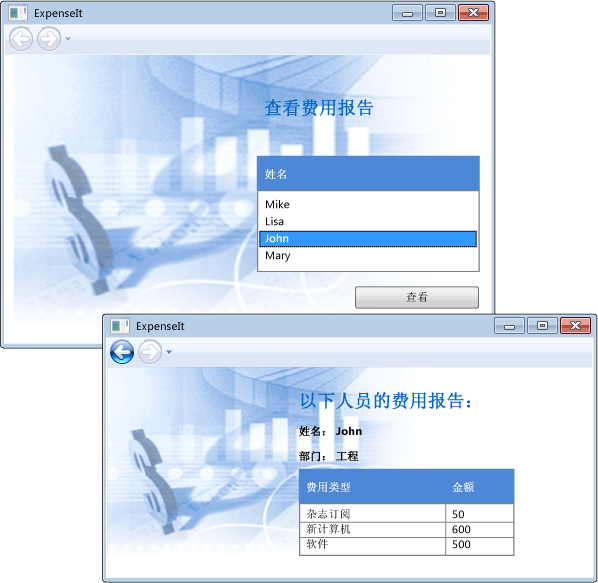

# <a name="walkthrough-my-first-wpf-desktop-application"></a>演练：我的第一个 WPF 桌面应用程序

本文介绍如何开发一个简单的 Windows Presentation Foundation (WPF) 应用程序，其中包括大多数 WPF 应用程序共有的元素： Extensible Application Markup Language (XAML) 标记、 代码隐藏、 应用程序定义控件、 布局、 数据绑定和样式。

本演练包含以下步骤：

- 使用 XAML 来设计应用程序的用户界面 (UI) 的外观。

- 编写代码以生成应用程序的行为。

- 创建应用程序定义管理应用程序。

- 将控件添加和创建布局以构成应用程序 UI。

- 创建应用程序的 UI 具有一致外观的样式。

- 绑定到数据来填充数据从 UI 和保护数据和 UI 同步的用户界面。

本演练结束时，你将生成独立的 Windows 应用程序，允许用户查看所选人员的费用报表。 应用程序的托管在浏览器样式的窗口中的多个 WPF 页面组成。

> [!TIP]
> 用于生成此演练的示例代码是适用于 Visual Basic 和 C# 均适用于[生成 WPF 应用程序简介](http://go.microsoft.com/fwlink/?LinkID=160008)。

## <a name="prerequisites"></a>系统必备

- Visual Studio 2012 或更高版本

有关安装 Visual Studio 的最新版本的详细信息，请参阅[安装 Visual Studio](/visualstudio/install/install-visual-studio)。

## <a name="create-the-application-project"></a>创建应用程序项目

第一步是创建应用程序基础结构，其中包括应用程序定义，两个页面和一个图像。

1. 在 Visual Basic 或 Visual C# 名为创建新的 WPF 应用程序项目**`ExpenseIt`**:

   1. 打开 Visual Studio 并选择**文件** > **新建** > **项目**。

      **新的项目**对话框随即打开。

   2. 下**已安装**类别中，展开**Visual C#** 或**Visual Basic**节点，然后再选择**Windows 经典桌面**。

   3. 选择**WPF 应用 (.NET Framework)** 模板。 输入的名称**`ExpenseIt`** ，然后选择**确定**。

      

      Visual Studio 创建项目并打开名为的默认应用程序窗口的设计器**MainWindow.xaml**。

   > [!NOTE]
   > 本演练使用<xref:System.Windows.Controls.DataGrid>在.NET Framework 4 和更高版本的控件。 为确保你的项目面向.NET Framework 4 或更高版本。 有关详细信息，请参阅[如何：面向 .NET Framework 的某个版本](/visualstudio/ide/how-to-target-a-version-of-the-dotnet-framework)。

2. 打开*Application.xaml* (Visual Basic) 或*App.xaml* (C#)。

    此 XAML 文件定义 WPF 应用程序和任何应用程序资源。 此外使用此文件来指定用户界面时，会自动显示在应用程序启动;在这种情况下， *MainWindow.xaml*。

    在 XAML 应在 Visual Basic 中如下所示：

    [!code-xaml[ExpenseIt#1_A](../../../../samples/snippets/visualbasic/VS_Snippets_Wpf/ExpenseIt/VB/ExpenseIt1_A/Application.xaml#1_a)]

    或者，在 C# 中是这样：

    [!code-xaml[ExpenseIt#1](../../../../samples/snippets/csharp/VS_Snippets_Wpf/ExpenseIt/CSharp/ExpenseIt/App.xaml#1)]

3. 打开*MainWindow.xaml*。

    此 XAML 文件是你的应用程序的主窗口，并显示在页面中创建的内容。 <xref:System.Windows.Window>类定义的属性窗口中，例如其标题、 大小或图标，并处理事件，例如关闭或隐藏。

4. 更改<xref:System.Windows.Window>元素<xref:System.Windows.Navigation.NavigationWindow>，如以下 XAML 所示：

   ```xaml
   <NavigationWindow x:Class="ExpenseIt.MainWindow"
        xmlns="http://schemas.microsoft.com/winfx/2006/xaml/presentation"
        xmlns:x="http://schemas.microsoft.com/winfx/2006/xaml"
        ...
   </NavigationWindow>
   ```

   此应用程序中导航到不同的内容，具体取决于用户输入。 这就是为什么主要<xref:System.Windows.Window>需要更改为<xref:System.Windows.Navigation.NavigationWindow>。 <xref:System.Windows.Navigation.NavigationWindow> 继承的所有属性<xref:System.Windows.Window>。 <xref:System.Windows.Navigation.NavigationWindow> XAML 文件中的元素创建的实例<xref:System.Windows.Navigation.NavigationWindow>类。 有关详细信息，请参阅[导航概述](../../../../docs/framework/wpf/app-development/navigation-overview.md)。

5. 更改以下属性上<xref:System.Windows.Navigation.NavigationWindow>元素：

    - 设置<xref:System.Windows.Window.Title%2A>属性设置为"`ExpenseIt`"。

    - 设置<xref:System.Windows.FrameworkElement.Width%2A>属性设置为 500 像素。

    - 设置<xref:System.Windows.FrameworkElement.Height%2A>属性设置为 350 像素。

    - 删除<xref:System.Windows.Controls.Grid>之间的元素<xref:System.Windows.Navigation.NavigationWindow>标记。

    在 XAML 应在 Visual Basic 中如下所示：

    [!code-xaml[ExpenseIt#2_A](../../../../samples/snippets/visualbasic/VS_Snippets_Wpf/ExpenseIt/VB/ExpenseIt/MainWindow.xaml#2_a)]

    或者，在 C# 中是这样：

    [!code-xaml[ExpenseIt#2](../../../../samples/snippets/csharp/VS_Snippets_Wpf/ExpenseIt/CSharp/ExpenseIt/MainWindow.xaml#2)]

6. 打开*MainWindow.xaml.vb*或*MainWindow.xaml.cs*。

    此文件是包含代码来处理中声明的事件的代码隐藏文件*MainWindow.xaml*。 此文件包含在 XAML 中定义的窗口的分部类。

7. 如果使用的 C#，更改`MainWindow`类进行派生<xref:System.Windows.Navigation.NavigationWindow>。 （在 Visual Basic 中，自动发生此情况更改 XAML 中的窗口。）

   你的代码应如下所示：

   [!code-csharp[ExpenseIt#3](../../../../samples/snippets/csharp/VS_Snippets_Wpf/ExpenseIt/CSharp/ExpenseIt/MainWindow.xaml.cs#3)]
   [!code-vb[ExpenseIt#3](../../../../samples/snippets/visualbasic/VS_Snippets_Wpf/ExpenseIt/VB/ExpenseIt1_A/MainWindow.xaml.vb#3)]

   > [!TIP]
   > 您可以切换之间 C# 和 Visual Basic 中的示例代码的代码语言**语言**这篇文章右上角的下拉列表。

## <a name="add-files-to-the-application"></a>将文件添加到应用程序

本部分将向应用程序添加两个页面和一个图像。

1. 将新的 WPF 页添加到项目中，并将其命名*`ExpenseItHome.xaml`*:

   1. 在中**解决方案资源管理器**，右键单击**`ExpenseIt`** 项目节点，然后选择**添加** > **页**。

   1. 在中**添加新项**对话框中，**页面 (WPF)** 尚未选择模板。 输入的名称**`ExpenseItHome`**，然后选择**添加**。

    此页是应用程序启动时显示的第一页。 它将显示要从中，以查看其费用报表的人员列表。

2. 打开*`ExpenseItHome.xaml`*。

3. 设置<xref:System.Windows.Controls.Page.Title%2A>到"`ExpenseIt - Home`"。

    在 XAML 应在 Visual Basic 中如下所示：

    [!code-xaml[ExpenseIt#6_A](../../../../samples/snippets/visualbasic/VS_Snippets_Wpf/ExpenseIt/VB/ExpenseIt1_A/ExpenseItHome.xaml#6_a)]

    或者，在 C# 中是这样：

    [!code-xaml[ExpenseIt#6](../../../../samples/snippets/csharp/VS_Snippets_Wpf/ExpenseIt/CSharp/ExpenseIt2/ExpenseItHome.xaml#6)]

4. 打开*MainWindow.xaml*。

5. 设置<xref:System.Windows.Navigation.NavigationWindow.Source%2A>上的属性<xref:System.Windows.Navigation.NavigationWindow>到"`ExpenseItHome.xaml`"。

    这将设置*`ExpenseItHome.xaml`* 的第一页时打开应用程序启动。 在 XAML 应在 Visual Basic 中如下所示：

    [!code-xaml[ExpenseIt#7_A](../../../../samples/snippets/visualbasic/VS_Snippets_Wpf/ExpenseIt/VB/ExpenseIt1_A/MainWindow.xaml#7_a)]

    或者，在 C# 中是这样：

    [!code-xaml[ExpenseIt#7](../../../../samples/snippets/csharp/VS_Snippets_Wpf/ExpenseIt/CSharp/ExpenseIt2/MainWindow.xaml#7)]

   > [!TIP]
   > 您还可以设置**源**属性中的**杂项**类别**属性**窗口。
   >
   > 

6. 将另一个新的 WPF 页添加到项目中，并将其命名*ExpenseReportPage.xaml*::

   1. 在中**解决方案资源管理器**，右键单击**`ExpenseIt`** 项目节点，然后选择**添加** > **页**。

   1. 在中**添加新项**对话框中，**页面 (WPF)** 尚未选择模板。 输入的名称**ExpenseReportPage**，然后选择**添加**。

    此页会显示费用报表上选择的人员**`ExpenseItHome`** 页。

7. 打开 *ExpenseReportPage.xaml*。

8. 设置<xref:System.Windows.Controls.Page.Title%2A>到"`ExpenseIt - View Expense`"。

    在 XAML 应在 Visual Basic 中如下所示：

    [!code-xaml[ExpenseIt#4_A](../../../../samples/snippets/visualbasic/VS_Snippets_Wpf/ExpenseIt/VB/ExpenseIt1_A/ExpenseReportPage.xaml#4_a)]

    或者，在 C# 中是这样：

    [!code-xaml[ExpenseIt#4](../../../../samples/snippets/csharp/VS_Snippets_Wpf/ExpenseIt/CSharp/ExpenseIt/ExpenseReportPage.xaml#4)]

9. 打开*ExpenseItHome.xaml.vb*并*ExpenseReportPage.xaml.vb*，或*ExpenseItHome.xaml.cs*和*ExpenseReportPage.xaml.cs*.

    创建新的页面文件时，Visual Studio 将自动创建*代码隐藏*文件。 这些代码隐藏文件处理响应用户输入的逻辑。

    你的代码应如下所示的**`ExpenseItHome`**:

    [!code-csharp[ExpenseIt#2_5](../../../../samples/snippets/csharp/VS_Snippets_Wpf/ExpenseIt/CSharp/ExpenseIt2/ExpenseItHome.xaml.cs#2_5)]
    [!code-vb[ExpenseIt#2_5](../../../../samples/snippets/visualbasic/VS_Snippets_Wpf/ExpenseIt/VB/ExpenseIt1_A/ExpenseItHome.xaml.vb#2_5)]

    并为如下**ExpenseReportPage**:

    [!code-csharp[ExpenseIt#5](../../../../samples/snippets/csharp/VS_Snippets_Wpf/ExpenseIt/CSharp/ExpenseIt/ExpenseReportPage.xaml.cs#5)]
    [!code-vb[ExpenseIt#5](../../../../samples/snippets/visualbasic/VS_Snippets_Wpf/ExpenseIt/VB/ExpenseIt1_A/ExpenseReportPage.xaml.vb#5)]

10. 添加名为图像*watermark.png*到项目。 可以创建自己的映像、 将文件从示例代码中，或获取它[此处](https://github.com/dotnet/docs/blob/master/docs/framework/wpf/getting-started/media/watermark.png)。

   1. 右键单击项目节点并选择**外** > **现有项**，或按**Shift**+**Alt**+ **A**。

   2. 在中**添加现有项**对话框中，浏览到你想要使用，并选择图像文件**添加**。

## <a name="build-and-run-the-application"></a>编译和运行应用程序

1. 若要生成并运行应用程序，按**F5**或选择**开始调试**从**调试**菜单。

    下图显示了与应用程序<xref:System.Windows.Navigation.NavigationWindow>按钮：

    

2. 关闭要返回到 Visual Studio 的应用程序。

## <a name="create-the-layout"></a>创建布局

布局提供有序的方式来放置 UI 元素，并调整 UI 时还管理的大小和这些元素的位置。 通常使用以下布局控件之一来创建布局：

- <xref:System.Windows.Controls.Canvas>
- <xref:System.Windows.Controls.DockPanel>
- <xref:System.Windows.Controls.Grid>
- <xref:System.Windows.Controls.StackPanel>
- <xref:System.Windows.Controls.VirtualizingStackPanel>
- <xref:System.Windows.Controls.WrapPanel>

每个布局控件都为子元素支持特殊类型的布局。 `ExpenseIt` 页面可进行调整，但每个页面不水平或垂直排列以及其他元素的元素。 因此，<xref:System.Windows.Controls.Grid>是应用程序的理想布局元素。

> [!TIP]
> 有关详细信息<xref:System.Windows.Controls.Panel>元素，请参阅[面板概述](../../../../docs/framework/wpf/controls/panels-overview.md)。 有关布局的详细信息，请参阅[布局](../../../../docs/framework/wpf/advanced/layout.md)。

在部分中，您创建的单列表包含三个行和 10 像素边距添加到的列和行定义<xref:System.Windows.Controls.Grid>中*`ExpenseItHome.xaml`*。

1. 打开*`ExpenseItHome.xaml`*。

2. 设置<xref:System.Windows.FrameworkElement.Margin%2A>属性上的<xref:System.Windows.Controls.Grid>"10,0,10,10"，对应于左侧、 顶部、 右侧和底部边距的元素：

   ```xaml
   <Grid Margin="10,0,10,10">
   ```

   > [!TIP]
   > 您还可以设置**边距**中的值**属性**窗口下**布局**类别：
   >
   > 

3. 添加以下 XAML 之间<xref:System.Windows.Controls.Grid>标记以创建行和列定义：

    [!code-xaml[ExpenseIt#8](../../../../samples/snippets/csharp/VS_Snippets_Wpf/ExpenseIt/CSharp/ExpenseIt3/ExpenseItHome.xaml#8)]

    <xref:System.Windows.Controls.RowDefinition.Height%2A>的两个行设置为<xref:System.Windows.GridLength.Auto%2A>，这意味着行大小将调整的基础的行中的内容。 默认值<xref:System.Windows.Controls.RowDefinition.Height%2A>是<xref:System.Windows.GridUnitType.Star>大小调整，这意味着行的高度可用空间的加权的比例。 例如，如果两个行具有<xref:System.Windows.Controls.RowDefinition.Height%2A>的"*"，它们都有高度将会是可用空间的一半。

    你<xref:System.Windows.Controls.Grid>现在应如以下 XAML 所示：

    [!code-xaml[ExpenseIt#9](../../../../samples/snippets/csharp/VS_Snippets_Wpf/ExpenseIt/CSharp/ExpenseIt3/ExpenseItHome.xaml#9)]

## <a name="add-controls"></a>添加控件

在本部分中，将更新主页 UI 以显示一个用户可以选择从以显示费用报表的人员列表。 控件是允许用户与应用程序交互的 UI 对象。 有关详细信息，请参阅 [控件](../../../../docs/framework/wpf/controls/index.md)。

若要创建此 UI，将添加到以下元素*`ExpenseItHome.xaml`*:

- <xref:System.Windows.Controls.ListBox> （用于人员列表）。
- <xref:System.Windows.Controls.Label> （用于列表标题）。
- <xref:System.Windows.Controls.Button> （若要单击以查看费用报表的列表中选择的人员）。

每个控件的某一行中放置<xref:System.Windows.Controls.Grid>通过设置<xref:System.Windows.Controls.Grid.Row%2A?displayProperty=nameWithType>附加属性。 有关附加属性的详细信息，请参阅[附加属性概述](../../../../docs/framework/wpf/advanced/attached-properties-overview.md)。

1. 打开*`ExpenseItHome.xaml`*。

2. 添加以下 XAML 某处之间<xref:System.Windows.Controls.Grid>标记：

   [!code-xaml[ExpenseIt#10](../../../../samples/snippets/csharp/VS_Snippets_Wpf/ExpenseIt/CSharp/ExpenseIt4/ExpenseItHome.xaml#10)]

   > [!TIP]
   > 此外可以通过将其从拖动来创建控件**工具箱**窗口拖到设计窗口中，然后设置其属性**属性**窗口。

3. 生成并运行应用程序。

下图显示了刚创建的控件：


## <a name="add-an-image-and-a-title"></a>添加图像和标题

在本部分中，将更新主页 UI 的图像和页面标题。

1. 打开*`ExpenseItHome.xaml`*。

2. 添加到另一个列<xref:System.Windows.Controls.Grid.ColumnDefinitions%2A>具有固定<xref:System.Windows.Controls.ColumnDefinition.Width%2A>为 230 像素：

    [!code-xaml[ExpenseIt#11](../../../../samples/snippets/csharp/VS_Snippets_Wpf/ExpenseIt/CSharp/ExpenseIt5/ExpenseItHome.xaml#11)]

3. 添加到另一行<xref:System.Windows.Controls.Grid.RowDefinitions%2A>，总共四行：

    [!code-xaml[ExpenseIt#11b](../../../../samples/snippets/csharp/VS_Snippets_Wpf/ExpenseIt/CSharp/ExpenseIt5/ExpenseItHome.xaml#11b)]

4. 将控件移动到第二列中，通过设置<xref:System.Windows.Controls.Grid.Column%2A?displayProperty=nameWithType>为 1 的三个控件 （边框、 列表框中，和按钮） 每个属性。

5. 递增每个控件下移一行，其<xref:System.Windows.Controls.Grid.Row%2A?displayProperty=nameWithType>值加 1。

   现在，三个控件的 XAML 如下所示：

    [!code-xaml[ExpenseIt#12](../../../../samples/snippets/csharp/VS_Snippets_Wpf/ExpenseIt/CSharp/ExpenseIt5/ExpenseItHome.xaml#12)]

6. 设置<xref:System.Windows.Controls.Panel.Background%2A>的<xref:System.Windows.Controls.Grid>要*watermark.png*图像文件，添加以下 XAML 某处之间`<Grid>`和`</Grid>`标记：

    [!code-xaml[ExpenseIt#14](../../../../samples/snippets/csharp/VS_Snippets_Wpf/ExpenseIt/CSharp/ExpenseIt5/ExpenseItHome.xaml#14)]

7. 之前<xref:System.Windows.Controls.Border>元素中，添加<xref:System.Windows.Controls.Label>"查看费用报表"的内容。 这是页面的标题。

    [!code-xaml[ExpenseIt#13](../../../../samples/snippets/csharp/VS_Snippets_Wpf/ExpenseIt/CSharp/ExpenseIt5/ExpenseItHome.xaml#13)]

8. 生成并运行应用程序。

下图显示了刚添加的结果：


## <a name="add-code-to-handle-events"></a>添加代码以处理事件

1. 打开*`ExpenseItHome.xaml`*。

2. 添加<xref:System.Windows.Controls.Primitives.ButtonBase.Click>事件处理程序<xref:System.Windows.Controls.Button>元素。 有关详细信息，请参阅[如何： 创建简单的事件处理程序](http://msdn.microsoft.com/library/b1456e07-9dec-4354-99cf-18666b64f480)。

    [!code-xaml[ExpenseIt#15](../../../../samples/snippets/csharp/VS_Snippets_Wpf/ExpenseIt/CSharp/ExpenseIt6/ExpenseItHome.xaml#15)]

3. 打开*`ExpenseItHome.xaml.vb`* 或*`ExpenseItHome.xaml.cs`*。

4. 将以下代码添加到`ExpenseItHome`类添加一个按钮单击事件处理程序。 事件处理程序打开**ExpenseReportPage**页。

    [!code-csharp[ExpenseIt#16](../../../../samples/snippets/csharp/VS_Snippets_Wpf/ExpenseIt/CSharp/ExpenseIt6/ExpenseItHome.xaml.cs#16)]
    [!code-vb[ExpenseIt#16](../../../../samples/snippets/visualbasic/VS_Snippets_Wpf/ExpenseIt/VB/ExpenseIt6/ExpenseItHome.xaml.vb#16)]

## <a name="create-the-ui-for-expensereportpage"></a>为 ExpenseReportPage 创建 UI

*ExpenseReportPage.xaml*选择的人员显示费用报表**`ExpenseItHome`** 页。 在本部分中，您将创建的用户界面**ExpenseReportPage**。 此外将添加背景和填充到各种 UI 元素的颜色。

1. 打开 *ExpenseReportPage.xaml*。

2. 添加以下 XAML 之间<xref:System.Windows.Controls.Grid>标记：

    [!code-xaml[ExpenseIt#17](../../../../samples/snippets/csharp/VS_Snippets_Wpf/ExpenseIt/CSharp/ExpenseIt6/ExpenseReportPage.xaml#17)]

    此用户界面是类似于*`ExpenseItHome.xaml`*，但报表数据显示在<xref:System.Windows.Controls.DataGrid>。

3. 生成并运行应用程序。

    > [!NOTE]
    > 如果收到错误<xref:System.Windows.Controls.DataGrid>找不到或不存在，请确保你的项目面向.NET Framework 4 或更高版本。 有关详细信息，请参阅[如何：面向 .NET Framework 的某个版本](/visualstudio/ide/how-to-target-a-version-of-the-dotnet-framework)。

4. 选择**视图**按钮。

    出现费用报告页。 另请注意，启用向后导航按钮。

下图显示了添加到的 UI 元素*ExpenseReportPage.xaml*。


## <a name="style-controls"></a>控件的样式

各种元素的外观通常是相同的 UI 中的相同类型的所有元素。 使用 UI[样式](../../../../docs/framework/wpf/controls/styling-and-templating.md)以使外观可重复使用跨多个元素。 重复使用样式有助于简化 XAML 创建和管理。 本部分替换在以前步骤中通过样式定义的按元素划分的属性。

1. 打开*Application.xaml*或*App.xaml*。

2. 添加以下 XAML 之间<xref:System.Windows.Application.Resources%2A?displayProperty=nameWithType>标记：

    [!code-xaml[ExpenseIt#18](../../../../samples/snippets/csharp/VS_Snippets_Wpf/ExpenseIt/CSharp/ExpenseIt7/App.xaml#18)]

    此 XAML 将添加以下样式：

    - `headerTextStyle`：可设置页标题 <xref:System.Windows.Controls.Label>的格式。

    - `labelStyle`：可设置 <xref:System.Windows.Controls.Label> 控件的格式。

    - `columnHeaderStyle`：可设置 <xref:System.Windows.Controls.Primitives.DataGridColumnHeader>的格式。

    - `listHeaderStyle`：可设置列表标头 <xref:System.Windows.Controls.Border> 控件的格式。

    - `listHeaderTextStyle`： 设置的格式列表标头<xref:System.Windows.Controls.Label>。

    - `buttonStyle`： 设置的格式<xref:System.Windows.Controls.Button>上`ExpenseItHome.xaml`。

    请注意，这些样式是资源和子级的<xref:System.Windows.Application.Resources%2A?displayProperty=nameWithType>属性元素。 在此位置中，这些样式将应用到应用程序中的所有元素。 在.NET Framework 应用程序中使用的资源的示例，请参阅[使用应用程序资源](../../../../docs/framework/wpf/advanced/how-to-use-application-resources.md)。

3. 打开*`ExpenseItHome.xaml`*。

4. 替换之间的所有内容<xref:System.Windows.Controls.Grid>具有以下 XAML 元素：

    [!code-xaml[ExpenseIt#19](../../../../samples/snippets/csharp/VS_Snippets_Wpf/ExpenseIt/CSharp/ExpenseIt7/ExpenseItHome.xaml#19)]

    应用样式会删除和替换定义每个控件外观的属性（如 <xref:System.Windows.VerticalAlignment> 和 <xref:System.Windows.Media.FontFamily> 。 例如，`headerTextStyle`应用于"查看费用报表" <xref:System.Windows.Controls.Label>。

5. 打开 *ExpenseReportPage.xaml*。

6. 替换之间的所有内容<xref:System.Windows.Controls.Grid>具有以下 XAML 元素：

    [!code-xaml[ExpenseIt#20](../../../../samples/snippets/csharp/VS_Snippets_Wpf/ExpenseIt/CSharp/ExpenseIt7/ExpenseReportPage.xaml#20)]

    这会将样式添加到 <xref:System.Windows.Controls.Label> 和 <xref:System.Windows.Controls.Border> 元素。

## <a name="bind-data-to-a-control"></a>将数据绑定到控件

在本部分中，将创建绑定到各种控件的 XML 数据。

1. 打开*`ExpenseItHome.xaml`*。

2. 打开之后<xref:System.Windows.Controls.Grid>元素中，添加以下 XAML 以创建<xref:System.Windows.Data.XmlDataProvider>包含数据的每个用户：

    [!code-xaml[ExpenseIt#21](../../../../samples/snippets/csharp/VS_Snippets_Wpf/ExpenseIt/CSharp/ExpenseIt8/ExpenseItHome.xaml#21)]
    [!code-xaml[ExpenseIt#23](../../../../samples/snippets/csharp/VS_Snippets_Wpf/ExpenseIt/CSharp/ExpenseIt8/ExpenseItHome.xaml#23)]
    [!code-xaml[ExpenseIt#22](../../../../samples/snippets/csharp/VS_Snippets_Wpf/ExpenseIt/CSharp/ExpenseIt8/ExpenseItHome.xaml#22)]

    作为创建数据<xref:System.Windows.Controls.Grid>资源。 这通常会作为文件加载，但为简单起见数据以内联方式添加。

3. 内`<Grid.Resources>`元素中，添加以下<xref:System.Windows.DataTemplate>，用于定义如何显示中的数据<xref:System.Windows.Controls.ListBox>:

    [!code-xaml[ExpenseIt#21](../../../../samples/snippets/csharp/VS_Snippets_Wpf/ExpenseIt/CSharp/ExpenseIt8/ExpenseItHome.xaml#21)]
    [!code-xaml[ExpenseIt#24](../../../../samples/snippets/csharp/VS_Snippets_Wpf/ExpenseIt/CSharp/ExpenseIt8/ExpenseItHome.xaml#24)]
    [!code-xaml[ExpenseIt#22](../../../../samples/snippets/csharp/VS_Snippets_Wpf/ExpenseIt/CSharp/ExpenseIt8/ExpenseItHome.xaml#22)]

    有关数据模板的详细信息，请参阅[数据模板化概述](../../../../docs/framework/wpf/data/data-templating-overview.md)。

4. 替换现有<xref:System.Windows.Controls.ListBox>使用以下 XAML:

    [!code-xaml[ExpenseIt#25](../../../../samples/snippets/csharp/VS_Snippets_Wpf/ExpenseIt/CSharp/ExpenseIt8/ExpenseItHome.xaml#25)]

    此 XAML 绑定<xref:System.Windows.Controls.ItemsControl.ItemsSource%2A>的属性<xref:System.Windows.Controls.ListBox>到数据源，并应用数据模板作为<xref:System.Windows.Controls.ItemsControl.ItemTemplate%2A>。

## <a name="connect-data-to-controls"></a>将数据连接到控件

接下来，将添加代码以检索名称上所选**`ExpenseItHome`** 页上，并将其传递给构造函数的**ExpenseReportPage**。 **ExpenseReportPage**设置与所传递的项目，这是定义的控件的数据上下文中*ExpenseReportPage.xaml*将绑定到。

1. 打开 *ExpenseReportPage.xaml.vb* 或 *ExpenseReportPage.xaml.cs*。

2. 添加获取对象的构造函数，以便传递所选人员的费用报表数据。

    [!code-csharp[ExpenseIt#26](../../../../samples/snippets/csharp/VS_Snippets_Wpf/ExpenseIt/CSharp/ExpenseIt8/ExpenseReportPage.xaml.cs#26)]
    [!code-vb[ExpenseIt#26](../../../../samples/snippets/visualbasic/VS_Snippets_Wpf/ExpenseIt/VB/ExpenseIt8/ExpenseReportPage.xaml.vb#26)]

3. 打开*`ExpenseItHome.xaml.vb`* 或*`ExpenseItHome.xaml.cs`*。

4. 更改<xref:System.Windows.Controls.Primitives.ButtonBase.Click>事件处理程序以调用新的构造函数传递所选人员的费用报表数据。

    [!code-csharp[ExpenseIt#27](../../../../samples/snippets/csharp/VS_Snippets_Wpf/ExpenseIt/CSharp/ExpenseIt8/ExpenseItHome.xaml.cs#27)]
    [!code-vb[ExpenseIt#27](../../../../samples/snippets/visualbasic/VS_Snippets_Wpf/ExpenseIt/VB/ExpenseIt8/ExpenseItHome.xaml.vb#27)]

## <a name="style-data-with-data-templates"></a>使用数据模板的样式数据

在本部分中，将使用数据模板来更新数据绑定列表中每个项的 UI。

1. 打开 *ExpenseReportPage.xaml*。

2. 将"Name"和"部门"的内容绑定<xref:System.Windows.Controls.Label>元素到相应的数据源属性。 有关数据绑定的详细信息，请参阅[数据绑定概述](../../../../docs/framework/wpf/data/data-binding-overview.md)。

    [!code-xaml[ExpenseIt#31](../../../../samples/snippets/csharp/VS_Snippets_Wpf/ExpenseIt/CSharp/ExpenseIt9/ExpenseReportPage.xaml#31)]

3. 打开之后<xref:System.Windows.Controls.Grid>元素中，添加以下数据模板，用于定义如何显示费用报表数据：

    [!code-xaml[ExpenseIt#30](../../../../samples/snippets/csharp/VS_Snippets_Wpf/ExpenseIt/CSharp/ExpenseIt9/ExpenseReportPage.xaml#30)]

4. 应用到模板<xref:System.Windows.Controls.DataGrid>列显示费用报表数据。

    [!code-xaml[ExpenseIt#32](../../../../samples/snippets/csharp/VS_Snippets_Wpf/ExpenseIt/CSharp/ExpenseIt9/ExpenseReportPage.xaml#32)]

5. 生成并运行应用程序。

6. 选择 person，然后选择**视图**按钮。

下图显示的两个页面`ExpenseIt`控件、 布局、 样式、 数据绑定和数据模板应用与应用程序：



> [!NOTE]
> 此示例演示了 WPF 的特定功能并不遵循所有最佳实践等安全、 本地化和可访问性。 WPF 和.NET Framework 应用程序开发最佳做法的全面介绍，请参阅以下主题：
>
> - [辅助功能](../../../../docs/framework/ui-automation/accessibility-best-practices.md)
>
> - [安全性](../../../../docs/framework/wpf/security-wpf.md)
>
> - [WPF 全球化和本地化](../../../../docs/framework/wpf/advanced/wpf-globalization-and-localization-overview.md)
>
> - [WPF 性能](../../../../docs/framework/wpf/advanced/optimizing-wpf-application-performance.md)

## <a name="next-steps"></a>后续步骤

在本演练中介绍了大量用于创建使用 Windows Presentation Foundation (WPF) UI 技术。 现在应具有一个基本的了解数据绑定，.NET Framework 应用程序的构建基块。 有关 WPF 体系结构和编程模型的详细信息，请参阅以下主题：

- [WPF 体系结构](../../../../docs/framework/wpf/advanced/wpf-architecture.md)
- [XAML 概述 (WPF)](../../../../docs/framework/wpf/advanced/xaml-overview-wpf.md)
- [依赖属性概述](../../../../docs/framework/wpf/advanced/dependency-properties-overview.md)
- [布局](../../../../docs/framework/wpf/advanced/layout.md)

有关创建应用程序的详细信息，请参阅以下主题：

- [应用程序开发](../../../../docs/framework/wpf/app-development/index.md)
- [控件](../../../../docs/framework/wpf/controls/index.md)
- [数据绑定概述](../../../../docs/framework/wpf/data/data-binding-overview.md)
- [图形和多媒体](../../../../docs/framework/wpf/graphics-multimedia/index.md)
- [WPF 中的文档](../../../../docs/framework/wpf/advanced/documents-in-wpf.md)

## <a name="see-also"></a>请参阅

- [面板概述](../../../../docs/framework/wpf/controls/panels-overview.md)
- [数据模板化概述](../../../../docs/framework/wpf/data/data-templating-overview.md)
- [生成 WPF 应用程序](../../../../docs/framework/wpf/app-development/building-a-wpf-application-wpf.md)
- [样式和模板](../../../../docs/framework/wpf/controls/styles-and-templates.md)
