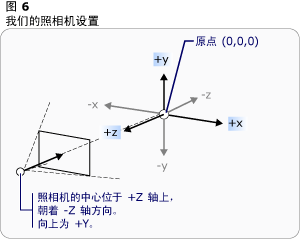

# 三维图形概述
 通过 [!INCLUDE[TLA#tla_winclient](../../../../includes/tlasharptla-winclient-md.md)] 中的[!INCLUDE[TLA2#tla_3d](../../../../includes/tla2sharptla-3d-md.md)]功能，开发人员可以使用标记代码和程序代码对三维图形进行绘制、转换和动画处理。  开发人员可以合并[!INCLUDE[TLA#tla_2d](../../../../includes/tlasharptla-2d-md.md)]和[!INCLUDE[TLA2#tla_3d](../../../../includes/tla2sharptla-3d-md.md)]图形以创建丰富的控件，提供复杂的数据图解，或者增强用户对应用程序界面的体验。[!INCLUDE[TLA2#tla_winclient](../../../../includes/tla2sharptla-winclient-md.md)] 中的[!INCLUDE[TLA2#tla_3d](../../../../includes/tla2sharptla-3d-md.md)]支持并非旨在提供功能齐全的游戏开发平台。本主题概述了 [!INCLUDE[TLA2#tla_winclient](../../../../includes/tla2sharptla-winclient-md.md)] 图形系统中的[!INCLUDE[TLA#tla_3d](../../../../includes/tlasharptla-3d-md.md)]功能。  
  
   
  
   
## 二维容器中的三维  
 [!INCLUDE[TLA2#tla_winclient](../../../../includes/tla2sharptla-winclient-md.md)] 中的[!INCLUDE[TLA2#tla_3d](../../../../includes/tla2sharptla-3d-md.md)]图形内容封装在 <xref:System.Windows.Controls.Viewport3D> 元素中，该元素可以参与二维元素结构。  该图形系统将 <xref:System.Windows.Controls.Viewport3D> 视为一个像 [!INCLUDE[TLA2#tla_winclient](../../../../includes/tla2sharptla-winclient-md.md)] 中的许多其他元素一样的二维可视化元素。  <xref:System.Windows.Controls.Viewport3D> 充当三维场景中的窗口（即视区）。  更准确地说，它是[!INCLUDE[TLA2#tla_3d](../../../../includes/tla2sharptla-3d-md.md)]场景所投影到的图面。  
  
 在传统的[!INCLUDE[TLA2#tla_2d](../../../../includes/tla2sharptla-2d-md.md)]应用程序中，当您需要使用 Grid 或 Canvas 之类的另一个容器元素时，可以使用 <xref:System.Windows.Controls.Viewport3D>。  尽管您可以将 <xref:System.Windows.Controls.Viewport3D> 与同一个场景图中的其他[!INCLUDE[TLA2#tla_2d](../../../../includes/tla2sharptla-2d-md.md)]绘图对象结合使用，但是您不能在 <xref:System.Windows.Controls.Viewport3D> 内部渗透[!INCLUDE[TLA2#tla_2d](../../../../includes/tla2sharptla-2d-md.md)]和[!INCLUDE[TLA2#tla_3d](../../../../includes/tla2sharptla-3d-md.md)]对象。  本主题重点讲述如何在 <xref:System.Windows.Controls.Viewport3D> 内部绘制[!INCLUDE[TLA2#tla_3d](../../../../includes/tla2sharptla-3d-md.md)]图形。  
  
   
## 三维坐标空间  
 [!INCLUDE[TLA2#tla_2d](../../../../includes/tla2sharptla-2d-md.md)]图形的 [!INCLUDE[TLA2#tla_winclient](../../../../includes/tla2sharptla-winclient-md.md)] 坐标系将原点定位在呈现区域（通常是屏幕）的左上角。  在[!INCLUDE[TLA2#tla_2d](../../../../includes/tla2sharptla-2d-md.md)]系统中，x 轴上的正值朝右，y 轴上的正值朝下。  但是，在[!INCLUDE[TLA2#tla_3d](../../../../includes/tla2sharptla-3d-md.md)]坐标系中，原点位于呈现区域的中心，x 轴上的正值朝右，但是 y 轴上的正值朝上，z 轴上的正值从原点向外朝向观察者。  
  
   
传统的二维和三维坐标系表示形式  
  
 由这些轴定义的空间是[!INCLUDE[TLA2#tla_3d](../../../../includes/tla2sharptla-3d-md.md)]对象在 [!INCLUDE[TLA2#tla_winclient](../../../../includes/tla2sharptla-winclient-md.md)] 中的固定参考框架。  当您在该空间中生成模型并创建光源和照相机以查看这些模型时，一定要在向每个模型应用变换时，将固定参考框架或“全局空间”与您为该模型创建的局部参考框架区分开。  另请记住，根据光源和照相机设置，全局空间中的对象可能会看上去完全不同或者根本不可见，但是照相机的位置不会改变对象在全局空间中的位置。  
  
   
## 照相机和投影  
 处理[!INCLUDE[TLA2#tla_2d](../../../../includes/tla2sharptla-2d-md.md)]对象的开发人员习惯于将绘图基元置于二维屏幕上。  当您创建[!INCLUDE[TLA2#tla_3d](../../../../includes/tla2sharptla-3d-md.md)]场景时，一定要记住您实际上是要创建[!INCLUDE[TLA2#tla_3d](../../../../includes/tla2sharptla-3d-md.md)]对象的[!INCLUDE[TLA2#tla_2d](../../../../includes/tla2sharptla-2d-md.md)]表示形式。  由于[!INCLUDE[TLA2#tla_3d](../../../../includes/tla2sharptla-3d-md.md)]场景的外观会因观察者的观察位置不同而异，因此您必须指定观察位置。  可以使用 <xref:System.Windows.Media.Media3D.Camera> 类来为[!INCLUDE[TLA2#tla_3d](../../../../includes/tla2sharptla-3d-md.md)]场景指定观察位置。  
  
 了解[!INCLUDE[TLA2#tla_3d](../../../../includes/tla2sharptla-3d-md.md)]场景如何在[!INCLUDE[TLA2#tla_2d](../../../../includes/tla2sharptla-2d-md.md)]图面上表示的另一种方法就是将场景描述为到观察表面上的投影。  使用 <xref:System.Windows.Media.Media3D.ProjectionCamera>，可以指定不同的投影及其属性以更改观察者查看[!INCLUDE[TLA2#tla_3d](../../../../includes/tla2sharptla-3d-md.md)]模型的方式。  <xref:System.Windows.Media.Media3D.PerspectiveCamera> 指定用来对场景进行透视收缩的投影。  换言之，<xref:System.Windows.Media.Media3D.PerspectiveCamera> 提供消失点透视。  您可以指定照相机在场景坐标系中的位置、照相机的方向和视野以及用来定义场景中“向上”方向的向量。  下图阐释 <xref:System.Windows.Media.Media3D.PerspectiveCamera> 的投影。  
  
 <xref:System.Windows.Media.Media3D.ProjectionCamera> 的 <xref:System.Windows.Media.Media3D.ProjectionCamera.NearPlaneDistance%2A> 和 <xref:System.Windows.Media.Media3D.ProjectionCamera.FarPlaneDistance%2A> 属性限制照相机的投影范围。  由于照相机可以位于场景中的任何位置，因此照相机实际上可能会位于模型内部或者紧靠模型，这使正确区分对象变得很困难。  通过 <xref:System.Windows.Media.Media3D.ProjectionCamera.NearPlaneDistance%2A>，可以指定一个距离照相机的最小距离，超过该距离后即不绘制对象。  相反，使用 <xref:System.Windows.Media.Media3D.ProjectionCamera.FarPlaneDistance%2A>，可以指定一个距离照相机的距离（即，在超过该距离后将不绘制对象），从而确保因距离太远而无法识别的对象将不包括在场景中。  
  
   
照相机位置  
  
 <xref:System.Windows.Media.Media3D.OrthographicCamera> 指定[!INCLUDE[TLA2#tla_3d](../../../../includes/tla2sharptla-3d-md.md)]模型到[!INCLUDE[TLA2#tla_2d](../../../../includes/tla2sharptla-2d-md.md)]可视化图面上的正投影。  与其他照相机一样，它指定位置、观察方向和“向上”方向。  但是，与 <xref:System.Windows.Media.Media3D.PerspectiveCamera> 不同的是，<xref:System.Windows.Media.Media3D.OrthographicCamera> 描述了不包括透视收缩的投影。  换言之，<xref:System.Windows.Media.Media3D.OrthographicCamera> 描述了一个侧面平行的取景框，而不是侧面汇集在场景中一点的取景框。  下图演示使用 <xref:System.Windows.Media.Media3D.PerspectiveCamera> 和 <xref:System.Windows.Media.Media3D.OrthographicCamera> 查看同一模型时的情况。  
  
   
透视投影和正投影  
  
 下面的代码演示一些典型的照相机设置。  
  
 [!code-csharp[3dgallery_procedural_snip#Basic3DShapeCodeExampleInline1](../../../../samples/snippets/csharp/VS_Snippets_Wpf/3DGallery_procedural_snip/CSharp/Basic3DShapeExample.cs#basic3dshapecodeexampleinline1)]
 [!code-vb[3dgallery_procedural_snip#Basic3DShapeCodeExampleInline1](../../../../samples/snippets/visualbasic/VS_Snippets_Wpf/3DGallery_procedural_snip/visualbasic/basic3dshapeexample.vb#basic3dshapecodeexampleinline1)]  
  
   
## 模型和网格基元  
 <xref:System.Windows.Media.Media3D.Model3D> 是表示泛型[!INCLUDE[TLA2#tla_3d](../../../../includes/tla2sharptla-3d-md.md)]对象的抽象基类。  若要生成[!INCLUDE[TLA2#tla_3d](../../../../includes/tla2sharptla-3d-md.md)]场景，需要一些要查看的对象，而且构成场景图的对象必须派生自 <xref:System.Windows.Media.Media3D.Model3D>。  目前，[!INCLUDE[TLA2#tla_winclient](../../../../includes/tla2sharptla-winclient-md.md)] 支持用 <xref:System.Windows.Media.Media3D.GeometryModel3D> 对几何形状进行建模。  此模型的 <xref:System.Windows.Media.Media3D.GeometryModel3D.Geometry%2A> 属性采用网格基元。  
  
 若要生成模型，请首先生成一个基元或网格。  [!INCLUDE[TLA2#tla_3d](../../../../includes/tla2sharptla-3d-md.md)]基元是一系列构成单个[!INCLUDE[TLA2#tla_3d](../../../../includes/tla2sharptla-3d-md.md)]实体的顶点。  大多数[!INCLUDE[TLA2#tla_3d](../../../../includes/tla2sharptla-3d-md.md)]系统都提供在最简单的闭合图（由三个顶点定义的三角形）上建模的基元。  由于三角形的三个点在一个平面上，因此您可以继续添加三角形，以便对网格这样较为复杂的形状建模。  
  
 [!INCLUDE[TLA2#tla_winclient](../../../../includes/tla2sharptla-winclient-md.md)] [!INCLUDE[TLA2#tla_3d](../../../../includes/tla2sharptla-3d-md.md)]系统目前提供 <xref:System.Windows.Media.Media3D.MeshGeometry3D> 类，使用该类，可以指定任何几何形状；它目前不支持预定义的[!INCLUDE[TLA2#tla_3d](../../../../includes/tla2sharptla-3d-md.md)]基元（如球体和立方体）。  首先通过将三角形顶点的列表指定为它的 <xref:System.Windows.Media.Media3D.MeshGeometry3D.Positions%2A> 属性来创建 <xref:System.Windows.Media.Media3D.MeshGeometry3D>。  每个顶点都指定为 <xref:System.Windows.Media.Media3D.Point3D>。  （在[!INCLUDE[TLA#tla_xaml](../../../../includes/tlasharptla-xaml-md.md)] 中，将该属性指定为三个一组的数字列表，每组中的三个数字表示每个顶点的坐标）。根据网格的几何形状，网格可能会由多个三角形组成，其中的一些三角形共用相同的角（顶点）。  若要正确地绘制网格，[!INCLUDE[TLA2#tla_winclient](../../../../includes/tla2sharptla-winclient-md.md)] 需要有关哪些顶点由哪些三角形共用的信息。  可以通过指定具有 <xref:System.Windows.Media.Media3D.MeshGeometry3D.TriangleIndices%2A> 属性的三角形索引列表来提供此信息。  此列表指定在 <xref:System.Windows.Media.Media3D.MeshGeometry3D.Positions%2A> 列表中指定的点将按哪种顺序确定三角形。  
  
 [!code-xml[basic3d#Basic3DXAML3DN3](../../../../samples/snippets/xaml/VS_Snippets_Wpf/Basic3D/XAML/Window1.xaml#basic3dxaml3dn3)]  
  
 在上面的示例中，<xref:System.Windows.Media.Media3D.MeshGeometry3D.Positions%2A> 列表指定用八个顶点来定义立方体形状的网格。  <xref:System.Windows.Media.Media3D.MeshGeometry3D.TriangleIndices%2A> 属性指定了一个包含十二个组的列表，每组由三个索引组成。  列表中的每个数字都指向与 <xref:System.Windows.Media.Media3D.MeshGeometry3D.Positions%2A> 列表的偏移量。  例如，由 <xref:System.Windows.Media.Media3D.MeshGeometry3D.Positions%2A> 列表指定的第一组三个顶点为 \(1,1,0\)、\(0,1,0\) 和 \(0,0,0\)。  由 <xref:System.Windows.Media.Media3D.MeshGeometry3D.TriangleIndices%2A> 列表指定的第一组三个索引为 0、2 和 1，这与 <xref:System.Windows.Media.Media3D.MeshGeometry3D.Positions%2A> 列表中的第一个、第三个和第二个点相对应。  因此，构成立方体模型的第一个三角形将按照从 \(1,1,0\) 到 \(0,1,0\) 再到 \(0,0,0\) 的顺序组合而成，其余的十一个三角形将按照类似方式确定。  
  
 您可以通过为 <xref:System.Windows.Media.Media3D.MeshGeometry3D.Normals%2A> 和 <xref:System.Windows.Media.Media3D.MeshGeometry3D.TextureCoordinates%2A> 属性指定值来继续定义模型。  为了呈现模型的图面，图形系统需要有关曲面在任何给定三角形上的朝向信息。  图形系统使用此信息来针对该模型进行照明计算：直接朝向光源的图面比偏离光源的图面显得更亮。  尽管 [!INCLUDE[TLA2#tla_winclient](../../../../includes/tla2sharptla-winclient-md.md)] 可以使用位置坐标来确定默认的法向量，但是您还可以指定不同的法向量来近似计算曲面的外观。  
  
 <xref:System.Windows.Media.Media3D.MeshGeometry3D.TextureCoordinates%2A> 属性指定 <xref:System.Windows.Point> 的集合，用于通知图形系统如何将用于确定纹理绘制方式的坐标映射到网格的顶点。  <xref:System.Windows.Media.Media3D.MeshGeometry3D.TextureCoordinates%2A> 指定为 0 和 1 闭区间上的值。  如同 <xref:System.Windows.Media.Media3D.MeshGeometry3D.Normals%2A> 属性一样，图形系统可以计算默认纹理坐标，但是您可以选择设置不同的纹理坐标来控制对包括重复图案一部分的纹理的映射。  有关纹理坐标的更多信息，可以在以后的主题或 Managed Direct3D SDK 中找到。  
  
 下面的示例演示如何在过程代码中创建立方体模型的一面。  请注意，您可以将整个立方体绘制为单个 GeometryModel3D；此示例将该立方体的各个面绘制为一个不同的模型，以便在以后向每个面应用不同的纹理。  
  
 [!code-csharp[3doverview#3DOverview3DN6](../../../../samples/snippets/csharp/VS_Snippets_Wpf/3DOverview/CSharp/Window1.xaml.cs#3doverview3dn6)]
 [!code-vb[3doverview#3DOverview3DN6](../../../../samples/snippets/visualbasic/VS_Snippets_Wpf/3DOverview/visualbasic/window1.xaml.vb#3doverview3dn6)]  
  
 [!code-csharp[3doverview#3DOverview3DN7](../../../../samples/snippets/csharp/VS_Snippets_Wpf/3DOverview/CSharp/Window1.xaml.cs#3doverview3dn7)]
 [!code-vb[3doverview#3DOverview3DN7](../../../../samples/snippets/visualbasic/VS_Snippets_Wpf/3DOverview/visualbasic/window1.xaml.vb#3doverview3dn7)]  
  
   
## 向模型应用 Material  
 为了使网格看上去像三维对象，必须向其应用纹理，以便覆盖由顶点和三角形定义的图面，从而使其可以由照相机照明和投影。  在[!INCLUDE[TLA2#tla_2d](../../../../includes/tla2sharptla-2d-md.md)]中，可以使用 <xref:System.Windows.Media.Brush> 类来向屏幕中的区域应用颜色、图案、渐变或其他可视化内容。  但是，[!INCLUDE[TLA2#tla_3d](../../../../includes/tla2sharptla-3d-md.md)]对象的外观是照明模型的功能，而不只是应用于它们的颜色或图案。  实际对象的图面质量不同，它们反射光的方式也会有所不同：光亮的图面与粗糙或不光滑的图面看上去不同，某些对象似乎可以吸收光，而某些对象似乎能够发光。  您可以向[!INCLUDE[TLA2#tla_3d](../../../../includes/tla2sharptla-3d-md.md)]对象应用与应用于[!INCLUDE[TLA2#tla_2d](../../../../includes/tla2sharptla-2d-md.md)]对象的完全相同的画笔，但是您不能直接应用它们。  
  
 [!INCLUDE[TLA2#tla_winclient](../../../../includes/tla2sharptla-winclient-md.md)] 使用 <xref:System.Windows.Media.Media3D.Material> 抽象类来定义模型图面的特征。  Material 的具体子类用来确定模型图面的某些外观特征，每个子类还提供一个可以向其传递 SolidColorBrush、TileBrush 或 VisualBrush 的 Brush 属性。  
  
-   <xref:System.Windows.Media.Media3D.DiffuseMaterial> 指定将向模型应用画笔，就好像模型是使用漫射光来照亮的一样。  使用 DiffuseMaterial 与直接针对[!INCLUDE[TLA2#tla_2d](../../../../includes/tla2sharptla-2d-md.md)]模型使用画笔非常相似；模型表面不反射光，就好像是自发光一样。  
  
-   <xref:System.Windows.Media.Media3D.SpecularMaterial> 指定将向模型应用画笔，就好像模型的表面坚硬或者光亮，能够反射光线一样。  可以通过为 <xref:System.Windows.Media.Media3D.SpecularMaterial.SpecularPower%2A> 属性指定一个值来设置系统将为纹理的反射特质（或“发光”）建议的度数。  
  
-   使用 <xref:System.Windows.Media.Media3D.EmissiveMaterial> 可以指定将应用纹理，就好像模型所发出的光与画笔的颜色相同。  这不会使模型成为光源；但是，它参与阴影设置的方式将不同于用 DiffuseMaterial 或 SpecularMaterial 设置纹理时的情况。  
  
 为进一步提高性能，可以从场景中精选 <xref:System.Windows.Media.Media3D.GeometryModel3D> 的背面（由于它们相对于照相机位于模型的背面，因此您将看不到这些面）。  若要指定要应用于模型（如飞机）背面的 <xref:System.Windows.Media.Media3D.Material>，请设置模型的 <xref:System.Windows.Media.Media3D.GeometryModel3D.BackMaterial%2A> 属性。  
  
 为了实现某些图面质量（如发光或发射效果），您可能希望向模型连续应用几个不同的画笔。  可以使用 <xref:System.Windows.Media.Media3D.MaterialGroup> 类来应用和重用多个 Material。  MaterialGroup 的子级在多个呈现过程中按照从头到尾的顺序来应用。  
  
 下面的代码示例演示如何将纯色和绘图以画笔形式应用于[!INCLUDE[TLA2#tla_3d](../../../../includes/tla2sharptla-3d-md.md)]模型。  
  
 [!code-xml[basic3d#Basic3DXAML3DN5](../../../../samples/snippets/xaml/VS_Snippets_Wpf/Basic3D/XAML/Window1.xaml#basic3dxaml3dn5)]  
  
 [!code-xml[3doverview#3DOverview3DN9](../../../../samples/snippets/csharp/VS_Snippets_Wpf/3DOverview/CSharp/app.xaml#3doverview3dn9)]  
  
 [!code-csharp[3doverview#3DOverview3DN8](../../../../samples/snippets/csharp/VS_Snippets_Wpf/3DOverview/CSharp/Window1.xaml.cs#3doverview3dn8)]
 [!code-vb[3doverview#3DOverview3DN8](../../../../samples/snippets/visualbasic/VS_Snippets_Wpf/3DOverview/visualbasic/window1.xaml.vb#3doverview3dn8)]  
  
   
## 照亮场景  
 与实际的光一样，[!INCLUDE[TLA2#tla_3d](../../../../includes/tla2sharptla-3d-md.md)]图形中的光能够使图面可见。  更确切地说，光确定了场景的哪个部分将包括在投影中。  [!INCLUDE[TLA2#tla_winclient](../../../../includes/tla2sharptla-winclient-md.md)] 中的光对象创建了各种光和阴影效果，而且是按照各种实际光的行为建模的。  您必须至少在场景中包括一个光，否则模型将不可见。  
  
 下面的光派生自基类 <xref:System.Windows.Media.Media3D.Light>：  
  
-   <xref:System.Windows.Media.Media3D.AmbientLight>：它所提供的环境光以一致的方式照亮所有的对象，而与对象的位置或方向无关。  
  
-   <xref:System.Windows.Media.Media3D.DirectionalLight>：像远处的光源那样照亮。  将方向光的 <xref:System.Windows.Media.Media3D.DirectionalLight.Direction%2A> 指定为 Vector3D，但是没有为方向光指定位置。  
  
-   <xref:System.Windows.Media.Media3D.PointLight>：像近处的光源那样照亮。  PointLight 具有一个位置并从该位置投射光。  场景中的对象是根据对象相对于光源的位置和距离而被照亮的。  <xref:System.Windows.Media.Media3D.PointLightBase> 公开 <xref:System.Windows.Media.Media3D.PointLightBase.Range%2A> 属性，该属性确定一个距离，超过该距离后模型将无法由光源照亮。  PointLight 还公开了多个衰减属性，这些属性确定光源的亮度如何随距离的增加而减小。  您可以为光源的衰减指定恒定、线性或二次内插算法。  
  
-   <xref:System.Windows.Media.Media3D.SpotLight>：从 <xref:System.Windows.Media.Media3D.PointLight> 继承。  Spotlight 的照亮方式与 PointLight 类似，但是它既具有位置又具有方向。  它们在 <xref:System.Windows.Media.Media3D.SpotLight.InnerConeAngle%2A> 和 <xref:System.Windows.Media.Media3D.SpotLight.OuterConeAngle%2A> 属性所设置的锥形区域（以度为单位指定）中投射光。  
  
 光源是 <xref:System.Windows.Media.Media3D.Model3D> 对象，因此您可以转换光源对象并对光源属性（包括位置、颜色、方向和范围）进行动画处理。  
  
 [!code-xml[hittest3d#HitTest3D3DN6](../../../../samples/snippets/csharp/VS_Snippets_Wpf/HitTest3D/CSharp/Window1.xaml#hittest3d3dn6)]  
  
 [!code-csharp[basic3d#Basic3D3DN11](../../../../samples/snippets/csharp/VS_Snippets_Wpf/Basic3D/CSharp/Window1.xaml.cs#basic3d3dn11)]
 [!code-vb[basic3d#Basic3D3DN11](../../../../samples/snippets/visualbasic/VS_Snippets_Wpf/Basic3D/visualbasic/window1.xaml.vb#basic3d3dn11)]  
  
 [!code-csharp[basic3d#Basic3D3DN12](../../../../samples/snippets/csharp/VS_Snippets_Wpf/Basic3D/CSharp/Window1.xaml.cs#basic3d3dn12)]
 [!code-vb[basic3d#Basic3D3DN12](../../../../samples/snippets/visualbasic/VS_Snippets_Wpf/Basic3D/visualbasic/window1.xaml.vb#basic3d3dn12)]  
  
 [!code-csharp[basic3d#Basic3D3DN13](../../../../samples/snippets/csharp/VS_Snippets_Wpf/Basic3D/CSharp/Window1.xaml.cs#basic3d3dn13)]
 [!code-vb[basic3d#Basic3D3DN13](../../../../samples/snippets/visualbasic/VS_Snippets_Wpf/Basic3D/visualbasic/window1.xaml.vb#basic3d3dn13)]  
  
   
## 变换模型  
 当您创建模型时，它们在场景中具有特定的位置。  为了在场景中移动、旋转这些模型或者更改这些模型的大小而更改用来定义模型本身的顶点是不切实际的。  相反，正如在[!INCLUDE[TLA2#tla_2d](../../../../includes/tla2sharptla-2d-md.md)]中一样，您可以向模型应用转换。  
  
 每个模型对象都有一个可用来对模型进行移动、重定向或调整大小的 <xref:System.Windows.Media.Media3D.Model3D.Transform%2A> 属性。  当您应用转换时，实际上是按照由转换功能指定的向量或值（以适用者为准）来有效地偏移模型的所有点。  换言之，您已经变换了在其中定义模型的坐标空间（“模型空间”），但是，您尚未更改在整个场景的坐标系（“全局空间”）中构成模型几何形状的值。  
  
 有关转换模型的更多信息，请参见[三维变换概述](../../../../docs/framework/wpf/graphics-multimedia/3-d-transformations-overview.md)。  
  
   
## 对模型进行动画处理  
 [!INCLUDE[TLA2#tla_winclient](../../../../includes/tla2sharptla-winclient-md.md)] [!INCLUDE[TLA2#tla_3d](../../../../includes/tla2sharptla-3d-md.md)]实现与[!INCLUDE[TLA2#tla_2d](../../../../includes/tla2sharptla-2d-md.md)]图形参与同一个计时和动画系统。  换言之，若要对三维场景进行动画处理，需要对其模型的属性进行动画处理。  可以直接对基元的属性进行动画处理，但是通常很容易对用来更改模型位置或外观的变换进行动画处理。  由于可以向 <xref:System.Windows.Media.Media3D.Model3DGroup> 对象及其各个模型应用转换，因此可以向 Model3DGroup 的子级应用一组动画，向一组子对象应用另一组动画。  还可以通过对场景的照明属性进行动画处理来实现各种可视化效果。  最后，您可以选择通过对照相机的位置或视野进行动画处理来对投影本身进行动画处理。  有关 [!INCLUDE[TLA2#tla_winclient](../../../../includes/tla2sharptla-winclient-md.md)] 计时和动画系统的背景信息，请参见[动画概述](../../../../docs/framework/wpf/graphics-multimedia/animation-overview.md)、[演示图板概述](../../../../docs/framework/wpf/graphics-multimedia/storyboards-overview.md)和[Freezable 对象概述](../../../../docs/framework/wpf/advanced/freezable-objects-overview.md)主题。  
  
 若要对 [!INCLUDE[TLA2#tla_winclient](../../../../includes/tla2sharptla-winclient-md.md)] 中的对象进行动画处理，可以创建时间线、定义动画（实际上是随着时间的推移而更改某个属性值）并指定要向其应用动画的属性。  由于[!INCLUDE[TLA2#tla_3d](../../../../includes/tla2sharptla-3d-md.md)]场景中的所有对象都是 <xref:System.Windows.Controls.Viewport3D> 的子级，因此要应用于场景的任何动画所面向的属性都是 Viewport3D 的属性。  
  
 假设您希望实现模型看上去是在原地摇摆的效果，  您可以选择向模型应用 <xref:System.Windows.Media.Media3D.RotateTransform3D>，并对模型从一个向量旋转到另一个向量时所围绕的轴进行动画处理。  下面的代码示例演示如何将 Vector3DAnimation 应用于该转换的 Rotation3D 的 Axis 属性，并假设 RotateTransform3D 是应用于具有 TransformGroup 的模型的几个转换之一。  
  
 [!code-csharp[3doverview#3DOverview3DN1](../../../../samples/snippets/csharp/VS_Snippets_Wpf/3DOverview/CSharp/Window1.xaml.cs#3doverview3dn1)]
 [!code-vb[3doverview#3DOverview3DN1](../../../../samples/snippets/visualbasic/VS_Snippets_Wpf/3DOverview/visualbasic/window1.xaml.vb#3doverview3dn1)]  
  
 [!code-csharp[3doverview#3DOverview3DN3](../../../../samples/snippets/csharp/VS_Snippets_Wpf/3DOverview/CSharp/Window1.xaml.cs#3doverview3dn3)]
 [!code-vb[3doverview#3DOverview3DN3](../../../../samples/snippets/visualbasic/VS_Snippets_Wpf/3DOverview/visualbasic/window1.xaml.vb#3doverview3dn3)]  
  
 [!code-csharp[3doverview#3DOverview3DN4](../../../../samples/snippets/csharp/VS_Snippets_Wpf/3DOverview/CSharp/Window1.xaml.cs#3doverview3dn4)]
 [!code-vb[3doverview#3DOverview3DN4](../../../../samples/snippets/visualbasic/VS_Snippets_Wpf/3DOverview/visualbasic/window1.xaml.vb#3doverview3dn4)]  
  
 [!code-csharp[3doverview#3DOverview3DN5](../../../../samples/snippets/csharp/VS_Snippets_Wpf/3DOverview/CSharp/Window1.xaml.cs#3doverview3dn5)]
 [!code-vb[3doverview#3DOverview3DN5](../../../../samples/snippets/visualbasic/VS_Snippets_Wpf/3DOverview/visualbasic/window1.xaml.vb#3doverview3dn5)]  
  
   
## 向窗口中添加三维内容  
 若要呈现场景，请向 <xref:System.Windows.Media.Media3D.Model3DGroup> 中添加模型和光源，然后将 <xref:System.Windows.Media.Media3D.Model3DGroup> 设置为 <xref:System.Windows.Media.Media3D.ModelVisual3D> 的 <xref:System.Windows.Media.Media3D.ModelVisual3D.Content%2A>。  将 <xref:System.Windows.Media.Media3D.ModelVisual3D> 添加到 <xref:System.Windows.Controls.Viewport3D> 的 <xref:System.Windows.Controls.Viewport3D.Children%2A> 集合中。  通过设置 <xref:System.Windows.Controls.Viewport3D> 的 <xref:System.Windows.Controls.Viewport3D.Camera%2A> 属性来向其添加照相机。  
  
 最后，请向该窗口中添加 <xref:System.Windows.Controls.Viewport3D>。  在将 <xref:System.Windows.Controls.Viewport3D> 作为布局元素（如 Canvas）的内容来包含时，可以通过设置 Viewport3D 的 <xref:System.Windows.FrameworkElement.Height%2A> 和 <xref:System.Windows.FrameworkElement.Width%2A> 属性（继承自 <xref:System.Windows.FrameworkElement>）来指定 Viewport3D 的大小。  
  
 [!code-xml[hostingwpfusercontrolinwf#1](../../../../samples/snippets/csharp/VS_Snippets_Wpf/HostingWpfUserControlInWf/CSharp/HostingWpfUserControlInWf/ConeControl.xaml#1)]  
  
## 请参阅  
 <xref:System.Windows.Controls.Viewport3D>   
 <xref:System.Windows.Media.Media3D.PerspectiveCamera>   
 <xref:System.Windows.Media.Media3D.DirectionalLight>   
 <xref:System.Windows.Media.Media3D.Material>   
 [三维变换概述](../../../../docs/framework/wpf/graphics-multimedia/3-d-transformations-overview.md)   
 [最大程度地提高 WPF 三维性能](../../../../docs/framework/wpf/graphics-multimedia/maximize-wpf-3d-performance.md)   
 [帮助主题](../../../../docs/framework/wpf/graphics-multimedia/3-d-graphics-how-to-topics.md)   
 [WPF 中的形状和基本绘图概述](../../../../docs/framework/wpf/graphics-multimedia/shapes-and-basic-drawing-in-wpf-overview.md)   
 [使用图像、绘图和 Visual 进行绘制](../../../../docs/framework/wpf/graphics-multimedia/painting-with-images-drawings-and-visuals.md)