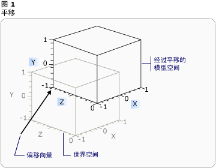

# 三维变换概述
本主题描述如何向 [!INCLUDE[TLA#tla_winclient](../../../../includes/tlasharptla-winclient-md.md)] 图形系统中的三维模型应用变换。  开发人员可以借助于变换功能来对模型进行重定位、调整大小和重定向，而无需更改用来定义模型的基值。  
  
 [!INCLUDE[autoOutline](../Token/autoOutline_md.md)]  
  
## 三维坐标空间  
 [!INCLUDE[TLA#tla_winclient](../../../../includes/tlasharptla-winclient-md.md)] 中的三维图形内容封装在 <xref:System.Windows.Controls.Viewport3D> 元素中，该元素可以参与二维元素结构。  该图形系统将 Viewport3D 视为一个像 [!INCLUDE[TLA#tla_winclient](../../../../includes/tlasharptla-winclient-md.md)] 中的许多其他元素一样的二维可视化元素。  Viewport3D 充当三维场景中的一个窗口（视区）。  更准确地说，它是三维场景所投影到的图面。  尽管可以将 Viewport3D 与其他二维绘图对象用在同一个场景关系图中，但是不能在 Viewport3D 中渗透二维和三维对象。  以下讨论中所描述的坐标空间包含在 Viewport3D 元素中。  
  
 二维图形的 [!INCLUDE[TLA#tla_winclient](../../../../includes/tlasharptla-winclient-md.md)] 坐标系将原点定位在呈现图面（通常是屏幕）的左上角。  在二维系统中，x 轴上的正值朝右增加，y 轴上的正值朝下增加。  但是，在三维坐标系中，原点位于屏幕的中心，x 轴上的正值朝右增加，但是 y 轴上的正值朝上增加，z 轴上的正值从原点向外朝向观察者增加。  
  
   
坐标系比较  
  
 由这些轴定义的空间是三维对象在 [!INCLUDE[TLA#tla_winclient](../../../../includes/tlasharptla-winclient-md.md)] 中的固定参考框架。  当您在该空间中生成模型并创建光源和照相机以查看这些模型时，一定要在向每个模型应用变换时，将固定参考框架或“全局空间”与您为该模型创建的局部参考框架区分开。  另请记住，根据光源和照相机设置，全局空间中的对象可能会看上去完全不同或者根本不可见，但是照相机的位置不会改变对象在全局空间中的位置。  
  
## 变换模型  
 当您创建模型时，它们在场景中具有特定的位置。  为了在场景中移动、旋转这些模型或者更改这些模型的大小而更改用来定义模型本身的顶点是不切实际的。  相反，正如在二维对象中一样，您可以向模型应用变换。  
  
 每个模型对象都有一个可用来对模型进行移动、重定向或调整大小的 <xref:System.Windows.Media.Media3D.Model3D.Transform%2A> 属性。  当您应用变换时，实际上是按照由变换功能指定的向量或值（以适用者为准）来偏移模型的所有点。  换言之，您已经变换了在其中定义模型的坐标空间（“模型空间”），但是，您尚未更改在整个场景的坐标系（“全局空间”）中构成模型几何形状的值。  
  
## 平移变换  
 三维变换继承自抽象基类 <xref:System.Windows.Media.Media3D.Transform3D>；这些变换包括仿射变换类 <xref:System.Windows.Media.Media3D.TranslateTransform3D>、<xref:System.Windows.Media.Media3D.ScaleTransform3D> 和 <xref:System.Windows.Media.Media3D.RotateTransform3D>。  [!INCLUDE[TLA#tla_winclient](../../../../includes/tlasharptla-winclient-md.md)] 三维系统还提供一个 <xref:System.Windows.Media.Media3D.MatrixTransform3D> 类，使用该类，可以用更简明的矩阵操作来指定同样的变换。  
  
 <xref:System.Windows.Media.Media3D.TranslateTransform3D> 沿着您用 <xref:System.Windows.Media.Media3D.TranslateTransform3D.OffsetX%2A>、<xref:System.Windows.Media.Media3D.TranslateTransform3D.OffsetY%2A> 和 <xref:System.Windows.Media.Media3D.TranslateTransform3D.OffsetZ%2A> 属性指定的偏移向量所指示的方向来移动 Model3D 中的所有点。  例如，假设立方体的一个顶点位于 \(2,2,2\)，则偏移向量 \(0,1.6,1\) 会将该顶点 \(2,2,2\) 移到 \(2,3.6,3\)。  该立方体的顶点在模型空间中仍位于 \(2,2,2\)，但是现在，该模型空间与世界空间的关系已经发生改变，因此，模型空间中的 \(2,2,2\) 是世界空间中的 \(2,3.6,3\)。  
  
   
带有偏移的平移  
  
 下面的代码示例演示如何应用平移。  
  
 [!code-xml[animation3dgallery_snip#Translation3DAnimationExampleWholePage](../../../../samples/snippets/csharp/VS_Snippets_Wpf/Animation3DGallery_snip/CS/Translation3DAnimationExample.xaml#translation3danimationexamplewholepage)]  
  
## 缩放变换  
 <xref:System.Windows.Media.Media3D.ScaleTransform3D> 沿着指定的缩放向量，相对于中心点来更改模型的比例。  可以指定等比缩放，即在 X、Y 和 Z 轴上将模型缩放同样的值来按比例更改模型的大小。  例如，将该变换的 <xref:System.Windows.Media.ScaleTransform.ScaleX%2A>、<xref:System.Windows.Media.ScaleTransform.ScaleY%2A> 和 <xref:System.Windows.Media.Media3D.ScaleTransform3D.ScaleZ%2A> 属性设置为 0.5 会将此模型二等分；将这些属性设置为 2 会将此模型在所有这三个轴上的值放大一倍。  
  
   
ScaleVector 示例  
  
 通过指定非等比变换（X、Y 和 Z 值不相等的缩放变换），可以使模型在一个或两个维度上拉伸或收缩，而不会影响其他维度。  例如，如果将 <xref:System.Windows.Media.ScaleTransform.ScaleX%2A>、<xref:System.Windows.Media.ScaleTransform.ScaleY%2A> 和 <xref:System.Windows.Media.Media3D.ScaleTransform3D.ScaleZ%2A> 分别设置为 1、2 和 1，则将导致变换模型的高度增加一倍，但是 X 和 Z 轴上的值仍保持不变。  
  
 默认情况下，ScaleTransform3D 会导致顶点围绕原点 \(0,0,0\) 拉伸或收缩  但是，如果要变换的模型不是从原点绘制的，那么，在从原点缩放模型时，模型将不会“就地”缩放。相反，当模型的顶点与缩放向量相乘时，缩放操作对模型的平移和缩放都会产生影响。  
  
   
缩放中心示例  
  
 若要“就地”缩放模型，请通过设置 ScaleTransform3D 的 <xref:System.Windows.Media.ScaleTransform.CenterX%2A>、<xref:System.Windows.Media.ScaleTransform.CenterY%2A> 和 <xref:System.Windows.Media.Media3D.ScaleTransform3D.CenterZ%2A> 属性来指定模型的中心。  这可确保图形系统缩放模型空间，然后平移该空间，使其在指定的 <xref:System.Windows.Media.Media3D.Point3D> 上居中。  相反，如果模型是围绕原点生成的，而且您指定了一个不同的中心点，则将看到模型会背离原点平移。  
  
## 旋转变换  
 可以通过几种不同的方法来旋转三维模型。  典型的旋转变换指定一个轴以及围绕该轴的旋转角度。  使用 <xref:System.Windows.Media.Media3D.RotateTransform3D> 类，可以用 <xref:System.Windows.Media.Media3D.RotateTransform3D.Rotation%2A> 属性来定义 <xref:System.Windows.Media.Media3D.Rotation3D>。  然后可以在 Rotation3D（在本例中为 <xref:System.Windows.Media.Media3D.AxisAngleRotation3D>）上指定 <xref:System.Windows.Media.Media3D.AxisAngleRotation3D.Axis%2A> 和 <xref:System.Windows.Media.Media3D.AxisAngleRotation3D.Angle%2A> 属性来定义变换。  下面的几个示例围绕 Y 轴将模型旋转 60 度。  
  
 [!code-xml[animation3dgallery_snip#Rotate3DUsingAxisAngleRotation3DExampleWholePage](../../../../samples/snippets/csharp/VS_Snippets_Wpf/Animation3DGallery_snip/CS/Rotat3DUsingAxisAngleRotation3DExample.xaml#rotate3dusingaxisanglerotation3dexamplewholepage)]  
  
 注意：[!INCLUDE[TLA#tla_winclient](../../../../includes/tlasharptla-winclient-md.md)] 三维是一个右手系统，这意味着，如果旋转角度为正数，则将围绕该轴逆时针旋转。  
  
 对于指定了轴和角度的旋转来说，如果没有为 RotateTransform3D 上的 <xref:System.Windows.Media.Media3D.RotateTransform3D.CenterX%2A>、<xref:System.Windows.Media.Media3D.RotateTransform3D.CenterY%2A> 和 <xref:System.Windows.Media.Media3D.RotateTransform3D.CenterZ%2A> 属性指定值，则假设围绕原点旋转。  与缩放时一样，一定要记住旋转时会变换模型的整个坐标空间。  如果模型不是围绕原点创建的，或者它以前经过平移，则旋转可能会围绕原点“转动”，而不是就地旋转。  
  
   
在指定了新中心的情况下旋转  
  
 若要“就地”旋转模型，请将模型的实际中心指定为旋转中心。  由于几何形状通常是围绕原点建模的，因此，在依次执行下列操作时通常将获取一组预期的变换结果：调整模型大小（缩放该模型），然后设置模型方向（旋转该模型），最后将模型移到所需的位置（平移该模型）。  
  
   
旋转示例  
  
 指定了轴和角度的旋转非常适于静态变换和某些动画。  但是，请考虑围绕 X 轴将立方体模型旋转 60 度，然后围绕 Z 轴将其旋转 45 度。  您可以将这种变换描述为两个离散的仿射变换，也可以将其描述为一个矩阵。  但是，对于按照这种方式定义的旋转，可能很难平滑地进行动画处理。  尽管按照这两种方法计算的模型起始位置和结束位置相同，但是，从计算的角度来看，该模型经过的中间位置是不确定的。  四元数提供了一种用来在旋转的起始位置和结束位置之间计算内插值的替代方法。  
  
 四元数表示三维空间中的一个轴以及围绕该轴的旋转。  例如，四元数可以表示 \(1,1,2\) 轴以及 50 度的旋转角度。  四元数在定义旋转方面的价值在于可以针对它们执行的两个运算：合成和内插。  应用于一个几何形状的两个四元数的合成是指“围绕 axis2 将几何形状旋转 rotation2 度，然后围绕 axis1 将其旋转 rotation1 度”。通过使用合成运算，可以将应用于几何形状的两个旋转合成在一起，以便获得一个代表合成结果的四元数。  由于四元数内插可以计算出从一个轴和方向到另一个轴和方向的平滑而又合理的路径，因此您可以从原始位置到合成的四元数之间进行内插，以便实现从一个位置到另一个位置的平滑过渡，从而可以对该变换进行动画处理。  对于要进行动画处理的模型，可以通过针对 <xref:System.Windows.Media.Media3D.RotateTransform3D.Rotation%2A> 属性使用 <xref:System.Windows.Media.Media3D.QuaternionRotation3D> 来为旋转指定目标 <xref:System.Windows.Media.Media3D.Quaternion>。  
  
## 使用变换集合  
 在生成场景时，通常会向模型应用多个变换。  向 <xref:System.Windows.Media.Media3D.Transform3DGroup> 类的 <xref:System.Windows.Media.Media3D.Transform3DGroup.Children%2A> 集合中添加变换，从而方便地将多个变换组合在一起以应用于场景中的各种模型。  通常，可以很方便地在几个不同的组中重用某个变换，这与通过向每个实例应用一组不同的变换来重用模型大体相同。  请注意，将变换添加到该集合中的顺序至关重要：集合中的变换是按照从第一个到最后一个的顺序应用的。  
  
## 对变换进行动画处理  
 [!INCLUDE[TLA#tla_winclient](../../../../includes/tlasharptla-winclient-md.md)] 三维实现与二维图形参与同一个计时和动画系统。  换言之，若要对三维场景进行动画处理，需要对其模型的属性进行动画处理。  可以直接对基元的属性进行动画处理，但是通常很容易对用来更改模型位置或外观的变换进行动画处理。  由于可以向 <xref:System.Windows.Media.Media3D.Model3DGroup> 对象及其各个模型应用变换，因此可以向 Model3DGroup 的子级应用一组动画，向一组对象应用另一组动画。  有关 [!INCLUDE[TLA#tla_winclient](../../../../includes/tlasharptla-winclient-md.md)] 计时和动画系统的背景信息，请参见[动画概述](../../../../docs/framework/wpf/graphics-multimedia/animation-overview.md)和[演示图板概述](../../../../docs/framework/wpf/graphics-multimedia/storyboards-overview.md)。  
  
 若要对 [!INCLUDE[TLA#tla_winclient](../../../../includes/tlasharptla-winclient-md.md)] 中的对象进行动画处理，可以创建时间线、定义动画（实际上是随着时间的推移而更改某个属性值）并指定要向其应用动画的属性。  此属性必须是 FrameworkElement 的属性。  由于三维场景中的所有对象都是 Viewport3D 的子级，因此要应用于场景的任何动画所面向的属性都是 Viewport3D 属性的属性。  一定要仔细设计动画的属性路径，因为语法可能会极为冗长。  
  
 假设您希望就地旋转某个对象，而且还希望应用摆动动作以公开要查看的对象的更多内容。  您可以选择向模型应用 RotateTransform3D，并对模型从一个向量旋转到另一个向量时所围绕的轴进行动画处理。  下面的代码示例演示如何将 <xref:System.Windows.Media.Animation.Vector3DAnimation> 应用于该变换的 Rotation3D 的 Axis 属性，并假设 RotateTransform3D 是应用于具有 <xref:System.Windows.Media.TransformGroup> 的模型的几个变换之一。  
  
 [!code-csharp[3doverview#3DOverview3DN1](../../../../samples/snippets/csharp/VS_Snippets_Wpf/3DOverview/CSharp/Window1.xaml.cs#3doverview3dn1)]
 [!code-vb[3doverview#3DOverview3DN1](../../../../samples/snippets/visualbasic/VS_Snippets_Wpf/3DOverview/visualbasic/window1.xaml.vb#3doverview3dn1)]  
  
 [!code-csharp[3doverview#3DOverview3DN3](../../../../samples/snippets/csharp/VS_Snippets_Wpf/3DOverview/CSharp/Window1.xaml.cs#3doverview3dn3)]
 [!code-vb[3doverview#3DOverview3DN3](../../../../samples/snippets/visualbasic/VS_Snippets_Wpf/3DOverview/visualbasic/window1.xaml.vb#3doverview3dn3)]  
  
 使用类似的语法可以将其他变换属性作为目标来移动或缩放该对象。  例如，可以在进行缩放变换时将 <xref:System.Windows.Media.Animation.Point3DAnimation> 应用于 ScaleCenter 属性，以便使模型的形状平滑地扭曲。  
  
 尽管上面的几个示例对 <xref:System.Windows.Media.Media3D.GeometryModel3D> 的属性进行变换，但是还可以对场景中其他模型的属性进行变换。  例如，可以通过对应用于 Light 对象的平移进行动画处理来创建移动灯光和阴影效果，这些效果可以显著改变模型的外观。  
  
 由于照相机也是模型，因此也可以对照相机的属性进行变换。  尽管您确实可以通过改变照相机的位置或平面距离来改变场景的外观（实际上是变换整个场景的投影），但应注意，对于观察者来说，以这种方法实现的许多效果不如将变换应用于场景中模型的地点或位置更有“视觉意义”。  
  
## 请参阅  
 [三维图形概述](../../../../docs/framework/wpf/graphics-multimedia/3-d-graphics-overview.md)   
 [变换概述](../../../../docs/framework/wpf/graphics-multimedia/transforms-overview.md)   
 [2\-D Transforms Sample](http://go.microsoft.com/fwlink/?LinkID=158252)