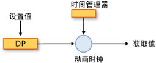
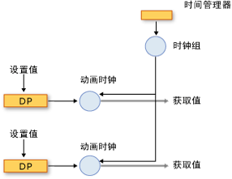

# 动画和计时系统概述
本主题介绍如何计时系统使用动画， <xref:System.Windows.Media.Animation.Timeline>，和<xref:System.Windows.Media.Animation.Clock>类属性进行动画处理。  
  
   
## 系统必备  
 为了了解本主题，应该能够使用 [!INCLUDE[TLA2#tla_winclient](../../../../includes/tla2sharptla-winclient-md.md)] 动画来对属性进行动画处理，如[动画概述](../../../../docs/framework/wpf/graphics-multimedia/animation-overview.md)中所述。 本主题还有助于熟悉依赖属性；有关详细信息，请参阅[依赖属性概述](../../../../docs/framework/wpf/advanced/dependency-properties-overview.md)。  
  
   
## 时间线和时钟  
 [动画概述](../../../../docs/framework/wpf/graphics-multimedia/animation-overview.md)描述如何<xref:System.Windows.Media.Animation.Timeline>表示的时间，以及一个动画段是一种<xref:System.Windows.Media.Animation.Timeline>生成输出值。 其本身而言， <xref:System.Windows.Media.Animation.Timeline>，不执行任何操作而不只是描述的时间段。 它是时间线的<xref:System.Windows.Media.Animation.Clock>对象，不能实际工作。 同样，动画不实际属性进行动画处理： 动画类描述应该如何计算输出值，但它是<xref:System.Windows.Media.Animation.Clock>创建用于动画驱动器动画输出并将它应用于属性。  
  
 A<xref:System.Windows.Media.Animation.Clock>是维护与计时相关运行时的状态对象的特殊类型<xref:System.Windows.Media.Animation.Timeline>。 它提供的信息对动画和时间系统至关重要的三个 bits: <xref:System.Windows.Media.Animation.Clock.CurrentTime%2A>， <xref:System.Windows.Media.Animation.Clock.CurrentProgress%2A>，和<xref:System.Windows.Media.Animation.Clock.CurrentState%2A>。 A<xref:System.Windows.Media.Animation.Clock>确定其当前时间、 进度和状态通过使用所描述的计时行为其<xref:System.Windows.Media.Animation.Timeline>: <xref:System.Windows.Media.Animation.Timeline.Duration%2A>， <xref:System.Windows.Media.Animation.Timeline.RepeatBehavior%2A>， <xref:System.Windows.Media.Animation.Timeline.AutoReverse%2A>，依次类推。  
  
 在大多数情况下，<xref:System.Windows.Media.Animation.Clock>自动为你的时间线创建。 当你使用进行动画处理<xref:System.Windows.Media.Animation.Storyboard>或<xref:System.Windows.Media.Animation.Animatable.BeginAnimation%2A>方法中，时钟自动创建为时间线和动画和应用到其目标属性。 你还可以创建<xref:System.Windows.Media.Animation.Clock>通过使用显式<xref:System.Windows.Media.Animation.Timeline.CreateClock%2A>方法你<xref:System.Windows.Media.Animation.Timeline>。 <xref:System.Windows.Media.MediaTimeline.CreateClock%2A?displayProperty=nameWithType>方法创建的相应类型的时钟<xref:System.Windows.Media.Animation.Timeline>对其调用。 如果<xref:System.Windows.Media.Animation.Timeline>包含子时间线，它会创建<xref:System.Windows.Media.Animation.Clock>以及这些对象。 生成<xref:System.Windows.Media.Animation.Clock>在与结构相匹配的目录树中排列对象<xref:System.Windows.Media.Animation.Timeline>对象从其创建树。  
  
 不同类型的时间线具有不同类型的时钟。 下表显示<xref:System.Windows.Media.Animation.Clock>对应于一些不同的类型<xref:System.Windows.Media.Animation.Timeline>类型。  
  
|时间线类型|时钟类型|时钟用途|  
|-------------------|----------------|-------------------|  
|动画 (继承自<xref:System.Windows.Media.Animation.AnimationTimeline>)|<xref:System.Windows.Media.Animation.AnimationClock>|为依赖属性生成输出值。|  
|<xref:System.Windows.Media.MediaTimeline>|<xref:System.Windows.Media.MediaClock>|处理媒体文件。|  
|<xref:System.Windows.Media.Animation.ParallelTimeline>|<xref:System.Windows.Media.Animation.ClockGroup>|分组和控制其子<xref:System.Windows.Media.Animation.Clock>对象|  
|<xref:System.Windows.Media.Animation.Storyboard>|<xref:System.Windows.Media.Animation.ClockGroup>|分组和控制其子<xref:System.Windows.Media.Animation.Clock>对象|  
  
 你可以在应用任何<xref:System.Windows.Media.Animation.AnimationClock>对象通过创建到兼容的依赖项属性<xref:System.Windows.Media.Animation.IAnimatable.ApplyAnimationClock%2A>方法。  
  
 在性能要求较高的情况下，对进行动画处理大量类似对象，如管理你自己<xref:System.Windows.Media.Animation.Clock>使用可以提供性能优势。  
  
   
## 时钟和时间管理器  
 当您创建动画中的对象[!INCLUDE[TLA2#tla_winclient](../../../../includes/tla2sharptla-winclient-md.md)]，它是时间管理器管理<xref:System.Windows.Media.MediaPlayer.Clock%2A>为时间线创建的对象。 时间管理器是 <xref:System.Windows.Media.MediaPlayer.Clock%2A> 对象树的根，并控制该树中的时间流。  将自动为每个 [!INCLUDE[TLA2#tla_winclient](../../../../includes/tla2sharptla-winclient-md.md)] 应用程序创建时间管理器，它对于应用程序开发人员不可见。 时间管理器每秒钟“滴答”多次；每秒发生的实际滴答次数取决于可用的系统资源。 在每个这些刻度，时间管理器计算的所有状态<xref:System.Windows.Media.Animation.ClockState.Active><xref:System.Windows.Media.Animation.Clock>计时树中的对象。  
  
 下图显示时间管理器、 之间的关系和<xref:System.Windows.Media.Animation.AnimationClock>，和一个动画的依赖项属性。  
  
   
对属性进行动画处理  
  
 当滴答时间管理器时，它会更新的时间每个<xref:System.Windows.Media.Animation.ClockState.Active><xref:System.Windows.Media.Animation.Clock>应用程序中。 如果<xref:System.Windows.Media.Animation.Clock>是<xref:System.Windows.Media.Animation.AnimationClock>，它使用<xref:System.Windows.Media.Animation.AnimationTimeline.GetCurrentValue%2A>方法<xref:System.Windows.Media.Animation.AnimationTimeline>于创建它来计算其当前输出值。 <xref:System.Windows.Media.Animation.AnimationClock>提供<xref:System.Windows.Media.Animation.AnimationTimeline>当前本地时间、 输入的值，这通常是属性的基值，与默认的目标值。 检索的动画的值时通过属性使用<xref:System.Windows.DependencyObject.GetValue%2A>方法或其 CLR 访问器，您将得到的输出其<xref:System.Windows.Media.Animation.AnimationClock>。  
  
#### 时钟组  
 前面的章节介绍了如何有不同类型的<xref:System.Windows.Media.Animation.Clock>时间线的时间的不同类型的对象。 下图显示时间管理器、 之间的关系<xref:System.Windows.Media.Animation.ClockGroup>、 <xref:System.Windows.Media.Animation.AnimationClock>，和一个动画的依赖项属性。 A<xref:System.Windows.Media.Animation.ClockGroup>为组其他时间线，如的时间线创建<xref:System.Windows.Media.Animation.Storyboard>类，它在动画和其他时间线。  
  
   
ClockGroup  
  
#### 撰写  
 可以将多个时钟与一个属性相关联，在这种情况下，每个时钟都将上一个时钟的输出值用作其基值。 下图显示了三个<xref:System.Windows.Media.Animation.AnimationClock>应用于相同的属性的对象。 时钟1 将经过动画处理的属性的基值用作其输入，并使用该值生成输出。 时钟2 将时钟1 的输出用作其输入，并使用该值生成输出。 时钟3 将时钟2 的输出用作其输入，并使用该值生成输出。 如果多个时钟同时影响同一个属性，则认为这些时钟位于一个组合链中。  
  
   
组合链  
  
 请注意，虽然在输入和输出之间创建关系<xref:System.Windows.Media.Animation.AnimationClock>组合链中的对象及其计时行为不会受到影响;<xref:System.Windows.Media.Animation.Clock>对象 (包括<xref:System.Windows.Media.Animation.AnimationClock>对象) 对它们的父级的分级的依存关系<xref:System.Windows.Media.Animation.Clock>对象。  
  
 若要将多个时钟应用到相同的属性，使用<xref:System.Windows.Media.Animation.HandoffBehavior.Compose><xref:System.Windows.Media.Animation.HandoffBehavior>应用时<xref:System.Windows.Media.Animation.Storyboard>，动画，或<xref:System.Windows.Media.Animation.AnimationClock>。  
  
#### 滴答和事件合并  
 除了计算输出值以外，时间管理器还会在它每滴答一次时执行其他工作：它会确定每个时钟的状态并根据需要引发事件。  
  
 尽管时钟周期频繁发生，但是不同时钟周期之间可能会很多操作。 例如，<xref:System.Windows.Media.Animation.Clock>可能已停止，启动，并且再次停止，在这种情况下其<xref:System.Windows.Media.Animation.Clock.CurrentState%2A>值将更改三次。 从理论上讲，<xref:System.Windows.Media.Animation.Clock.CurrentStateInvalidated>事件可能会引发多个时间中的一个刻度; 但是，计时引擎将合并事件，以便<xref:System.Windows.Media.Animation.Clock.CurrentStateInvalidated>每刻度最多一次引发事件。 这适用于所有计时事件： 均将引发一个事件最多每种类型的给定<xref:System.Windows.Media.Animation.Clock>对象。  
  
 当<xref:System.Windows.Media.Animation.Clock>切换状态并计时周期之间将返回到其原始状态 (例如，更改从<xref:System.Windows.Media.Animation.ClockState.Active>到<xref:System.Windows.Media.Animation.ClockState.Stopped>并返回到<xref:System.Windows.Media.Animation.ClockState.Active>)，仍发生关联的事件。  
  
 有关计时事件的详细信息，请参阅[计时事件概述](../../../../docs/framework/wpf/graphics-multimedia/timing-events-overview.md)。  
  
   
## 属性的当前值和基值  
 可进行动画处理的属性具有两个值：基值和当前值。 当将使用其 CLR 访问器的属性的设置或<xref:System.Windows.DependencyObject.SetValue%2A>方法，你将其基的值设置。 对于尚未进行动画处理的属性，基值和当前值相同。  
  
 当你对属性进行动画处理<xref:System.Windows.Media.Animation.AnimationClock>设置该属性的*当前*值。 检索通过其 CLR 访问器的属性的值或<xref:System.Windows.DependencyObject.GetValue%2A>方法返回的输出<xref:System.Windows.Media.Animation.AnimationClock>时<xref:System.Windows.Media.Animation.AnimationClock>是<xref:System.Windows.Media.Animation.ClockState.Active>或<xref:System.Windows.Media.Animation.ClockState.Filling>。 你可以使用来检索属性的基值<xref:System.Windows.Media.Animation.IAnimatable.GetAnimationBaseValue%2A>方法。  
  
## 请参阅  
 [动画概述](../../../../docs/framework/wpf/graphics-multimedia/animation-overview.md)  
 [计时事件概述](../../../../docs/framework/wpf/graphics-multimedia/timing-events-overview.md)  
 [计时行为概述](../../../../docs/framework/wpf/graphics-multimedia/timing-behaviors-overview.md)
