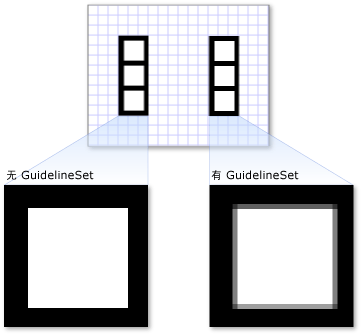

# Drawing 对象概述
本主题介绍<xref:System.Windows.Media.Drawing>对象，并说明如何使用它们来有效地绘制形状、 位图、 文本和媒体。 使用<xref:System.Windows.Media.Drawing>对象时创建剪贴画，绘制与<xref:System.Windows.Media.DrawingBrush>，或使用<xref:System.Windows.Media.Visual>对象。  
  
 
  
   
## 什么是 Drawing 对象？  
 A<xref:System.Windows.Media.Drawing>对象描述可见内容，如形状、 位图、 视频或文本行。 不同类型的图形描述不同类型的内容。 下面是不同类型图形对象的列表。  
  
-   <xref:System.Windows.Media.GeometryDrawing> – 绘制一个形状。  
  
-   <xref:System.Windows.Media.ImageDrawing> – 绘制图像。  
  
-   <xref:System.Windows.Media.GlyphRunDrawing> – 绘制文本。  
  
-   <xref:System.Windows.Media.VideoDrawing> – 播放音频或视频文件。  
  
-   <xref:System.Windows.Media.DrawingGroup> – 绘制其他绘制项。 使用图形组将其他图形合并到单个复合图形。  
  
 <xref:System.Windows.Media.Drawing> 对象是通用;有多种方法可以使用<xref:System.Windows.Media.Drawing>对象。  
  
-   您可以通过将它显示为图像<xref:System.Windows.Media.DrawingImage>和<xref:System.Windows.Controls.Image>控件。  
  
-   你可以将它与<xref:System.Windows.Media.DrawingBrush>绘制一个对象，如<xref:System.Windows.Controls.Page.Background%2A>的<xref:System.Windows.Controls.Page>。  
  
-   你可以使用它来描述的外观<xref:System.Windows.Media.DrawingVisual>。  
  
-   可用来枚举的内容<xref:System.Windows.Media.Visual>。  
  
 WPF 提供能够绘制形状、位图、文本和媒体的其他对象类型。 例如，你还可以使用<xref:System.Windows.Shapes.Shape>对象绘制形状，和<xref:System.Windows.Controls.MediaElement>控件提供另一种方法将视频添加到你的应用程序。 因此何时应使用<xref:System.Windows.Media.Drawing>对象？ 当可以牺牲 framework 级别功能，以获得性能优势或在需要时<xref:System.Windows.Freezable>功能。 因为<xref:System.Windows.Media.Drawing>对象缺少对支持[布局](../../../../docs/framework/wpf/advanced/layout.md)、 输入，并集中，它们提供使其很适合，描述背景，剪贴画，并与低级别绘图的性能优势<xref:System.Windows.Media.Visual>对象。  
  
 因为它们是一种<xref:System.Windows.Freezable>对象，<xref:System.Windows.Media.Drawing>对象具有一些特殊功能，其中包括以下： 它们可以声明为[资源](../../../../docs/framework/wpf/advanced/xaml-resources.md)、 多个对象，进行只读的以提高之间共享性能，克隆，并进行线程安全。 有关提供的不同功能的详细信息<xref:System.Windows.Freezable>对象，请参阅[可冻结对象概述](../../../../docs/framework/wpf/advanced/freezable-objects-overview.md)。  
  
   
## 绘制形状  
 若要绘制形状，请使用<xref:System.Windows.Media.GeometryDrawing>。 几何绘图的<xref:System.Windows.Media.GeometryDrawing.Geometry%2A>属性描述该形状以绘制，其<xref:System.Windows.Media.GeometryDrawing.Brush%2A>属性描述应绘制形状的内部的方式，并将其<xref:System.Windows.Media.GeometryDrawing.Pen%2A>属性描述应如何绘制其轮廓。  
  
 下面的示例使用<xref:System.Windows.Media.GeometryDrawing>以绘制的形状。 描述形状<xref:System.Windows.Media.GeometryGroup>和两个<xref:System.Windows.Media.EllipseGeometry>对象。 形状内部上色与<xref:System.Windows.Media.LinearGradientBrush>和以绘制其轮廓<xref:System.Windows.Media.Brushes.Black%2A> <xref:System.Windows.Media.Pen>。  
  
 此示例将创建以下<xref:System.Windows.Media.GeometryDrawing>。  
  
   
一个 GeometryDrawing  
  
 [!code-csharp[DrawingMiscSnippets_snip#GeometryDrawingExampleInline](../../../../samples/snippets/csharp/VS_Snippets_Wpf/DrawingMiscSnippets_snip/CSharp/GeometryDrawingExample.cs#geometrydrawingexampleinline)]
 [!code-xaml[DrawingMiscSnippets_snip#GeometryDrawingExampleInline](../../../../samples/snippets/xaml/VS_Snippets_Wpf/DrawingMiscSnippets_snip/XAML/GeometryDrawingExample.xaml#geometrydrawingexampleinline)]  
  
 有关完整示例，请参阅[创建 GeometryDrawing](../../../../docs/framework/wpf/graphics-multimedia/how-to-create-a-geometrydrawing.md)。  
  
 其他<xref:System.Windows.Media.Geometry>类，如<xref:System.Windows.Media.PathGeometry>使您能够通过创建曲线和弧线创建更复杂的图形。 有关详细信息<xref:System.Windows.Media.Geometry>对象，请参阅[几何图形概述](../../../../docs/framework/wpf/graphics-multimedia/geometry-overview.md)。  
  
 绘制形状不使用其他方法有关的详细信息<xref:System.Windows.Media.Drawing>对象，请参阅[形状和 WPF 概述中的基本绘图](../../../../docs/framework/wpf/graphics-multimedia/shapes-and-basic-drawing-in-wpf-overview.md)。  
  
   
## 绘制图像  
 若要绘制图像，请使用<xref:System.Windows.Media.ImageDrawing>。 <xref:System.Windows.Media.ImageDrawing>对象的<xref:System.Windows.Media.ImageDrawing.ImageSource%2A>属性描述要绘制图像，并将其<xref:System.Windows.Media.ImageDrawing.Rect%2A>属性定义绘制图像的区域。  
  
 以下示例将在一个矩形的 (75,75) 处绘制一个 100 x 100 像素的图像。 下图显示<xref:System.Windows.Media.ImageDrawing>创建的示例。 添加了一条灰色边框来显示的边界<xref:System.Windows.Media.ImageDrawing>。  
  
   
100 x 100 的 ImageDrawing  
  
 [!code-csharp[DrawingMiscSnippets_snip#ImageDrawing100by100Inline](../../../../samples/snippets/csharp/VS_Snippets_Wpf/DrawingMiscSnippets_snip/CSharp/ImageDrawingExample.cs#imagedrawing100by100inline)]
 [!code-xaml[DrawingMiscSnippets_snip#ImageDrawing100by100Inline](../../../../samples/snippets/xaml/VS_Snippets_Wpf/DrawingMiscSnippets_snip/XAML/ImageDrawingExample.xaml#imagedrawing100by100inline)]  
  
 有关图像的详细信息，请参阅[图像处理概述](../../../../docs/framework/wpf/graphics-multimedia/imaging-overview.md)。  
  
   
## 播放媒体（仅代码）  
  
> [!NOTE]
>  虽然可以将声明<xref:System.Windows.Media.VideoDrawing>中[!INCLUDE[TLA#tla_xaml](../../../../includes/tlasharptla-xaml-md.md)]，仅可以加载并进行播放使用代码其媒体。 若要播放视频中[!INCLUDE[TLA#tla_xaml](../../../../includes/tlasharptla-xaml-md.md)]，使用<xref:System.Windows.Controls.MediaElement>相反。  
  
 若要播放的音频或视频文件，你可以使用<xref:System.Windows.Media.VideoDrawing>和<xref:System.Windows.Media.MediaPlayer>。 加载并播放媒体有两种方法。 第一种是使用<xref:System.Windows.Media.MediaPlayer>和<xref:System.Windows.Media.VideoDrawing>通过本身，，第二种方法是创建你自己<xref:System.Windows.Media.MediaTimeline>用于<xref:System.Windows.Media.MediaPlayer>和<xref:System.Windows.Media.VideoDrawing>。  
  
> [!NOTE]
>  当媒体随应用程序一起分发时，无法像图像那样将媒体文件用作项目资源。 在项目文件中，必须改为将媒体类型设置为 `Content` 并将 `CopyToOutputDirectory` 设置为 `PreserveNewest` 或 `Always`。  
  
 若要播放的媒体，而无需创建你自己<xref:System.Windows.Media.MediaTimeline>，执行以下步骤。  
  
1.  创建 <xref:System.Windows.Media.MediaPlayer> 对象。  
  
     [!code-csharp[DrawingMiscSnippets_snip#VideoDrawingExampleInline1](../../../../samples/snippets/csharp/VS_Snippets_Wpf/DrawingMiscSnippets_snip/CSharp/VideoDrawingExample.cs#videodrawingexampleinline1)]  
  
2.  使用<xref:System.Windows.Media.MediaPlayer.Open%2A>方法以加载媒体文件。  
  
     [!code-csharp[DrawingMiscSnippets_snip#VideoDrawingExampleInline2](../../../../samples/snippets/csharp/VS_Snippets_Wpf/DrawingMiscSnippets_snip/CSharp/VideoDrawingExample.cs#videodrawingexampleinline2)]  
  
3.  创建 <xref:System.Windows.Media.VideoDrawing>。  
  
     [!code-csharp[DrawingMiscSnippets_snip#VideoDrawingExampleInline3](../../../../samples/snippets/csharp/VS_Snippets_Wpf/DrawingMiscSnippets_snip/CSharp/VideoDrawingExample.cs#videodrawingexampleinline3)]  
  
4.  指定的大小和位置来设置绘制媒体<xref:System.Windows.Media.VideoDrawing.Rect%2A>属性<xref:System.Windows.Media.VideoDrawing>。  
  
     [!code-csharp[DrawingMiscSnippets_snip#VideoDrawingExampleInline4](../../../../samples/snippets/csharp/VS_Snippets_Wpf/DrawingMiscSnippets_snip/CSharp/VideoDrawingExample.cs#videodrawingexampleinline4)]  
  
5.  设置<xref:System.Windows.Media.VideoDrawing.Player%2A>属性<xref:System.Windows.Media.VideoDrawing>与<xref:System.Windows.Media.MediaPlayer>你创建。  
  
     [!code-csharp[DrawingMiscSnippets_snip#VideoDrawingExampleInline5](../../../../samples/snippets/csharp/VS_Snippets_Wpf/DrawingMiscSnippets_snip/CSharp/VideoDrawingExample.cs#videodrawingexampleinline5)]  
  
6.  使用<xref:System.Windows.Media.MediaPlayer.Play%2A>方法<xref:System.Windows.Media.MediaPlayer>开始播放媒体。  
  
     [!code-csharp[DrawingMiscSnippets_snip#VideoDrawingExampleInline6](../../../../samples/snippets/csharp/VS_Snippets_Wpf/DrawingMiscSnippets_snip/CSharp/VideoDrawingExample.cs#videodrawingexampleinline6)]  
  
 下面的示例使用<xref:System.Windows.Media.VideoDrawing>和<xref:System.Windows.Media.MediaPlayer>播放视频文件一次。  
  
 [!code-csharp[DrawingMiscSnippets_snip#VideoDrawingExampleInline](../../../../samples/snippets/csharp/VS_Snippets_Wpf/DrawingMiscSnippets_snip/CSharp/VideoDrawingExample.cs#videodrawingexampleinline)]  
  
 若要获得其他计时控制媒体，使用<xref:System.Windows.Media.MediaTimeline>与<xref:System.Windows.Media.MediaPlayer>和<xref:System.Windows.Media.VideoDrawing>对象。 <xref:System.Windows.Media.MediaTimeline>使您能够指定是否应重复视频。 若要使用<xref:System.Windows.Media.MediaTimeline>与<xref:System.Windows.Media.VideoDrawing>，执行以下步骤：  
  
1.  声明<xref:System.Windows.Media.MediaTimeline>并设置其计时行为。  
  
     [!code-csharp[DrawingMiscSnippets_snip#RepeatingVideoDrawingExampleInline1](../../../../samples/snippets/csharp/VS_Snippets_Wpf/DrawingMiscSnippets_snip/CSharp/VideoDrawingExample.cs#repeatingvideodrawingexampleinline1)]  
  
2.  创建<xref:System.Windows.Media.MediaClock>从<xref:System.Windows.Media.MediaTimeline>。  
  
     [!code-csharp[DrawingMiscSnippets_snip#RepeatingVideoDrawingExampleInline2](../../../../samples/snippets/csharp/VS_Snippets_Wpf/DrawingMiscSnippets_snip/CSharp/VideoDrawingExample.cs#repeatingvideodrawingexampleinline2)]  
  
3.  创建<xref:System.Windows.Media.MediaPlayer>并用<xref:System.Windows.Media.MediaClock>设置其<xref:System.Windows.Media.MediaPlayer.Clock%2A>属性。  
  
     [!code-csharp[DrawingMiscSnippets_snip#RepeatingVideoDrawingExampleInline3](../../../../samples/snippets/csharp/VS_Snippets_Wpf/DrawingMiscSnippets_snip/CSharp/VideoDrawingExample.cs#repeatingvideodrawingexampleinline3)]  
  
4.  创建<xref:System.Windows.Media.VideoDrawing>并分配<xref:System.Windows.Media.MediaPlayer>到<xref:System.Windows.Media.VideoDrawing.Player%2A>属性<xref:System.Windows.Media.VideoDrawing>。  
  
     [!code-csharp[DrawingMiscSnippets_snip#RepeatingVideoDrawingExampleInline4](../../../../samples/snippets/csharp/VS_Snippets_Wpf/DrawingMiscSnippets_snip/CSharp/VideoDrawingExample.cs#repeatingvideodrawingexampleinline4)]  
  
 下面的示例使用<xref:System.Windows.Media.MediaTimeline>与<xref:System.Windows.Media.MediaPlayer>和<xref:System.Windows.Media.VideoDrawing>重复播放视频。  
  
 [!code-csharp[DrawingMiscSnippets_snip#RepeatingVideoDrawingExampleInline](../../../../samples/snippets/csharp/VS_Snippets_Wpf/DrawingMiscSnippets_snip/CSharp/VideoDrawingExample.cs#repeatingvideodrawingexampleinline)]  
  
 请注意，当你使用<xref:System.Windows.Media.MediaTimeline>，你使用交互式<xref:System.Windows.Media.Animation.ClockController>从返回<xref:System.Windows.Media.Animation.Clock.Controller%2A>属性<xref:System.Windows.Media.MediaClock>控制而不是交互式的方法的媒体播放<xref:System.Windows.Media.MediaPlayer>。  
  
   
## 绘制文本  
 若要绘制的文本，请使用<xref:System.Windows.Media.GlyphRunDrawing>和<xref:System.Windows.Media.GlyphRun>。 下面的示例使用<xref:System.Windows.Media.GlyphRunDrawing>来绘制文本"Hello World"。  
  
 [!code-csharp[DrawingMiscSnippets_snip#GlyphRunDrawingExampleInline](../../../../samples/snippets/csharp/VS_Snippets_Wpf/DrawingMiscSnippets_snip/CSharp/GlyphRunDrawingExample.cs#glyphrundrawingexampleinline)]
 [!code-xaml[DrawingMiscSnippets_snip#GlyphRunDrawingExampleInline](../../../../samples/snippets/xaml/VS_Snippets_Wpf/DrawingMiscSnippets_snip/XAML/GlyphRunExample.xaml#glyphrundrawingexampleinline)]  
  
 A<xref:System.Windows.Media.GlyphRun>适用于固定格式的文档演示文稿和打印的方案是低级别对象。 屏幕上绘制文本的简单办法是使用<xref:System.Windows.Controls.Label>或<xref:System.Windows.Controls.TextBlock>。 有关详细信息<xref:System.Windows.Media.GlyphRun>，请参阅[简介 GlyphRun 对象和标志符号元素](../../../../docs/framework/wpf/advanced/introduction-to-the-glyphrun-object-and-glyphs-element.md)概述。  
  
   
## 复合绘图  
 A<xref:System.Windows.Media.DrawingGroup>允许用户将组合到单个复合绘图的多个绘图。 通过使用<xref:System.Windows.Media.DrawingGroup>，可以将形状、 图像和文本合并到单个<xref:System.Windows.Media.Drawing>对象。  
  
 下面的示例使用<xref:System.Windows.Media.DrawingGroup>以组合两个<xref:System.Windows.Media.GeometryDrawing>对象和<xref:System.Windows.Media.ImageDrawing>对象。 本示例生成以下输出。  
  
   
复合绘图  
  
 [!code-csharp[DrawingMiscSnippets_snip#GraphicsMMSimpleDrawingGroupExample](../../../../samples/snippets/csharp/VS_Snippets_Wpf/DrawingMiscSnippets_snip/CSharp/DrawingGroupExample.cs#graphicsmmsimpledrawinggroupexample)]
 [!code-xaml[DrawingMiscSnippets_snip#GraphicsMMSimpleDrawingGroupExample](../../../../samples/snippets/xaml/VS_Snippets_Wpf/DrawingMiscSnippets_snip/XAML/DrawingGroupExample.xaml#graphicsmmsimpledrawinggroupexample)]  
  
 A<xref:System.Windows.Media.DrawingGroup>还可用于将不透明蒙板、 转换、 位图效果和其他操作应用于其内容。 <xref:System.Windows.Media.DrawingGroup> 按以下顺序应用操作： <xref:System.Windows.Media.DrawingGroup.OpacityMask%2A>， <xref:System.Windows.Media.DrawingGroup.Opacity%2A>， <xref:System.Windows.Media.DrawingGroup.BitmapEffect%2A>， <xref:System.Windows.Media.DrawingGroup.ClipGeometry%2A>， <xref:System.Windows.Media.DrawingGroup.GuidelineSet%2A>，，然后<xref:System.Windows.Media.DrawingGroup.Transform%2A>。  
  
 下图显示在其中顺序<xref:System.Windows.Media.DrawingGroup>将操作应用。  
  
   
DrawingGroup 操作的顺序  
  
 下表介绍可用于处理的属性<xref:System.Windows.Media.DrawingGroup>对象的内容。  
  
|属性|描述|图示|  
|--------------|-----------------|------------------|  
|<xref:System.Windows.Media.DrawingGroup.OpacityMask%2A>|更改的所选部分的不透明度<xref:System.Windows.Media.DrawingGroup>内容。 有关示例，请参阅[如何：控制绘图的不透明度](http://msdn.microsoft.com/library/68580652-7d32-4d27-93cc-a5148cf4d5ee)。||  
|<xref:System.Windows.Media.DrawingGroup.Opacity%2A>|统一更改的不透明度<xref:System.Windows.Media.DrawingGroup>内容。 使用此属性可以使<xref:System.Windows.Media.Drawing>透明或部分透明。 有关示例，请参阅[如何：向绘图应用不透明蒙板](http://msdn.microsoft.com/library/d77b420b-9be2-479c-a45e-82f4da30eb9f)。||  
|<xref:System.Windows.Media.DrawingGroup.BitmapEffect%2A>|适用<xref:System.Windows.Media.Effects.BitmapEffect>到<xref:System.Windows.Media.DrawingGroup>内容。 有关示例，请参阅[如何：向绘图应用 BitmapEffect](http://msdn.microsoft.com/library/c5b1de83-8d09-47fb-96db-5f174471f4b5)。||  
|<xref:System.Windows.Media.DrawingGroup.ClipGeometry%2A>|剪辑<xref:System.Windows.Media.DrawingGroup>到区域的内容，你描述使用<xref:System.Windows.Media.Geometry>。 有关示例，请参阅[如何：剪裁绘图](http://msdn.microsoft.com/library/1f7d8a2c-c3c2-42cb-a542-e6796f9fb058)。||  
|<xref:System.Windows.Media.DrawingGroup.GuidelineSet%2A>|根据指定的基准将与设备无关的像素与设备像素对齐。 此属性对于确保细节丰富的图形在低 DPI 屏幕上清晰地呈现很有用。 有关示例，请参阅[向绘图应用 GuidelineSet](../../../../docs/framework/wpf/graphics-multimedia/how-to-apply-a-guidelineset-to-a-drawing.md)。||  
|<xref:System.Windows.Media.DrawingGroup.Transform%2A>|转换<xref:System.Windows.Media.DrawingGroup>内容。 有关示例，请参阅[如何：向绘图应用转换](http://msdn.microsoft.com/library/0d525f2b-682d-4d67-9660-cf46929fbabd)。||  
  
   
## 将绘图显示为图像  
 若要显示<xref:System.Windows.Media.Drawing>与<xref:System.Windows.Controls.Image>控制，请使用<xref:System.Windows.Media.DrawingImage>作为<xref:System.Windows.Controls.Image>控件的<xref:System.Windows.Controls.Image.Source%2A>并设置<xref:System.Windows.Media.DrawingImage>对象的<xref:System.Windows.Media.DrawingImage.Drawing%2A?displayProperty=nameWithType>到绘图想要显示的属性。  
  
 下面的示例使用<xref:System.Windows.Media.DrawingImage>和<xref:System.Windows.Controls.Image>控件来显示<xref:System.Windows.Media.GeometryDrawing>。 本示例生成以下输出。  
  
   
一个 DrawingImage  
  
 [!code-csharp[DrawingMiscSnippets_snip#DrawingImageExampleWholePage](../../../../samples/snippets/csharp/VS_Snippets_Wpf/DrawingMiscSnippets_snip/CSharp/DrawingImageExample.cs#drawingimageexamplewholepage)]
 [!code-xaml[DrawingMiscSnippets_snip#DrawingImageExampleWholePage](../../../../samples/snippets/xaml/VS_Snippets_Wpf/DrawingMiscSnippets_snip/XAML/DrawingImageExample.xaml#drawingimageexamplewholepage)]  
  
   
## 使用 Drawing 绘制对象  
 A<xref:System.Windows.Media.DrawingBrush>是一种使用图形对象绘制区域的画笔。 几乎可以使用它绘制任何带有绘图的图形对象。 <xref:System.Windows.Media.Drawing>属性<xref:System.Windows.Media.DrawingBrush>描述其<xref:System.Windows.Media.DrawingBrush.Drawing%2A>。 呈现<xref:System.Windows.Media.Drawing>与<xref:System.Windows.Media.DrawingBrush>，将其添加到使用画笔的画笔<xref:System.Windows.Media.Drawing>属性和使用画笔来绘制图形对象，如控件或面板。  
  
 下面的示例使用<xref:System.Windows.Media.DrawingBrush>来绘制<xref:System.Windows.Shapes.Shape.Fill%2A>的<xref:System.Windows.Shapes.Rectangle>具有从创建模式<xref:System.Windows.Media.GeometryDrawing>。 本示例生成以下输出。  
  
   
与 DrawingBrush 结合使用的 GeometryDrawing  
  
 [!code-csharp[DrawingMiscSnippets_snip#DrawingBrushExampleWholePage](../../../../samples/snippets/csharp/VS_Snippets_Wpf/DrawingMiscSnippets_snip/CSharp/DrawingBrushExample.cs#drawingbrushexamplewholepage)]
 [!code-xaml[DrawingMiscSnippets_snip#DrawingBrushExampleWholePage](../../../../samples/snippets/xaml/VS_Snippets_Wpf/DrawingMiscSnippets_snip/XAML/DrawingBrushExample.xaml#drawingbrushexamplewholepage)]  
  
 <xref:System.Windows.Media.DrawingBrush>类提供了各种用于拉伸和平铺其内容的选项。 有关详细信息<xref:System.Windows.Media.DrawingBrush>，请参阅[使用图像、 图形和视觉对象进行绘制](../../../../docs/framework/wpf/graphics-multimedia/painting-with-images-drawings-and-visuals.md)概述。  
  
   
## 使用视觉对象呈现绘图  
 A<xref:System.Windows.Media.DrawingVisual>是一种旨在呈现绘图的视觉对象。 对于希望生成高度自定义的图形环境的开发者来说，可以选择直接在视觉对象层上工作，但在本概述中不作介绍。 有关详细信息，请参阅[使用 DrawingVisual 对象](../../../../docs/framework/wpf/graphics-multimedia/using-drawingvisual-objects.md)概述。  
  
   
## DrawingContext 对象  
 <xref:System.Windows.Media.DrawingContext>类使你能够填充<xref:System.Windows.Media.Visual>或<xref:System.Windows.Media.Drawing>可视化内容。 此类的很多较低级别图形对象使用<xref:System.Windows.Media.DrawingContext>因为它非常高效地说明了图形的内容。  
  
 尽管<xref:System.Windows.Media.DrawingContext>绘图方法看上去相似的绘图方法<xref:System.Drawing.Graphics?displayProperty=nameWithType>类型，它们是却大相径庭。 <xref:System.Windows.Media.DrawingContext> 是与一个保留的模式图形系统一起使用，而<xref:System.Drawing.Graphics?displayProperty=nameWithType>与即时模式图形系统使用类型。 当你使用<xref:System.Windows.Media.DrawingContext>对象的绘图命令时，实际上存储一组呈现指令 (尽管具体的存储机制取决于提供的对象的类型<xref:System.Windows.Media.DrawingContext>)，将更高版本使用图形系统; 您都不绘制到实时屏幕。 有关 Windows Presentation Foundation (WPF) 图形系统的工作原理的详细信息，请参阅[WPF 图形呈现概述](../../../../docs/framework/wpf/graphics-multimedia/wpf-graphics-rendering-overview.md)。  
  
 你永远不会直接实例化<xref:System.Windows.Media.DrawingContext>; 但是，可以获取绘制上下文从某些方法，如<xref:System.Windows.Media.DrawingGroup.Open%2A?displayProperty=nameWithType>和<xref:System.Windows.Media.DrawingVisual.RenderOpen%2A?displayProperty=nameWithType>。  
  
   
## 枚举 Visual 的内容  
 除了其其他用法，<xref:System.Windows.Media.Drawing>对象还可用于枚举的内容提供的对象模型<xref:System.Windows.Media.Visual>。  
  
 下面的示例使用<xref:System.Windows.Media.VisualTreeHelper.GetDrawing%2A>方法来检索<xref:System.Windows.Media.DrawingGroup>值<xref:System.Windows.Media.Visual>并枚举该值。  
  
 [!code-csharp[DrawingMiscSnippets_snip#GraphicsMMRetrieveDrawings](../../../../samples/snippets/csharp/VS_Snippets_Wpf/DrawingMiscSnippets_snip/CSharp/EnumerateDrawingsExample.xaml.cs#graphicsmmretrievedrawings)]  
  
## 请参阅  
 <xref:System.Windows.Media.Drawing>  
 <xref:System.Windows.Media.DrawingGroup>  
 [2D 图形和图像处理](../../../../docs/framework/wpf/advanced/optimizing-performance-2d-graphics-and-imaging.md)  
 [使用图像、绘图和视觉对象进行绘制](../../../../docs/framework/wpf/graphics-multimedia/painting-with-images-drawings-and-visuals.md)  
 [Geometry 概述](../../../../docs/framework/wpf/graphics-multimedia/geometry-overview.md)  
 [WPF 中的形状和基本绘图概述](../../../../docs/framework/wpf/graphics-multimedia/shapes-and-basic-drawing-in-wpf-overview.md)  
 [WPF 图形呈现概述](../../../../docs/framework/wpf/graphics-multimedia/wpf-graphics-rendering-overview.md)  
 [Freezable 对象概述](../../../../docs/framework/wpf/advanced/freezable-objects-overview.md)  
 [帮助主题](../../../../docs/framework/wpf/graphics-multimedia/drawings-how-to-topics.md)
