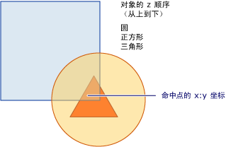

# 可视化层中的命中测试
本主题概述可视化层提供的命中测试功能。  通过命中测试支持，您可以确定某个几何图形或点值是否位于 <xref:System.Windows.Media.Visual> 的呈现内容内，从而可以实现用户界面行为（例如用于选择多个对象的选择矩形）。  
  
   
  
   
## 命中测试方案  
 <xref:System.Windows.UIElement> 类提供了 <xref:System.Windows.UIElement.InputHitTest%2A> 方法，可用于针对使用给定坐标值的元素执行命中测试。  在许多情况下，<xref:System.Windows.UIElement.InputHitTest%2A> 方法为实现元素的命中测试提供了所需功能。  但是，有几种方案可能需要在可视化层实现命中测试。  
  
-   针对非 <xref:System.Windows.UIElement> 对象进行命中测试：适用于对非 <xref:System.Windows.UIElement> 对象（例如 <xref:System.Windows.Media.DrawingVisual> 或图形对象）执行命中测试。  
  
-   使用几何图形进行命中测试：适用于需要使用几何图形对象而不是点的坐标值执行命中测试。  
  
-   针对多个对象进行命中测试：适用于需要对多个对象（例如重叠的对象）执行命中测试。  您可以获取与某个几何图形或点相交的所有可视化对象的结果，而不仅仅是第一个可视化对象的结果。  
  
-   忽略 <xref:System.Windows.UIElement> 命中测试策略：适用于需要忽略 <xref:System.Windows.UIElement> 命中测试策略，该策略将元素是否已禁用或不可见等因素考虑在内。  
  
> [!NOTE]
>  有关阐释在可视化层执行命中测试的完整代码示例，请参见 [Hit Test Using DrawingVisuals Sample](http://go.microsoft.com/fwlink/?LinkID=159994)（使用 DrawingVisuals 进行命中测试示例）和 [Hit Test with Win32 Interoperation Sample](http://go.microsoft.com/fwlink/?LinkID=159995)（Win32 互操作命中测试示例）。  
  
   
## 命中测试支持  
 <xref:System.Windows.Media.VisualTreeHelper> 类中的 <xref:System.Windows.Media.VisualTreeHelper.HitTest%2A> 方法的用途是确定几何图形或点坐标值是否位于给定对象（如控件或图形元素）的呈现内容内。  例如，您可以使用命中测试来确定鼠标在对象边框中的单击点是否位于圆形几何图形内。  您还可以选择重写对命中测试的默认实现来执行您自己的自定义命中测试计算。  
  
 下图显示了某个非矩形对象的区域及其边框之间的关系。  
  
   
有效命中测试区域的关系图  
  
   
## 命中测试和 Z 顺序  
 [!INCLUDE[TLA#tla_winclient](../../../../includes/tlasharptla-winclient-md.md)] 可视化层支持针对点或几何图形下的所有对象执行命中测试，而不仅仅是最顶层对象。  结果以 [Z 顺序](GTMT)返回。  但是，作为 <xref:System.Windows.Media.VisualTreeHelper.HitTest%2A> 方法的参数传递的可视化对象确定要对[可视化树](GTMT)的哪个部分执行命中测试。  您可以对整个可视化树执行命中测试，也可以对其任何部分执行命中测试。  
  
 在下图中，圆对象位于正方形对象和三角形对象之上。  如果您只希望对其 [Z 顺序](GTMT)值为最顶层的可视化对象执行命中测试，则可以设置可视化命中测试枚举，使其在第一个项之后从 <xref:System.Windows.Media.HitTestResultCallback> 返回 <xref:System.Windows.Media.HitTestResultBehavior> 以停止命中测试遍历。  
  
   
可视化树的 Z 顺序的关系图  
  
 如果您希望枚举特定点或几何图形下的所有可视化对象，请从 <xref:System.Windows.Media.HitTestResultCallback> 返回 <xref:System.Windows.Media.HitTestResultBehavior>。  这意味着您可以对某一对象之下的其他可视化对象执行命中测试，即使它们完全被遮盖也是如此。  有关更多信息，请参见“使用命中测试结果回调”部分中的代码示例。  
  
> [!NOTE]
>  还可以对透明的可视化对象执行命中测试。  
  
   
## 使用默认命中测试  
 通过使用 <xref:System.Windows.Media.VisualTreeHelper.HitTest%2A> 方法指定要进行命中测试的可视化对象和点坐标值，可以确定某个点是否处于可视化对象的几何图形之内。  可视化对象参数标识可视化树中命中测试搜索的起始点。  如果在可视化树中找到其几何图形包含此坐标的可视化对象，则将该对象设置为 <xref:System.Windows.Media.HitTestResult> 对象的 <xref:System.Windows.Media.HitTestResult.VisualHit%2A> 属性。  然后从 <xref:System.Windows.Media.VisualTreeHelper.HitTest%2A> 方法返回 <xref:System.Windows.Media.HitTestResult>。  如果要执行命中测试的可视化子树中不包含该点，则 <xref:System.Windows.Media.VisualTreeHelper.HitTest%2A> 返回 `null`。  
  
> [!NOTE]
>  默认命中测试始终返回 [Z 顺序](GTMT)中位于最顶层的对象。  为了标识所有可视化对象，甚至是那些可能被部分或完全遮盖的对象，请使用命中测试结果回调。  
  
 作为 <xref:System.Windows.Media.VisualTreeHelper.HitTest%2A> 方法的点参数传递的坐标值必须相对于要进行命中测试的可视化对象的坐标空间。  例如，如果您在父对象坐标空间中的 \(100, 100\) 处定义了嵌套可视化对象，则对位于 \(0, 0\) 的子可视化对象执行命中测试等效于对父对象坐标空间中 \(100, 100\) 处的子可视化对象执行命中测试。  
  
 下面的代码演示如何为某个 <xref:System.Windows.UIElement> 对象（用于捕获要进行命中测试的事件）设置鼠标事件处理程序。  
  
 [!code-csharp[HitTestingOverview#100](../../../../samples/snippets/csharp/VS_Snippets_Wpf/HitTestingOverview/CSharp/Window1.xaml.cs#100)]
 [!code-vb[HitTestingOverview#100](../../../../samples/snippets/visualbasic/VS_Snippets_Wpf/HitTestingOverview/visualbasic/window1.xaml.vb#100)]  
  
### 可视化树如何影响命中测试  
 可视化树中的起始点确定在对象的命中测试枚举过程中返回哪些对象。  如果有多个要执行命中测试的对象，则可视化树中用作起始点的可视化对象必须是所有相关对象的公共上级。  例如，如果您希望对以下关系图中的按钮元素和绘图可视化对象执行命中测试，则必须将可视化树中的起始点设置为两者的公共上级。  在本例中，画布元素是按钮元素和绘图可视化对象的公共上级。  
  
   
可视化树层次结构的关系图  
  
> [!NOTE]
>  <xref:System.Windows.UIElement.IsHitTestVisible%2A> 属性可获取或设置一个值，该值声明某个 <xref:System.Windows.UIElement> 派生对象是否可以作为其呈现内容某部分的命中测试结果返回。  这样，您便可以选择性地更改可视化树，以确定命中测试中涉及哪些可视化对象。  
  
   
## 使用命中测试结果回调  
 您可以枚举可视化树中其几何图形包含指定坐标值的所有可视化对象。  这样，您便可以标识所有可视化对象，甚至是那些可能被其他可视化对象部分或完全遮盖的对象。  若要枚举可视化树中的可视化对象，请使用带有命中测试回调函数的 <xref:System.Windows.Media.VisualTreeHelper.HitTest%2A> 方法。  当指定的坐标值包含在可视化对象中时，系统将调用该命中测试回调函数。  
  
 在命中测试结果枚举过程中，不应执行修改可视化树的任何操作。  在遍历可视化树的过程中，在可视化树中添加或移除对象会导致不可预知的行为。  您可以在 <xref:System.Windows.Media.VisualTreeHelper.HitTest%2A> 方法返回之后安全地修改可视化树。  您可能想要提供一个数据结构（例如 <xref:System.Collections.ArrayList>），以便在命中测试结果枚举期间存储值。  
  
 [!code-csharp[HitTestingOverview#101](../../../../samples/snippets/csharp/VS_Snippets_Wpf/HitTestingOverview/CSharp/Window1.xaml.cs#101)]
 [!code-vb[HitTestingOverview#101](../../../../samples/snippets/visualbasic/VS_Snippets_Wpf/HitTestingOverview/visualbasic/window1.xaml.vb#101)]  
  
 命中测试回调方法定义当确定对可视化树中的特定可视化对象执行命中测试时要执行的操作。  执行这些操作之后，将返回一个 <xref:System.Windows.Media.HitTestResultBehavior> 值，该值确定是否继续枚举任何其他可视化对象。  
  
 [!code-csharp[HitTestingOverview#102](../../../../samples/snippets/csharp/VS_Snippets_Wpf/HitTestingOverview/CSharp/Window1.xaml.cs#102)]
 [!code-vb[HitTestingOverview#102](../../../../samples/snippets/visualbasic/VS_Snippets_Wpf/HitTestingOverview/visualbasic/window1.xaml.vb#102)]  
  
> [!NOTE]
>  命中的可视化对象按 [Z 顺序](GTMT)进行枚举。  [Z 顺序](GTMT)中位于最顶层的可视化对象最先进行枚举。  所有其他可视化对象按递减的 [Z 顺序](GTMT)级别进行枚举。  此枚举顺序对应于可视化对象的呈现顺序。  
  
 您可以在命中测试回调函数中通过返回 <xref:System.Windows.Media.HitTestResultBehavior> 随时停止对可视化对象的枚举。  
  
 [!code-csharp[HitTestingOverview#103](../../../../samples/snippets/csharp/VS_Snippets_Wpf/HitTestingOverview/CSharp/Window1.xaml.cs#103)]
 [!code-vb[HitTestingOverview#103](../../../../samples/snippets/visualbasic/VS_Snippets_Wpf/HitTestingOverview/visualbasic/window1.xaml.vb#103)]  
  
   
## 使用命中测试筛选回调  
 可以使用可选的命中测试筛选来限制传递到命中测试结果中的对象。  这样，您便可以在处理命中测试结果时忽略可视化树中的无关部分。  若要实现命中测试筛选器，请定义一个命中测试筛选器回调函数，并在调用 <xref:System.Windows.Media.VisualTreeHelper.HitTest%2A> 方法时将其作为参数值进行传递。  
  
 [!code-csharp[HitTestingOverview#104](../../../../samples/snippets/csharp/VS_Snippets_Wpf/HitTestingOverview/CSharp/Window1.xaml.cs#104)]
 [!code-vb[HitTestingOverview#104](../../../../samples/snippets/visualbasic/VS_Snippets_Wpf/HitTestingOverview/visualbasic/window1.xaml.vb#104)]  
  
 如果不希望提供可选的命中测试筛选回调函数，请传递一个 `null` 值作为其 <xref:System.Windows.Media.VisualTreeHelper.HitTest%2A> 方法的参数。  
  
 [!code-csharp[HitTestingOverview#105](../../../../samples/snippets/csharp/VS_Snippets_Wpf/HitTestingOverview/CSharp/Window1.xaml.cs#105)]
 [!code-vb[HitTestingOverview#105](../../../../samples/snippets/visualbasic/VS_Snippets_Wpf/HitTestingOverview/visualbasic/window1.xaml.vb#105)]  
  
   
修剪可视化树  
  
 使用命中测试筛选回调函数可以枚举呈现内容包含指定坐标的所有可视化对象。  但是，您可能要忽略不希望在命中测试结果回调函数中处理的可视化树的某些分支。  命中测试筛选回调函数的返回值确定可视化对象的枚举应执行的操作类型。  例如，如果返回值 <xref:System.Windows.Media.HitTestFilterBehavior>，则可从命中测试结果枚举中移除当前可视化对象及其子对象。  这意味着命中测试结果回调函数在其枚举中将看不到这些对象。  修剪可视化对象树会减少命中测试结果枚举过程中的处理量。  在下面的代码示例中，筛选器会跳过标签及其子代，并对其他所有内容进行命中测试。  
  
 [!code-csharp[HitTestingOverview#106](../../../../samples/snippets/csharp/VS_Snippets_Wpf/HitTestingOverview/CSharp/Window1.xaml.cs#106)]
 [!code-vb[HitTestingOverview#106](../../../../samples/snippets/visualbasic/VS_Snippets_Wpf/HitTestingOverview/visualbasic/window1.xaml.vb#106)]  
  
> [!NOTE]
>  当未调用命中测试结果回调时，有时会调用命中测试筛选回调。  
  
   
## 重写默认命中测试  
 您可以通过重写 <xref:System.Windows.Media.Visual.HitTestCore%2A> 方法来重写可视化对象的默认命中测试支持。  这意味着调用 <xref:System.Windows.Media.VisualTreeHelper.HitTest%2A> 方法时，将调用 <xref:System.Windows.Media.Visual.HitTestCore%2A> 的重写实现。  命中测试位于可视化对象的边框中时将调用重写方法，即使坐标位于可视化对象的呈现内容之外时也是如此。  
  
 [!code-csharp[HitTestingOverview#107](../../../../samples/snippets/csharp/VS_Snippets_Wpf/HitTestingOverview/CSharp/Window1.xaml.cs#107)]
 [!code-vb[HitTestingOverview#107](../../../../samples/snippets/visualbasic/VS_Snippets_Wpf/HitTestingOverview/visualbasic/window1.xaml.vb#107)]  
  
 有时您可能希望对可视化对象的边框和呈现内容均执行命中测试。  通过在重写的 <xref:System.Windows.Media.Visual.HitTestCore%2A> 方法中使用 `PointHitTestParameters` 参数值作为基方法 <xref:System.Windows.Media.Visual.HitTestCore%2A> 的参数，可以基于可视化对象的边框的命中来执行操作，然后针对该可视化对象的呈现内容执行第二次命中测试。  
  
 [!code-csharp[HitTestingOverview#108](../../../../samples/snippets/csharp/VS_Snippets_Wpf/HitTestingOverview/CSharp/Window1.xaml.cs#108)]
 [!code-vb[HitTestingOverview#108](../../../../samples/snippets/visualbasic/VS_Snippets_Wpf/HitTestingOverview/visualbasic/window1.xaml.vb#108)]  
  
## 请参阅  
 <xref:System.Windows.Media.VisualTreeHelper.HitTest%2A>   
 <xref:System.Windows.Media.HitTestResult>   
 <xref:System.Windows.Media.HitTestResultCallback>   
 <xref:System.Windows.Media.HitTestFilterCallback>   
 <xref:System.Windows.UIElement.IsHitTestVisible%2A>   
 [Hit Test Using DrawingVisuals Sample](http://go.microsoft.com/fwlink/?LinkID=159994)   
 [Hit Test with Win32 Interoperation Sample](http://go.microsoft.com/fwlink/?LinkID=159995)   
 [对 Visual 中的几何图形进行命中测试](../../../../docs/framework/wpf/graphics-multimedia/how-to-hit-test-geometry-in-a-visual.md)   
 [使用 Win32 宿主容器执行命中测试](../../../../docs/framework/wpf/graphics-multimedia/how-to-hit-test-using-a-win32-host-container.md)