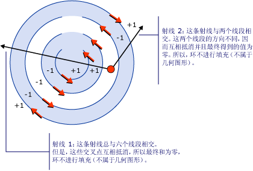

# 如何：控制复合形状的填充
<xref:System.Windows.Media.GeometryGroup.FillRule%2A>属性<xref:System.Windows.Media.GeometryGroup>或<xref:System.Windows.Media.PathGeometry>，指定"规则"复合形状用于确定给定的点是否为几何图形的标识符的一部分。 有两个可能值为<xref:System.Windows.Media.FillRule>: <xref:System.Windows.Media.FillRule>和<xref:System.Windows.Media.FillRule>。 以下各节将介绍如何使用这两个规则。  
  
 **EvenOdd:**此规则确定一个点是否位于填充区域通过从该点沿任意方向绘制一条射线和内给定形状中与该射线相交的路径段数进行计数。 如果此数目为奇数，那么该点则在内部；如果为偶数，则该点在外部。  
  
 例如，下面的 XAML 创建复合形状组成同心环 （目标） 的一系列<xref:System.Windows.Media.GeometryGroup.FillRule%2A>设置为<xref:System.Windows.Media.FillRule>。  
  
 [!code-xml[GeometriesMiscSnippets_snip#FillRuleEvenOddValue](../../../../samples/snippets/xaml/VS_Snippets_Wpf/GeometriesMiscSnippets_snip/XAML/FillRuleExample.xaml#fillruleevenoddvalue)]  
  
 下图显示了在上一示例中创建的形状。  
  
   
  
 在上图中，请注意，不填充的中心和第 3 环。 这是因为从这两个环之一内的任何点绘制一条射线传递数量为偶数的段。 请参阅下图中︰  
  
   
  
 **NonZero:**此规则确定一个点是否在路径的填充区域从该点沿任意方向绘制一条射线，然后检查段形状与射线相交的位置的位置。 从开始计数为零，添加一个每个时间段从左到右中减去&1; 每个与该射线每当路径段与该射线从右到左。 在对交叉点进行计数后，如果结果为零，那么该点则位于路径外。 否则，该点则在路径内。  
  
 [!code-xml[GeometriesMiscSnippets_snip#FillRuleNonZeroValueEllipseGeometry](../../../../samples/snippets/xaml/VS_Snippets_Wpf/GeometriesMiscSnippets_snip/XAML/FillRuleExample.xaml#fillrulenonzerovalueellipsegeometry)]  
  
 使用以下示例中，值为<xref:System.Windows.Media.FillRule>为<xref:System.Windows.Media.GeometryGroup.FillRule%2A>因此提供了下面的插图︰  
  
   
  
 正如您所看到的都将填充所有环。 这是因为所有段都运行相同的方向，因此从任意点绘制一条射线都将与一个或多个段和交点的数目之和不等于零。 例如，在下图中，红色箭头表示段的绘制的方向，白色箭头表示从内部环中的点的任意射线。 从零开始，对于该射线相交，每个段的值开始一个值，该值被添加到右从左向右段与该射线因为。  
  
   
  
 为了更好地演示此行为的<xref:System.Windows.Media.FillRule>规则更复杂的形状与运行在不同的方向中的段是必需的。 下面的 XAML 代码与前面的示例创建字形相似，只不过使用创建<xref:System.Windows.Media.PathGeometry>而不是<xref:System.Windows.Media.EllipseGeometry>这将创建四个同心弧而不是完全封闭的同心圆。  
  
 [!code-xml[GeometriesMiscSnippets_snip#FillRuleNonZeroValuePathGeometry](../../../../samples/snippets/xaml/VS_Snippets_Wpf/GeometriesMiscSnippets_snip/XAML/FillRuleExample.xaml#fillrulenonzerovaluepathgeometry)]  
  
 下图显示了在上一示例中创建的形状。  
  
   
  
 请注意从中心第三个圆弧不被填满。 下图说明了原因。 在图中，红色箭头表示段的绘制的方向。 两个白色箭头表示两个任意射线移出的"非填充"区域中的点。 从图中可看出，在其路径中的段的交叉给定射线值的总和为零。 如上文所定义，总和为零意味着点不是几何图形 （而不是填充的一部分） 的一部分而已总和*不*为零，包括负值，是几何图形的标识符的一部分。  
  
   
  
 **注意︰**出于的<xref:System.Windows.Media.FillRule>，所有形状都被都视为是闭合。 如果在一段差距，绘制假想线以将其关闭。 在上述示例中，有一些小环中的间隙。 鉴于此，其中一个可能会认为穿过此间隙提供不同的结果的射线，然后在另一个方向的射线。 下面是放大的举例说明了一种存在的这些障碍和"假想段"(针对应用的目的进行绘制的段<xref:System.Windows.Media.FillRule>)，将其关闭。  
  
   
  
## 示例  
  
## 另请参阅  
 [创建复合形状](../../../../docs/framework/wpf/graphics-multimedia/how-to-create-a-composite-shape.md)   
 [Geometry 概述](../../../../docs/framework/wpf/graphics-multimedia/geometry-overview.md)