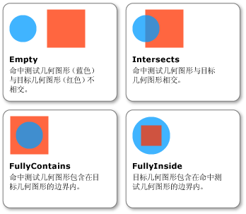

# 如何：将几何图形用作参数的命中测试
此示例演示如何在视觉对象使用上执行命中的测试<xref:System.Windows.Media.Geometry>作为命中测试参数。  
  
## 示例  
 下面的示例演示如何设置命中的测试使用<xref:System.Windows.Media.GeometryHitTestParameters>为<xref:System.Windows.Media.VisualTreeHelper.HitTest%2A>方法。 <xref:System.Windows.Point>值传递给`OnMouseDown`方法用于创建<xref:System.Windows.Media.Geometry>以展开的命中测试的范围的对象。  
  
 [!code-csharp[HitTestingOverview#HitTestingOverviewSnippet10](../../../../samples/snippets/csharp/VS_Snippets_Wpf/HitTestingOverview/CSharp/GeometryHitTest.cs#hittestingoverviewsnippet10)]
 [!code-vb[HitTestingOverview#HitTestingOverviewSnippet10](../../../../samples/snippets/visualbasic/VS_Snippets_Wpf/HitTestingOverview/visualbasic/geometryhittest.vb#hittestingoverviewsnippet10)]  
  
 <xref:System.Windows.Media.GeometryHitTestResult.IntersectionDetail%2A>属性<xref:System.Windows.Media.GeometryHitTestResult>提供有关使用命中测试的结果信息<xref:System.Windows.Media.Geometry>作为命中测试参数。 下图演示了命中测试几何图形（蓝色圆圈）与目标视觉对象（红色正方形）的呈现内容之间的关系。  
  
   
命中测试几何图形与目标视觉对象之间的交集  
  
 下面的示例演示如何实现命中的测试回调时<xref:System.Windows.Media.Geometry>用作命中的测试参数。 `result`参数被强制转换为<xref:System.Windows.Media.GeometryHitTestResult>以便检索的值<xref:System.Windows.Media.GeometryHitTestResult.IntersectionDetail%2A>属性。 属性值，您可以确定如果<xref:System.Windows.Media.Geometry>命中的测试参数完全或部分包含在所呈现内容的命中的测试目标。 在本示例中，示例代码仅将命中测试结果添加到完全包含在目标边界中的视觉对象的列表中。  
  
 [!code-csharp[HitTestingOverview#HitTestingOverviewSnippet11](../../../../samples/snippets/csharp/VS_Snippets_Wpf/HitTestingOverview/CSharp/GeometryHitTest.cs#hittestingoverviewsnippet11)]
 [!code-vb[HitTestingOverview#HitTestingOverviewSnippet11](../../../../samples/snippets/visualbasic/VS_Snippets_Wpf/HitTestingOverview/visualbasic/geometryhittest.vb#hittestingoverviewsnippet11)]  
  
> [!NOTE]
>  <xref:System.Windows.Media.HitTestResult>交集详细信息时，不应该调用回调<xref:System.Windows.Media.IntersectionDetail.Empty>。  
  
## 请参阅  
 [可视化层中的命中测试](../../../../docs/framework/wpf/graphics-multimedia/hit-testing-in-the-visual-layer.md)  
 [对视觉对象中的几何图形进行命中测试](../../../../docs/framework/wpf/graphics-multimedia/how-to-hit-test-geometry-in-a-visual.md)
