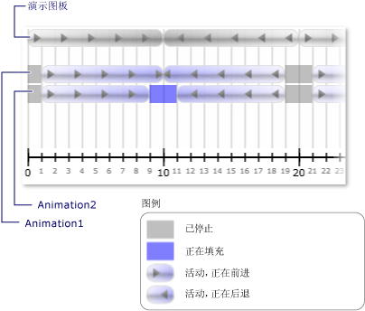

# 如何： 接收通知时时钟&#39;s 状态更改
时钟的<xref:System.Windows.Media.Animation.Clock.CurrentStateInvalidated>事件发生时其<xref:System.Windows.Media.Animation.Clock.CurrentState%2A>将变为无效，如时钟时启动或停止。 你可以直接使用此事件注册<xref:System.Windows.Media.Animation.Clock>，或者也可以注册使用<xref:System.Windows.Media.Animation.Timeline>。  
  
 在下面的示例中，<xref:System.Windows.Media.Animation.Storyboard>和两个<xref:System.Windows.Media.Animation.DoubleAnimation>使用对象进行动画处理的两个矩形的宽度。 <xref:System.Windows.Media.Animation.Timeline.CurrentStateInvalidated>事件用于侦听的时钟状态更改。  
  
## 示例  
 [!code-xaml[timingbehaviors_snip#_graphicsmm_StateExampleMarkupWholePage](../../../../samples/snippets/csharp/VS_Snippets_Wpf/timingbehaviors_snip/CSharp/StateExample.xaml#_graphicsmm_stateexamplemarkupwholepage)]  
  
 [!code-csharp[timingbehaviors_snip#_graphicsmm_StateEventHandlers](../../../../samples/snippets/csharp/VS_Snippets_Wpf/timingbehaviors_snip/CSharp/StateExample.xaml.cs#_graphicsmm_stateeventhandlers)]
 [!code-vb[timingbehaviors_snip#_graphicsmm_StateEventHandlers](../../../../samples/snippets/visualbasic/VS_Snippets_Wpf/timingbehaviors_snip/visualbasic/stateexample.xaml.vb#_graphicsmm_stateeventhandlers)]  
  
 下图显示的不同状态动画输入作为父时间线 (*情节提要*) 进行。  
  
   
  
 下表显示时间从该处*Animation1*的<xref:System.Windows.Media.Animation.Timeline.CurrentStateInvalidated>事件将触发：  
  
||||||||  
|-|-|-|-|-|-|-|  
|时间 （秒）|1|10|19|21|30|39|  
|状态|活动的|活动的|已停止|活动的|活动的|已停止|  
  
 下表显示时间从该处*Animation2*的<xref:System.Windows.Media.Animation.Timeline.CurrentStateInvalidated>事件将触发：  
  
||||||||||  
|-|-|-|-|-|-|-|-|-|  
|时间 （秒）|1|9|11|19|21|29|31|39|  
|状态|活动的|填充|活动的|已停止|活动的|填充|活动的|已停止|  
  
 请注意， *Animation1*的<xref:System.Windows.Media.Animation.Timeline.CurrentStateInvalidated>在 10 秒，将激发的事件，即使其状态保持<xref:System.Windows.Media.Animation.ClockState.Active>。 这是因为在 10 秒，更改其状态，但它从更改<xref:System.Windows.Media.Animation.ClockState.Active>到<xref:System.Windows.Media.Animation.ClockState.Filling>和再转回<xref:System.Windows.Media.Animation.ClockState.Active>中相同的刻度。
