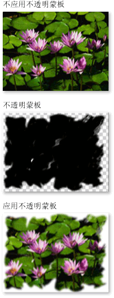
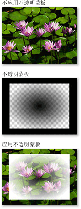

# 不透明遮罩概述
使用不透明蒙板，您可以使某个元素或 visual 类的某些部分呈现出透明或部分透明的效果。  若要创建不透明蒙板，请将 <xref:System.Windows.Media.Brush> 应用到元素或 <xref:System.Windows.Media.Visual> 的 <xref:System.Windows.UIElement.OpacityMask%2A> 属性。  将画笔映射到元素或 visual 类，每个画笔像素的不透明度值用于确定对应的元素或 visual 类像素的不透明度值。  
  
 本主题包括以下部分。  
  
   
-   [必备组件](#prereqs)  
  
-   [使用不透明蒙板创建可视化效果](#opacitymasks)  
  
-   [创建不透明蒙板](#creatingopacitymasks)  
  
-   [将渐变用作不透明蒙板](#creatingopacitymaskswithgradients)  
  
-   [为不透明蒙板指定渐变停止点](#specifyinggradientcolors)  
  
-   [将图像用作不透明蒙板](#usingimageasopacitymask)  
  
-   [根据绘图创建不透明蒙板](#drawingbrushasopacitymask)  
  
-   [相关主题](#seeAlsoToggle)  
  
   
## 必备组件  
 本概述假定您熟悉 <xref:System.Windows.Media.Brush> 对象。  有关画笔用法的介绍，请参见[使用纯色和渐变进行绘制概述](../../../../docs/framework/wpf/graphics-multimedia/painting-with-solid-colors-and-gradients-overview.md)。  有关 <xref:System.Windows.Media.ImageBrush> 和 <xref:System.Windows.Media.DrawingBrush> 的信息，请参见[使用图像、绘图和 Visual 进行绘制](../../../../docs/framework/wpf/graphics-multimedia/painting-with-images-drawings-and-visuals.md)。  
  
   
## 使用不透明蒙板创建可视化效果  
 不透明蒙板通过将其内容映射到元素或 visual 类来发挥作用。  然后，使用各画笔像素的 [alpha 通道](GTMT)确定元素或 visual 类的相应像素的不透明度值，并忽略画笔的实际颜色。  如果画笔的指定部分是透明的，则元素或 visual 类的相应部分也将变成透明的。  如果画笔的指定部分是不透明的，则元素或 visual 类的相应部分的不透明度保持不变。  应将不透明蒙板指定的不透明度与元素或 visual 类中存在的任何不透明度设置结合使用。  例如，如果元素的不透明度值为 25%，并且应用的不透明蒙板从完全不透明过渡到完全透明，则元素会从 25% 不透明过渡到完全透明。  
  
> [!NOTE]
>  本概述中的示例只演示了如何将不透明蒙板应用到图像元素，而事实上，可以将它应用到任何元素或 <xref:System.Windows.Media.Visual>，包括各种面板和控件。  
  
 不透明蒙板可用来创建各种各样有趣的可视化效果，例如创建逐渐从视野中消失的图像或按钮、向元素中添加纹理或者结合渐变制造出玻璃般的图面。  下面的插图演示不透明蒙板的用法：  方格形背景用于显示蒙板的透明部分。  
  
   
不透明蒙板示例  
  
   
## 创建不透明蒙板  
 若要创建不透明蒙板，请创建一个 <xref:System.Windows.Media.Brush> 并将其应用到元素或 visual 类的 <xref:System.Windows.UIElement.OpacityMask%2A> 属性。  可以将任何类型的 <xref:System.Windows.Media.Brush> 用作不透明蒙板。  
  
-   <xref:System.Windows.Media.LinearGradientBrush>、<xref:System.Windows.Media.RadialGradientBrush>：用来使元素或 visual 类逐渐从视野中消失。  
  
     下面的图像显示了将 <xref:System.Windows.Media.LinearGradientBrush> 用作不透明蒙板的效果。  
  
       
LinearGradientBrush 不透明蒙板示例  
  
-   <xref:System.Windows.Media.ImageBrush>：用来创建纹理和制造柔化或撕裂边缘效果。  
  
     下面的图像显示了将 <xref:System.Windows.Media.ImageBrush> 用作不透明蒙板的效果。  
  
       
LinearGradientBrush 不透明蒙板示例  
  
-   <xref:System.Windows.Media.DrawingBrush>：用来根据各种模式的形状、图像和渐变创建复杂的不透明蒙板。  
  
     下面的图像显示了将 <xref:System.Windows.Media.DrawingBrush> 用作不透明蒙板的效果。  
  
       
DrawingBrush 不透明蒙板示例  
  
 渐变画笔（<xref:System.Windows.Media.LinearGradientBrush> 和 <xref:System.Windows.Media.RadialGradientBrush>）非常适合于用作不透明蒙板。  因为 <xref:System.Windows.Media.SolidColorBrush> 将区域填充为统一的颜色，因此其不透明蒙板效果较弱；使用 <xref:System.Windows.Media.SolidColorBrush> 的效果相当于设置元素或 visual 类的 <xref:System.Windows.UIElement.OpacityMask%2A> 属性。  
  
   
## 将渐变用作不透明蒙板  
 若要创建渐变填充，请指定两个或多个渐变停止点。  每个渐变停止点都包含并描述了一种颜色和一个位置（有关创建和使用渐变的更多信息，请参见[使用纯色和渐变进行绘制概述](../../../../docs/framework/wpf/graphics-multimedia/painting-with-solid-colors-and-gradients-overview.md)）。  此过程与将渐变用作不透明蒙板类似，所不同的是，此处不透明蒙板渐变混合 alpha 通道值，而不是混合颜色。  因此，渐变内容的实际颜色无关紧要，只有各种颜色的 alpha 通道或不透明度才是比较重要的。  下面是一个示例。  
  
 <!-- TODO: review snippet reference [!code-xml[OpacityMasksExample#LinearGradientOpacityMaskonImage](../../../../samples/snippets/csharp/VS_Snippets_Wpf/OpacityMasksExample/CS/GradientBrushExample.xaml#lineargradientopacitymaskonimage)]  -->
 <!-- TODO: review snippet reference [!code-xml[OpacityMasksExample#LinearGradientOpacityMaskonImage](../../../../samples/snippets/xaml/VS_Snippets_Wpf/OpacityMasksExample/XAML/GradientBrushExample.xaml#lineargradientopacitymaskonimage)]  -->  
  
   
## 为不透明蒙板指定渐变停止点  
 在上面的示例中，系统定义的颜色 <xref:System.Windows.Media.Colors.Black%2A> 用作渐变的开始颜色。  由于 <xref:System.Windows.Media.Colors> 类中除 <xref:System.Windows.Media.Colors.Transparent%2A> 之外的所有颜色都是完全不透明的，因此可以将这些颜色用来定义渐变不透明蒙板的开始颜色。  
  
 对于在定义不透明蒙板时对 alpha 值其他控制，可以使用标记中的 [!INCLUDE[TLA#tla_argb](../../../../includes/tlasharptla-argb-md.md)] 十六进制表示法或使用 <xref:System.Windows.Media.Color.FromScRgb%2A?displayProperty=fullName> 方法指定颜色的 alpha 通道。  
  
   
### 在“XAML”中指定颜色的不透明度  
 在 [!INCLUDE[TLA#tla_xaml](../../../../includes/tlasharptla-xaml-md.md)] 中，使用 [!INCLUDE[TLA2#tla_argb](../../../../includes/tla2sharptla-argb-md.md)] 十六进制表示法指定各颜色的不透明度。  [!INCLUDE[TLA2#tla_argb](../../../../includes/tla2sharptla-argb-md.md)] 十六进制表示法使用以下语法：  
  
 `#`**aa** *rrggbb*  
  
 上一行中的 *aa* 表示用于指定颜色的不透明度的两位十六进制值。  *rr*、*gg* 和 *bb* 分别表示用于指定颜色中的红色分量、绿色分量和蓝色分量的两位十六进制值。  每个十六进制数字都是 0\-9 或 A\-F 中的一个值。  其中 0 是最小值，F 是最大值。  Alpha 值 00 用于指定完全透明的颜色，而 alpha 值 FF 用于建完全不透明的颜色。  在下面的示例中，使用十六进制 [!INCLUDE[TLA2#tla_argb](../../../../includes/tla2sharptla-argb-md.md)] 表示法来指定两种颜色。  第一种是完全不透明的，第二种是完全透明的。  
  
 <!-- TODO: review snippet reference [!code-xml[OpacityMasksExample#AARRGGBBValueonOpacityMask](../../../../samples/snippets/csharp/VS_Snippets_Wpf/OpacityMasksExample/CS/GradientBrushExample.xaml#aarrggbbvalueonopacitymask)]  -->
 <!-- TODO: review snippet reference [!code-xml[OpacityMasksExample#AARRGGBBValueonOpacityMask](../../../../samples/snippets/xaml/VS_Snippets_Wpf/OpacityMasksExample/XAML/GradientBrushExample.xaml#aarrggbbvalueonopacitymask)]  -->  
  
   
## 将图像用作不透明蒙板  
 图像也可用作不透明蒙板。  下面的图像就是一个很好的例子。  方格形背景用于显示蒙板的透明部分。  
  
   
不透明蒙板示例  
  
 若要将图像用作不透明蒙板，请使用 <xref:System.Windows.Media.ImageBrush> 以包含图像。  创建作为不透明蒙板使用的图像时，请将图像保存为支持多个透明度级别的格式，如[!INCLUDE[TLA#tla_png](../../../../includes/tlasharptla-png-md.md)]。  下面的示例演示了用于创建上述效果的代码。  
  
 <!-- TODO: review snippet reference [!code-xml[OpacityMasksExample#UIElementOpacityMask](../../../../samples/snippets/csharp/VS_Snippets_Wpf/OpacityMasksExample/CS/ImageBrushExample.xaml#uielementopacitymask)]  -->
 <!-- TODO: review snippet reference [!code-xml[OpacityMasksExample#UIElementOpacityMask](../../../../samples/snippets/xaml/VS_Snippets_Wpf/OpacityMasksExample/XAML/ImageBrushExample.xaml#uielementopacitymask)]  -->  
  
   
### 将平铺的图像用作不透明蒙板  
 在下面的示例中，通过另一个 <xref:System.Windows.Media.ImageBrush> 来利用同一图像，但是还利用了该画笔的平铺功能来生成图像为 50 像素的正方形的平铺效果。  
  
 <!-- TODO: review snippet reference [!code-xml[OpacityMasksExample#TiledImageasOpacityMask](../../../../samples/snippets/csharp/VS_Snippets_Wpf/OpacityMasksExample/CS/ImageBrushExample.xaml#tiledimageasopacitymask)]  -->
 <!-- TODO: review snippet reference [!code-xml[OpacityMasksExample#TiledImageasOpacityMask](../../../../samples/snippets/xaml/VS_Snippets_Wpf/OpacityMasksExample/XAML/ImageBrushExample.xaml#tiledimageasopacitymask)]  -->  
  
   
## 根据绘图创建不透明蒙板  
 绘图也可用作不透明蒙板。  绘图内包含的形状本身可以使用渐变、纯色、图像甚至其他绘图来填充。  下面的图像举例说明了将绘图用作不透明蒙板的效果。  方格形背景用于显示蒙板的透明部分。  
  
   
DrawingBrush 不透明蒙板示例  
  
 若要将绘图用作不透明蒙板，请使用 <xref:System.Windows.Media.DrawingBrush> 以包含绘图。  下面的示例演示了用于创建上述效果的代码：  
  
 <!-- TODO: review snippet reference [!code-xml[OpacityMasksExample#OpacityMaskfromDrawing](../../../../samples/snippets/csharp/VS_Snippets_Wpf/OpacityMasksExample/CS/DrawingBrushExample.xaml#opacitymaskfromdrawing)]  -->
 <!-- TODO: review snippet reference [!code-xml[OpacityMasksExample#OpacityMaskfromDrawing](../../../../samples/snippets/xaml/VS_Snippets_Wpf/OpacityMasksExample/XAML/DrawingBrushExample.xaml#opacitymaskfromdrawing)]  -->  
  
   
### 将平铺的绘图用作不透明蒙板  
 与 <xref:System.Windows.Media.ImageBrush> 相同，<xref:System.Windows.Media.DrawingBrush> 也可用来平铺其绘图。  在下面的示例中，绘图画笔用于创建平铺的不透明蒙板。  
  
 <!-- TODO: review snippet reference [!code-xml[OpacityMasksExample#TiledDrawingasOpacityMask](../../../../samples/snippets/csharp/VS_Snippets_Wpf/OpacityMasksExample/CS/DrawingBrushExample.xaml#tileddrawingasopacitymask)]  -->
 <!-- TODO: review snippet reference [!code-xml[OpacityMasksExample#TiledDrawingasOpacityMask](../../../../samples/snippets/xaml/VS_Snippets_Wpf/OpacityMasksExample/XAML/DrawingBrushExample.xaml#tileddrawingasopacitymask)]  -->  
  
## 请参阅  
 [使用图像、绘图和 Visual 进行绘制](../../../../docs/framework/wpf/graphics-multimedia/painting-with-images-drawings-and-visuals.md)   
 [使用纯色和渐变进行绘制概述](../../../../docs/framework/wpf/graphics-multimedia/painting-with-solid-colors-and-gradients-overview.md)