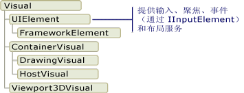
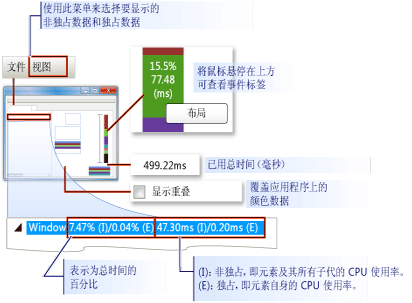
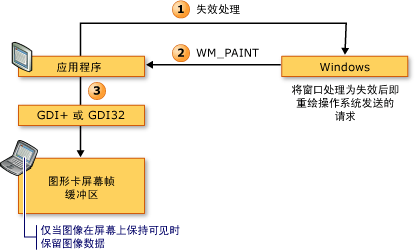
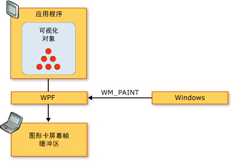
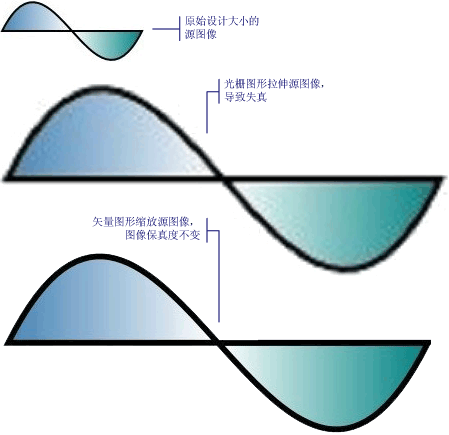
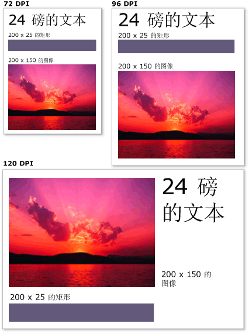

# WPF 图形呈现疑难解答
本主题概述 [!INCLUDE[TLA2#tla_winclient](../../../../includes/tla2sharptla-winclient-md.md)] 可视化层。  本主题重点讲述 [!INCLUDE[TLA2#tla_winclient](../../../../includes/tla2sharptla-winclient-md.md)] 模型中呈现支持的 <xref:System.Windows.Media.Visual> 类的角色。  
  
 [!INCLUDE[autoOutline](../Token/autoOutline_md.md)]  
  
   
## Visual 对象的角色  
 <xref:System.Windows.Media.Visual> 类是每个 <xref:System.Windows.FrameworkElement> 对象所派生自的基本抽象。  该类还充当在 [!INCLUDE[TLA2#tla_winclient](../../../../includes/tla2sharptla-winclient-md.md)] 中编写新控件的入口点。在 Win32 应用程序模型中，该类在许多方面可以被视为窗口句柄 \(HWND\)。  
  
 <xref:System.Windows.Media.Visual> 对象是一个核心 [!INCLUDE[TLA2#tla_winclient](../../../../includes/tla2sharptla-winclient-md.md)] 对象，它的主要角色是提供呈现支持。  用户界面控件（如 <xref:System.Windows.Controls.Button> 和 <xref:System.Windows.Controls.TextBox>）派生自 <xref:System.Windows.Media.Visual> 类，并使用它来保持它们的呈现数据。  <xref:System.Windows.Media.Visual> 对象为下列功能提供支持：  
  
-   输出显示：呈现 Visual 对象的持久的序列化绘图内容。  
  
-   转换：对可视对象执行转换。  
  
-   剪辑：为 Visual 对象提供剪辑区域支持。  
  
-   命中测试：确定 Visual 对象的边界内是否包含坐标或几何形状。  
  
-   边界框计算：确定 Visual 对象的边框。  
  
 但是，<xref:System.Windows.Media.Visual> 对象不包括对非呈现功能的支持，如：  
  
-   事件处理  
  
-   布局  
  
-   样式  
  
-   数据绑定  
  
-   全球化  
  
 <xref:System.Windows.Media.Visual> 作为子类必须派生自的公共抽象类进行公开。  下图显示了 [!INCLUDE[TLA2#tla_winclient](../../../../includes/tla2sharptla-winclient-md.md)] 中所公开的可视化对象的层次结构。  
  
   
Visual 类的层次结构  
  
### DrawingVisual 类  
 <xref:System.Windows.Media.DrawingVisual> 是一个用于呈现形状、图像或文本的轻量绘图类。  此类之所以被视为轻量，是因为它不提供布局或事件处理功能，从而能够改善运行时性能。  因此，绘图最适于背景和剪贴画。  <xref:System.Windows.Media.DrawingVisual> 可用于创建自定义可视化对象。  有关更多信息，请参见[使用 DrawingVisual 对象](../../../../docs/framework/wpf/graphics-multimedia/using-drawingvisual-objects.md)。  
  
### Viewport3DVisual 类  
 <xref:System.Windows.Media.Media3D.Viewport3DVisual> 在二维 <xref:System.Windows.Media.Visual> 和 <xref:System.Windows.Media.Media3D.Visual3D> 对象之间起到桥梁作用。  <xref:System.Windows.Media.Media3D.Visual3D> 类是所有三维可视化元素的基类。  <xref:System.Windows.Media.Media3D.Viewport3DVisual> 要求您定义一个 <xref:System.Windows.Media.Media3D.Viewport3DVisual.Camera%2A> 值和一个 <xref:System.Windows.Media.Media3D.Viewport3DVisual.Viewport%2A> 值。  可以借助照相机来查看场景。  投影映射到二维图面的区域称作视区。  有关 [!INCLUDE[TLA2#tla_winclient](../../../../includes/tla2sharptla-winclient-md.md)] 中三维形状的更多信息，请参见[三维图形概述](../../../../docs/framework/wpf/graphics-multimedia/3-d-graphics-overview.md)。  
  
### ContainerVisual 类  
 <xref:System.Windows.Media.ContainerVisual> 类用作 <xref:System.Windows.Media.Visual> 对象集的容器。  <xref:System.Windows.Media.DrawingVisual> 类派生自 <xref:System.Windows.Media.ContainerVisual> 类，这允许它包含可视化对象的集合。  
  
### 可视化对象中的绘图内容  
 <xref:System.Windows.Media.Visual> 对象将它的呈现数据另存为**向量图形指令列表**。  指令列表中的每一项都以序列化格式表示一组低级别的图形数据及其相关资源。  共有四种不同类型的呈现数据可以包含绘图内容。  
  
|绘图内容类型|说明|  
|------------|--------|  
|向量图形|表示向量图形数据以及任何相关的 <xref:System.Windows.Media.Brush> 和 <xref:System.Windows.Media.Pen> 信息。|  
|Image|表示 <xref:System.Windows.Rect> 所定义区域中的图像。|  
|标志符号|表示用来呈现 <xref:System.Windows.Media.GlyphRun>（来自指定字体资源中的一系列标志符号）的绘图。  这就是文本的表示方式。|  
|视频|表示用来呈现视频的绘图。|  
  
 通过 <xref:System.Windows.Media.DrawingContext>，您可用可视化内容填充 <xref:System.Windows.Media.Visual>。  当您使用 <xref:System.Windows.Media.DrawingContext> 对象的绘图命令时，实际上是存储一组日后将由图形系统使用的呈现数据，而不是实时绘制到屏幕上。  
  
 当您创建 [!INCLUDE[TLA2#tla_winclient](../../../../includes/tla2sharptla-winclient-md.md)] 控件（如 <xref:System.Windows.Controls.Button>）时，该控件会为绘图对象本身隐式生成呈现数据。  例如，设置 <xref:System.Windows.Controls.Button> 的 <xref:System.Windows.Controls.ContentControl.Content%2A> 属性会导致该控件存储标志符号的呈现表示。  
  
 <xref:System.Windows.Media.Visual> 将其内容描述为一个或多个包含在 <xref:System.Windows.Media.DrawingGroup> 中的 <xref:System.Windows.Media.Drawing> 对象。  <xref:System.Windows.Media.DrawingGroup> 还描述了应用于其内容的不透明度蒙版、变换、位图效果及其他操作。  呈现内容时，<xref:System.Windows.Media.DrawingGroup> 操作按下列顺序应用：<xref:System.Windows.Media.DrawingGroup.OpacityMask%2A>、<xref:System.Windows.Media.DrawingGroup.Opacity%2A>、<xref:System.Windows.Media.DrawingGroup.BitmapEffect%2A>、<xref:System.Windows.Media.DrawingGroup.ClipGeometry%2A>、<xref:System.Windows.Media.DrawingGroup.GuidelineSet%2A> 和 <xref:System.Windows.Media.DrawingGroup.Transform%2A>。  
  
 下图显示了在呈现过程中 <xref:System.Windows.Media.DrawingGroup> 操作的应用顺序。  
  
   
DrawingGroup 操作的顺序  
  
 有关更多信息，请参见[Drawing 对象概述](../../../../docs/framework/wpf/graphics-multimedia/drawing-objects-overview.md)。  
  
#### 在可视化层绘制内容  
 绝不能直接实例化 <xref:System.Windows.Media.DrawingContext>；但可以通过某些方法（例如 <xref:System.Windows.Media.DrawingGroup.Open%2A?displayProperty=fullName> 和 <xref:System.Windows.Media.DrawingVisual.RenderOpen%2A?displayProperty=fullName>）获取绘图上下文。  下面的示例从 <xref:System.Windows.Media.DrawingVisual> 中检索 <xref:System.Windows.Media.DrawingContext> 并将其用于绘制矩形。  
  
 [!code-csharp[drawingvisualsample#101](../../../../samples/snippets/csharp/VS_Snippets_Wpf/DrawingVisualSample/CSharp/Window1.xaml.cs#101)]
 [!code-vb[drawingvisualsample#101](../../../../samples/snippets/visualbasic/VS_Snippets_Wpf/DrawingVisualSample/visualbasic/window1.xaml.vb#101)]  
  
#### 在可视化层枚举绘图内容  
 此外，<xref:System.Windows.Media.Drawing> 对象还可提供用来枚举 <xref:System.Windows.Media.Visual> 内容的对象模型。  
  
> [!NOTE]
>  您在枚举可视化层的内容时，就是相当于在检索 <xref:System.Windows.Media.Drawing> 对象，而不是以向量图形指令列表形式检索呈现数据的基础表示。  
  
 下面的示例使用 <xref:System.Windows.Media.VisualTreeHelper.GetDrawing%2A> 方法来检索 <xref:System.Windows.Media.Visual> 的 <xref:System.Windows.Media.DrawingGroup> 值并枚举该值。  
  
 [!code-csharp[DrawingMiscSnippets_snip#GraphicsMMRetrieveDrawings](../../../../samples/snippets/csharp/VS_Snippets_Wpf/DrawingMiscSnippets_snip/CSharp/EnumerateDrawingsExample.xaml.cs#graphicsmmretrievedrawings)]  
  
   
## 如何使用可视化对象来生成控件  
 [!INCLUDE[TLA2#tla_winclient](../../../../includes/tla2sharptla-winclient-md.md)] 中的许多对象都由其他可视化对象组成，这意味着它们可以包含子代对象的各种层次结构。  [!INCLUDE[TLA2#tla_winclient](../../../../includes/tla2sharptla-winclient-md.md)] 中的许多用户界面元素（如控件）都由多个表示不同类型呈现元素的可视化对象组成。  例如，<xref:System.Windows.Controls.Button> 控件可以包含许多其他对象，其中包括 <xref:Microsoft.Windows.Themes.ClassicBorderDecorator>、<xref:System.Windows.Controls.ContentPresenter> 和 <xref:System.Windows.Controls.TextBlock>。  
  
 下面的代码显示的是在标记中定义的 <xref:System.Windows.Controls.Button> 控件。  
  
 [!code-xml[VisualsOverview#VisualsOverviewSnippet1](../../../../samples/snippets/csharp/VS_Snippets_Wpf/VisualsOverview/CSharp/Window1.xaml#visualsoverviewsnippet1)]  
  
 如果您要枚举包含默认 <xref:System.Windows.Controls.Button> 控件的可视化对象，则将发现如下所示的可视化对象层次结构：  
  
   
可视化树层次结构的关系图  
  
 <xref:System.Windows.Controls.Button> 控件包含一个 <xref:Microsoft.Windows.Themes.ClassicBorderDecorator> 元素，该元素又包含一个 <xref:System.Windows.Controls.ContentPresenter> 元素。  <xref:Microsoft.Windows.Themes.ClassicBorderDecorator> 元素负责为 <xref:System.Windows.Controls.Button> 绘制边框和背景。  <xref:System.Windows.Controls.ContentPresenter> 元素负责显示 <xref:System.Windows.Controls.Button> 的内容。  在本例中，由于您要显示文本，因此 <xref:System.Windows.Controls.ContentPresenter> 元素中包含一个 <xref:System.Windows.Controls.TextBlock> 元素。  <xref:System.Windows.Controls.Button> 控件使用 <xref:System.Windows.Controls.ContentPresenter>，这意味着该控件的内容可以由其他元素（如 <xref:System.Windows.Controls.Image>）或几何形状（如 <xref:System.Windows.Media.EllipseGeometry>）来表示。  
  
### 控件模板  
 将控件扩展为控件层次结构的关键在于 <xref:System.Windows.Controls.ControlTemplate>。  控件模板为控件指定默认的可视化层次结构。  当您显式引用某个控件时，会隐式引用它的可视化层次结构。  您可以重写控件模板的默认值，以便为控件创建自定义的可视化外观。  例如，您可以修改 <xref:System.Windows.Controls.Button> 控件的背景颜色值，以便它使用线性渐变颜色值，而不使用纯色值。  有关更多信息，请参见 [Button 样式和模板](../../../../docs/framework/wpf/controls/button-styles-and-templates.md)。  
  
 用户界面元素（如 <xref:System.Windows.Controls.Button> 控件）包含几个向量图形指令列表，这些列表描述控件的全部呈现定义。  下面的代码显示的是在标记中定义的 <xref:System.Windows.Controls.Button> 控件。  
  
 [!code-xml[VisualsOverview#VisualsOverviewSnippet2](../../../../samples/snippets/csharp/VS_Snippets_Wpf/VisualsOverview/CSharp/Window1.xaml#visualsoverviewsnippet2)]  
  
 如果您要枚举包含 <xref:System.Windows.Controls.Button> 控件的可视化对象和向量图形指令列表，则将发现如下所示的可视化对象层次结构：  
  
   
可视化树和呈现数据的关系图  
  
 <xref:System.Windows.Controls.Button> 控件包含一个 <xref:Microsoft.Windows.Themes.ClassicBorderDecorator> 元素，该元素又包含一个 <xref:System.Windows.Controls.ContentPresenter> 元素。  <xref:Microsoft.Windows.Themes.ClassicBorderDecorator> 元素负责绘制所有构成按钮边框和背景的离散图形元素。  <xref:System.Windows.Controls.ContentPresenter> 元素负责显示 <xref:System.Windows.Controls.Button> 的内容。  在本例中，由于您要显示图像，因此 <xref:System.Windows.Controls.ContentPresenter> 元素中包含一个 <xref:System.Windows.Controls.Image> 元素。  
  
 对于可视化对象和向量图形指令列表的层次结构，需要注意多个事项：  
  
-   该层次结构中的排序表示绘图信息的呈现顺序。  从可视化元素的根，按照从左到右、从上到下的顺序遍历子元素。  如果某个元素有可视化子元素，则会先遍历该元素的子元素，然后再遍历该元素的同级。  
  
-   层次结构中的非叶节点元素（如 <xref:System.Windows.Controls.ContentPresenter>）用于包含子元素，它们并不包含指令列表。  
  
-   如果可视化元素既包含向量图形指令列表又包含可视化子级，则会先呈现父级可视化元素中的指令列表，然后再呈现任何可视化子对象中的绘图。  
  
-   向量图形指令列表中的项按照从左到右的顺序呈现。  
  
   
## 可视化树  
 可视化树中包含某个应用程序的用户界面所使用的所有可视化元素。  由于可视化元素中包含持久的绘图信息，因此您可以将可视化树视为场景图，其中包含将输出写入显示设备所必需的全部呈现信息。  该树汇集了由该应用程序在代码或标记中直接创建的所有可视化元素。  该可视化树还包含由元素（如控件和数据对象）的模板扩展功能创建的所有可视化元素。  
  
 下面的代码显示的是在标记中定义的 <xref:System.Windows.Controls.StackPanel> 元素。  
  
 [!code-xml[VisualsOverview#VisualsOverviewSnippet3](../../../../samples/snippets/csharp/VS_Snippets_Wpf/VisualsOverview/CSharp/Window1.xaml#visualsoverviewsnippet3)]  
  
 如果您要枚举包含标记示例中 <xref:System.Windows.Controls.StackPanel> 元素的可视化对象，将发现如下所示可视化对象的层次结构：  
  
   
可视化树层次结构的关系图  
  
### 呈现顺序  
 通过可视化树，可以确定 [!INCLUDE[TLA2#tla_winclient](../../../../includes/tla2sharptla-winclient-md.md)] 可视化对象和绘图对象的呈现顺序。  将从位于可视化树中最顶层节点中的可视化元素根开始遍历，  然后将按照从左到右的顺序遍历可视化元素根的子级。  如果某个可视化元素有子级，则将先遍历该可视化元素的子级，然后再遍历其同级。  这意味着子可视化元素的内容先于该可视化元素本身的内容而呈现。  
  
   
可视化树呈现顺序的关系图  
  
### 可视化元素根  
 **可视化元素根**是可视化树层次结构中最顶层的元素。  在大多数应用程序中，可视化元素根的基类是 <xref:System.Windows.Window> 或 <xref:System.Windows.Navigation.NavigationWindow>。  但是，如果您在 Win32 应用程序中承载可视化对象，则可视化元素根将是在 Win32 窗口中承载的最顶层的可视化元素。  有关更多信息，请参见 [教程：在 Win32 应用程序中承载 Visual 对象](../../../../docs/framework/wpf/graphics-multimedia/tutorial-hosting-visual-objects-in-a-win32-application.md)。  
  
### 与逻辑树的关系  
 [!INCLUDE[TLA2#tla_winclient](../../../../includes/tla2sharptla-winclient-md.md)] 中的逻辑树表示应用程序在运行时的元素。  尽管您不直接操作该树，但是该应用程序视图对于了解属性继承和事件路由非常有用。  与可视化树不同，逻辑树可以表示非可视化数据对象（如 <xref:System.Windows.Documents.ListItem>）。  在许多情况下，逻辑树密切映射到应用程序的标记定义。  下面的代码显示的是在标记中定义的 <xref:System.Windows.Controls.DockPanel> 元素。  
  
 [!code-xml[VisualsOverview#VisualsOverviewSnippet5](../../../../samples/snippets/csharp/VS_Snippets_Wpf/VisualsOverview/CSharp/Window1.xaml#visualsoverviewsnippet5)]  
  
 如果您要枚举包含标记示例中 <xref:System.Windows.Controls.DockPanel> 元素的逻辑对象，则将发现如下所示逻辑对象的层次结构：  
  
   
逻辑树的关系图  
  
 可视化树和逻辑树与当前的应用程序元素集合同步，并反映对元素进行的任何添加、删除或修改。  但是，这些树表示不同的应用程序视图。  与可视化树不同，逻辑树不展开控件的 <xref:System.Windows.Controls.ContentPresenter> 元素。  这意味着同一组对象的逻辑树和可视化树之间没有直接的一对一对应关系。  实际上，在将同一个元素用作参数的情况下，调用 **LogicalTreeHelper** 对象的 <xref:System.Windows.LogicalTreeHelper.GetChildren%2A> 方法与调用 **VisualTreeHelper** 对象的 <xref:System.Windows.Media.VisualTreeHelper.GetChild%2A> 方法会生成不同的结果。  
  
 有关逻辑树的更多信息，请参见 [WPF 中的树](../../../../docs/framework/wpf/advanced/trees-in-wpf.md)。  
  
### 使用 XamlPad 查看可视化树  
 [!INCLUDE[TLA2#tla_winclient](../../../../includes/tla2sharptla-winclient-md.md)] 工具 \(XamlPad\) 提供了一个用来查看和浏览可视化树的选项，该树与当前所定义的 [!INCLUDE[TLA#tla_titlexaml](../../../../includes/tlasharptla-titlexaml-md.md)] 内容相对应。  单击菜单栏上的**“显示可视化树”**按钮可显示相应的可视化树。  下面将说明如何在 XamlPad 的**“可视化树资源管理器”**面板中将 [!INCLUDE[TLA#tla_titlexaml](../../../../includes/tlasharptla-titlexaml-md.md)] 内容扩展为可视化树节点：  
  
   
XamlPad 中的“可视化树资源管理器”面板  
  
 请注意 <xref:System.Windows.Controls.Label>、<xref:System.Windows.Controls.TextBox> 和 <xref:System.Windows.Controls.Button> 控件如何在 XamlPad 的**“可视化树资源管理器”**面板中各自显示一个可视化对象层次结构。  这是由于 [!INCLUDE[TLA2#tla_winclient](../../../../includes/tla2sharptla-winclient-md.md)] 控件具有一个包含其可视化树的 <xref:System.Windows.Controls.ControlTemplate>。  当您显式引用某个控件时，会隐式引用它的可视化层次结构。  
  
### 分析可视化性能  
 [!INCLUDE[TLA2#tla_winclient](../../../../includes/tla2sharptla-winclient-md.md)] 提供了一套性能分析工具，来帮助您分析应用程序的运行时行为，并确定可以应用的性能优化的类型。  可视化探查器工具通过直接映射到应用程序的可视化树来为性能数据提供一个丰富的图形视图。  在此屏幕快照中，可视化探查器的**“CPU 使用率”**部分使您可以清楚地了解对象对 [!INCLUDE[TLA2#tla_winclient](../../../../includes/tla2sharptla-winclient-md.md)] 服务（如呈现和布局）的使用情况。  
  
   
可视化探查器显示输出  
  
   
## 可视化对象的呈现行为  
 [!INCLUDE[TLA2#tla_winclient](../../../../includes/tla2sharptla-winclient-md.md)] 引进了几个影响可视化对象呈现行为的功能：保留的模式图形、矢量图形和与设备无关的图形。  
  
### 保留的模式图形  
 了解**即时模式**和**保留模式**图形系统之间的区别是了解 Visual 对象角色的要点之一。  基于 GDI 或 GDI\+ 的标准 Win32 应用程序使用即时模式图形系统。  这意味着应用程序负责重新绘制工作区中由于某项操作（如调整窗口大小）或者对象的可视化外观发生变化而失效的部分。  
  
   
Win32 呈现顺序的关系图  
  
 与之相比，[!INCLUDE[TLA2#tla_winclient](../../../../includes/tla2sharptla-winclient-md.md)] 使用保留模式系统。  这意味着具有可视化外观的应用程序对象定义一组序列化绘图数据。  在定义了绘图数据之后，系统会响应所有的重新绘制请求来呈现应用程序对象。  甚至在运行时，您也可以修改或创建应用程序对象，并仍旧依赖系统响应绘制请求。  保留模式图形系统中有一个强大功能，那就是绘图信息总是由应用程序保持为序列化状态，但是呈现功能仍由系统负责。  下面的关系图演示应用程序如何依赖 [!INCLUDE[TLA2#tla_winclient](../../../../includes/tla2sharptla-winclient-md.md)] 来响应绘制请求。  
  
   
WPF 呈现顺序的关系图  
  
#### 智能重绘  
 使用保留模型图形的最大好处之一就是，[!INCLUDE[TLA2#tla_winclient](../../../../includes/tla2sharptla-winclient-md.md)] 可以高效率地优化需要在应用程序中重绘的内容。  即使您有一个具有各种不透明度的复杂场景，通常也不必编写特殊用途的代码来优化重绘功能。  请将智能重绘功能与 Win32 编程进行比较，在后者中，可以通过最小化更新区域中的重绘量来尽力优化应用程序。  有关在 Win32 应用程序中优化重绘功能时涉及到的复杂度类型的示例，请参见[在更新区域中重绘](_win32_Redrawing_in_the_Update_Region)。  
  
### 向量图形  
 [!INCLUDE[TLA2#tla_winclient](../../../../includes/tla2sharptla-winclient-md.md)] 使用**向量图形**作为其呈现数据的格式。  向量图形（包括可缩放的向量图形 \(SVG\)、Windows 元文件 \(.wmf\) 和 TrueType 字体）存储呈现数据，并以指令列表的形式传输该呈现数据，这些指令描述如何使用图形基元来重新创建图像。  例如，TrueType 字体是描述一组直线、曲线和命令（而不是像素数组）的矢量字。  矢量图形的主要好处之一就是能够伸缩到任何大小和分辨率。  
  
 与矢量图形不同，位图图形以图像的逐像素表示形式来存储呈现数据，而且在特定的分辨率下预先呈现。  位图图形格式和矢量图形格式的主要区别之一就是对原始图像的保真度。  例如，当某个源图像的大小发生变化时，位图图形系统会拉伸该图像，而向量图形系统会伸缩该图像，从而保持图像的保真度。  
  
 下图显示了源图像在放大到 3 倍时的情况。  请注意，当源图像作为位图图形拉伸时会发生失真，而当源图像作为矢量图形伸缩时，则不会发生失真。  
  
   
光栅图形和矢量图形之间的区别  
  
 下面的标记显示所定义的两个 <xref:System.Windows.Shapes.Path> 元素。  第二个元素使用 <xref:System.Windows.Media.ScaleTransform> 将第一个元素的绘图指令放大到 3 倍。  请注意 <xref:System.Windows.Shapes.Path> 元素中的绘图指令保持不变。  
  
 [!code-xml[VectorGraphicsSnippets#VectorGraphicsSnippet1](../../../../samples/snippets/csharp/VS_Snippets_Wpf/VectorGraphicsSnippets/CS/PageOne.xaml#vectorgraphicssnippet1)]  
  
### 关于分辨率和与设备无关的图形  
 可通过以下两个系统因子来确定屏幕上的文本大小和图形大小：分辨率和 DPI。  分辨率描述出现在屏幕上的像素数量。  由于分辨率变大，因此像素会变小，从而导致所显示的图形和文本会变小。  在将显示器的分辨率从 1024 x 768 更改为 1600 x 1200 时，显示器上所显示的图形会小得多。  
  
 另一个系统设置 \(DPI\) 以像素数来描述屏幕英寸的大小。  大多数 [!INCLUDE[TLA#tla_mswin](../../../../includes/tlasharptla-mswin-md.md)] 系统的 DPI 都为 96，这意味着一屏幕英寸等于 96 个像素。  增加 DPI 设置会使屏幕英寸变大，减小 DPI 会使屏幕英寸变小。  这意味着屏幕英寸与实际的英寸不相等；在多数系统上，二者很有可能不相等。  当您增加 DPI 时，屏幕英寸会变大，因此支持 DPI 的图形和文本也会变大。  增加 DPI 可能会增强文本的可读性，在高分辨率下尤其如此。  
  
 并非所有的应用程序都支持 DPI：一些应用程序将硬件像素作为其主要计量单位；更改系统 DPI 不会对这些应用程序产生任何影响。  许多其他应用程序都使用支持 DPI 的单位来描述字号，使用像素来描述任何其他内容。  DPI 太小或太大都可能会导致这些应用程序出现布局问题，因为应用程序的文本会随着系统的 DPI 设置而伸缩，而应用程序的 UI 却不会出现此类问题。  对于使用 [!INCLUDE[TLA2#tla_winclient](../../../../includes/tla2sharptla-winclient-md.md)] 开发的应用程序，此问题已经消除。  
  
 [!INCLUDE[TLA2#tla_winclient](../../../../includes/tla2sharptla-winclient-md.md)] 支持通过将与设备无关的像素（而不是硬件像素）用作其主要计量单位来自动伸缩；图像和文本会适当伸缩，而无需应用程序开发人员执行任何额外的工作。  下图显示了 [!INCLUDE[TLA2#tla_winclient](../../../../includes/tla2sharptla-winclient-md.md)] 文本和图形在不同 DPI 设置下的显示方式的示例。  
  
   
不同 DPI 设置下的图形和文本  
  
   
## VisualTreeHelper 类  
 <xref:System.Windows.Media.VisualTreeHelper> 类是一个静态帮助器类，它提供了一个要在可视化对象级别编程的低级功能，该类在非常特殊的方案（如开发高性能自定义控件）中非常有用。  在大多数情况下，更高级的 [!INCLUDE[TLA2#tla_winclient](../../../../includes/tla2sharptla-winclient-md.md)] 框架对象（如 <xref:System.Windows.Controls.Canvas> 和 <xref:System.Windows.Controls.TextBlock>）提供更大的灵活性且更易于使用。  
  
### 命中测试  
 <xref:System.Windows.Media.VisualTreeHelper> 类提供了当默认的命中测试支持无法满足您的需要时，针对可视化对象的命中测试方法。  可以在 <xref:System.Windows.Media.VisualTreeHelper> 类中使用 <xref:System.Windows.Media.VisualTreeHelper.HitTest%2A> 方法来确定几何形状或点坐标值是否位于给定对象（如控件或图形元素）的边界内。  例如，您可以使用命中测试来确定鼠标在对象边框中的单击点是否落在圆形几何形状内部。您还可以选择重写对命中测试的默认实现来执行自己的自定义命中测试计算。  
  
 有关命中测试的更多信息，请参见[可视化层中的命中测试](../../../../docs/framework/wpf/graphics-multimedia/hit-testing-in-the-visual-layer.md)。  
  
### 枚举可视化树  
 <xref:System.Windows.Media.VisualTreeHelper> 类提供了用来枚举可视化树成员的功能。  若要检索父级，请调用 <xref:System.Windows.Media.VisualTreeHelper.GetParent%2A> 方法。  若要检索可视化对象的子级或直接子代，请调用 <xref:System.Windows.Media.VisualTreeHelper.GetChild%2A> 方法。  此方法返回父级在指定索引处的子 <xref:System.Windows.Media.Visual>。  
  
 下面的示例演示如何枚举一个可视化对象的所有子代，如果您对序列化可视化对象层次结构的所有呈现信息感兴趣，则可能希望使用该技术。  
  
 [!code-csharp[VisualsOverview#101](../../../../samples/snippets/csharp/VS_Snippets_Wpf/VisualsOverview/CSharp/Window1.xaml.cs#101)]
 [!code-vb[VisualsOverview#101](../../../../samples/snippets/visualbasic/VS_Snippets_Wpf/VisualsOverview/visualbasic/window1.xaml.vb#101)]  
  
 在大多数情况下，逻辑树更能表示 [!INCLUDE[TLA2#tla_winclient](../../../../includes/tla2sharptla-winclient-md.md)] 应用程序中的元素。  尽管您不直接修改逻辑树，但是该应用程序视图对于了解属性继承和事件路由非常有用。  与可视化树不同，逻辑树可以表示非可视化数据对象（如 <xref:System.Windows.Documents.ListItem>）。  有关逻辑树的更多信息，请参见 [WPF 中的树](../../../../docs/framework/wpf/advanced/trees-in-wpf.md)。  
  
 <xref:System.Windows.Media.VisualTreeHelper> 类提供用来返回可视化对象边框的方法。  可以通过调用 <xref:System.Windows.Media.VisualTreeHelper.GetContentBounds%2A> 来返回可视化对象的边框。  可以通过调用 <xref:System.Windows.Media.VisualTreeHelper.GetDescendantBounds%2A> 来返回可视化对象及其所有子代的边框。  下面的代码演示如何计算可视化对象及其所有子代的边框。  
  
 [!code-csharp[VisualsOverview#102](../../../../samples/snippets/csharp/VS_Snippets_Wpf/VisualsOverview/CSharp/Window1.xaml.cs#102)]
 [!code-vb[VisualsOverview#102](../../../../samples/snippets/visualbasic/VS_Snippets_Wpf/VisualsOverview/visualbasic/window1.xaml.vb#102)]  
  
## 请参阅  
 <xref:System.Windows.Media.Visual>   
 <xref:System.Windows.Media.VisualTreeHelper>   
 <xref:System.Windows.Media.DrawingVisual>   
 [二维图形和图像处理](../../../../docs/framework/wpf/advanced/optimizing-performance-2d-graphics-and-imaging.md)   
 [可视化层中的命中测试](../../../../docs/framework/wpf/graphics-multimedia/hit-testing-in-the-visual-layer.md)   
 [使用 DrawingVisual 对象](../../../../docs/framework/wpf/graphics-multimedia/using-drawingvisual-objects.md)   
 [教程：在 Win32 应用程序中承载 Visual 对象](../../../../docs/framework/wpf/graphics-multimedia/tutorial-hosting-visual-objects-in-a-win32-application.md)   
 [优化 WPF 应用程序性能](../../../../docs/framework/wpf/advanced/optimizing-wpf-application-performance.md)