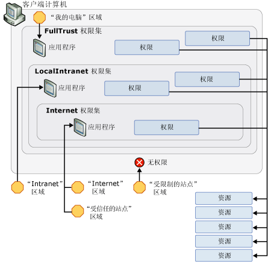

# WPF 安全策略 - 平台安全性
尽管 Windows Presentation Foundation (WPF) 提供了各种安全服务，它还利用的安全功能的基础平台，包括操作系统， [!INCLUDE[TLA2#tla_clr](../../../includes/tla2sharptla-clr-md.md)]，和[!INCLUDE[TLA2#tla_ie](../../../includes/tla2sharptla-ie-md.md)]。 这些层组合在一起旨在提供 [!INCLUDE[TLA2#tla_wpf](../../../includes/tla2sharptla-wpf-md.md)] 强大且深层防御的安全模型，尝试避免任何单点故障，如下图所示：  
  
   
  
 本主题的其余部分主要讨论与 [!INCLUDE[TLA2#tla_wpf](../../../includes/tla2sharptla-wpf-md.md)] 相关的各个层。  
  

  
   
## 操作系统安全  
 [!INCLUDE[TLA2#tla_wpf](../../../includes/tla2sharptla-wpf-md.md)] 要求的操作系统最低级别是 [!INCLUDE[TLA2#tla_winxpsp2](../../../includes/tla2sharptla-winxpsp2-md.md)]。 核心[!INCLUDE[TLA2#tla_winxpsp2](../../../includes/tla2sharptla-winxpsp2-md.md)]提供了一些安全功能，窗体中所有的 Windows 应用程序，包括那些使用生成的安全基础[!INCLUDE[TLA2#tla_wpf](../../../includes/tla2sharptla-wpf-md.md)]。 [!INCLUDE[TLA#tla_longhorn](../../../includes/tlasharptla-longhorn-md.md)] 包含 [!INCLUDE[TLA2#tla_wpf](../../../includes/tla2sharptla-wpf-md.md)] 的安全功能并对其进行了进一步扩展。 本主题详细介绍了对 [!INCLUDE[TLA2#tla_wpf](../../../includes/tla2sharptla-wpf-md.md)] 至关重要的这些安全功能，以及 [!INCLUDE[TLA2#tla_wpf](../../../includes/tla2sharptla-wpf-md.md)] 如何与这些功能集成从而提供深层防御方面的知识。  
  
   
### Microsoft Windows XP Service Pack 2 (SP2)  
 除了常规评审和增强的 Windows，有三个主要功能从[!INCLUDE[TLA2#tla_winxpsp2](../../../includes/tla2sharptla-winxpsp2-md.md)]，本主题中，我们将讨论：  
  
-   /GS 编译  
  
-   [!INCLUDE[TLA#tla_win_update](../../../includes/tlasharptla-win-update-md.md)]。  
  
#### /GS 编译  
 [!INCLUDE[TLA2#tla_winxpsp2](../../../includes/tla2sharptla-winxpsp2-md.md)] 通过对众多核心系统库进行重新编译提供保护，这些核心系统库包括所有 [!INCLUDE[TLA2#tla_wpf](../../../includes/tla2sharptla-wpf-md.md)] 依赖项（如 [!INCLUDE[TLA2#tla_clr](../../../includes/tla2sharptla-clr-md.md)] 以帮助缓解缓冲区溢出。 通过使用/GS 形参和 C/C++ 命令行编译器可实现这一点。 虽然应显式避免缓冲区溢出，但 /GS 编译针对由它们无意或恶意创建的潜在漏洞提供了深层防御示例。  
  
 以前，缓冲区溢出已导致出现了许多影响较大的安全漏洞。 当攻击者利用代码漏洞时就会发生缓冲区溢出，代码漏洞可让注入的恶意代码通过缓冲区边界写入。 从而让攻击者可以通过重写导致执行攻击者代码的函数返回地址执行代码进程。 结果，恶意代码可以执行具有截获进程相同特权的任意代码。  
  
 在较高级别，/GS 编译器标志通过注入特殊安全 cookie 保护部分潜在缓冲区溢出，从而保护具有本地字符串缓冲区的函数返回地址。 函数返回后，安全 cookie 将与其上一个值进行比较。 如果值已更改，可能已发生缓冲区溢出，并且该进程已停止并显示错误条件。 停止的进程将阻止执行潜在的恶意代码。 请参阅[/GS （缓冲区安全检查）](http://msdn.microsoft.com/library/8dbf701c.aspx)有关详细信息。  
  
 [!INCLUDE[TLA2#tla_wpf](../../../includes/tla2sharptla-wpf-md.md)] 已使用/GS 标志进行编译，旨在对 [!INCLUDE[TLA2#tla_wpf](../../../includes/tla2sharptla-wpf-md.md)] 应用程序增加另一层防御。  
  
#### Microsoft Windows Update 增强功能  
 [!INCLUDE[TLA#tla_win_update](../../../includes/tlasharptla-win-update-md.md)] 也对 [!INCLUDE[TLA2#tla_winxpsp2](../../../includes/tla2sharptla-winxpsp2-md.md)] 进行了改进，以简化用于下载和安装更新的过程。 这些更改通过帮助确保其系统（尤其是设计到安全更新）处于最新状态，显著地增强了 [!INCLUDE[TLA2#tla_wpf](../../../includes/tla2sharptla-wpf-md.md)] 客户的安全。  
  
   
### Windows Vista  
 [!INCLUDE[TLA#tla_longhorn](../../../includes/tlasharptla-longhorn-md.md)] 上的 [!INCLUDE[TLA2#tla_wpf](../../../includes/tla2sharptla-wpf-md.md)] 用户将从操作系统其他的安全增强功能中受益，这些功能包括“Least-Privilege User Access(最小特权用户访问)”、代码完整性检查以及特权隔离。  
  
#### 用户帐户控制 (UAC)  
 如今，Windows 用户往往因为许多应用程序需要它们才能安装和/或执行，使用管理员特权运行。 其中一个示例就是，可以将默认应用程序设置写入到注册表。  
  
 使用管理员特权运行实际上就是指应用程序从授予管理员特权的进程执行。 此方法的安全影响在于，可截获使用管理员特权运行的进程的任何恶意代码都将自动继承这些特权，包括对关键系统资源的访问权限。  
  
 保护计算机免受此安全威胁的一种方法就是使用所需的最少特权数运行应用程序。 这就是通常所说的最低特权原则，也是 [!INCLUDE[TLA#tla_longhorn](../../../includes/tlasharptla-longhorn-md.md)] 操作系统的核心功能。 此功能称为用户帐户控制 (UAC)，被 [!INCLUDE[TLA#tla_longhorn](../../../includes/tlasharptla-longhorn-md.md)] UAC 使用，主要有两种使用方式：  
  
-   若要在默认情况下使用 UAC 特权运行大多数应用程序，即使用户是管理员，也只有需要使用管理员特权的应用程序才会使用管理员特权运行。 要使用管理特权运行，必须以应用程序清单形式或作为安全策略中的一个条目显式标记应用程序。  
  
-   提供兼容性解决方案(如虚拟化)。 例如，许多应用程序尝试写入受限位置，例如 C:\Program Files。 对于在 UAC 中执行的应用程序，存在基于用户的可选位置无需管理员特权就能写入。 对于在 UAC 中运行的应用程序，UAC 可虚拟化 C:\Program Files，这样认为其写入到其中的应用程序实际上是写入到基于用户的可选位置。 这种兼容性工作可使操作系统来运行许多以前无法在 UAC 中运行的应用程序。  
  
#### 代码完整性检查  
 [!INCLUDE[TLA#tla_longhorn](../../../includes/tlasharptla-longhorn-md.md)] 集成了更深入的代码完整性检查，有助于防止恶意代码在负载/运行时注入到系统文件或内核。 这超出了系统文件保护。  
  
   
### 浏览器承载的应用程序的受限权限进程  
 浏览器承载的 [!INCLUDE[TLA2#tla_wpf](../../../includes/tla2sharptla-wpf-md.md)] 应用程序在 Internet 区域沙箱内执行。 [!INCLUDE[TLA2#tla_wpf](../../../includes/tla2sharptla-wpf-md.md)] 与 [!INCLUDE[TLA#tla_ie](../../../includes/tlasharptla-ie-md.md)] 集成扩展了此保护，可提供其他支持。  
  
#### Internet Explorer 6 Service Pack 2 和适用于 XP 的 Internet Explorer 7  
 [!INCLUDE[TLA2#tla_wpf](../../../includes/tla2sharptla-wpf-md.md)] 通过限制 [!INCLUDE[TLA#tla_winfxwebapp#plural](../../../includes/tlasharptla-winfxwebappsharpplural-md.md)] 的进程特权利用操作系统安全提供进一步的保护。 在启动浏览器承载的 [!INCLUDE[TLA2#tla_wpf](../../../includes/tla2sharptla-wpf-md.md)] 应用程序之前，操作系统会创建一个宿主进程，用于删除进程令牌中不必要的特权。 删除的特权的部分示例包括：关闭用户的计算机、加载驱动程序以及读取计算机上所有文件的访问权限的能力。  
  
#### 适用于 Vista 的 Internet Explorer 7  
 在 [!INCLUDE[TLA#tla_ie7](../../../includes/tlasharptla-ie7-md.md)] 中，[!INCLUDE[TLA2#tla_wpf](../../../includes/tla2sharptla-wpf-md.md)] 应用程序以受保护模式运行。 具体而言，[!INCLUDE[TLA#tla_xbap#plural](../../../includes/tlasharptla-xbapsharpplural-md.md)] 以中等级别的完整性运行。  
  
#### 深层防御层  
 由于 [!INCLUDE[TLA#tla_winfxwebapp#plural](../../../includes/tlasharptla-winfxwebappsharpplural-md.md)] 通常都是通过 Internet 区域权限集设置的沙盒，因此，删除这些权限不会损害 [!INCLUDE[TLA#tla_winfxwebapp#plural](../../../includes/tlasharptla-winfxwebappsharpplural-md.md)] 的兼容性。 反而会创建一个附加的深层防御层；如果经过沙箱处理的应用程序能够利用其他层截获此进程，该进程将仍然只有有限特权。  
  
 请参阅[使用最少特权用户帐户](http://technet.microsoft.com/library/cc700846.aspx)。  
  
   
## 公共语言运行时的安全性  
 [!INCLUDE[TLA#tla_clr](../../../includes/tlasharptla-clr-md.md)] 提供了多个主要安全优势，包括确认和验证、[!INCLUDE[TLA#tla_cas](../../../includes/tlasharptla-cas-md.md)] 和安全关键方法。  
  
   
### 确认和验证  
 为了提供程序集隔离和完整性，[!INCLUDE[TLA2#tla_clr](../../../includes/tla2sharptla-clr-md.md)] 将使用验证过程。 [!INCLUDE[TLA2#tla_clr](../../../includes/tla2sharptla-clr-md.md)] 验证可确保程序集通过以下方式进行隔离：即通过验证其指向程序集外部地址的可移植可执行 (PE) 文件的格式。 [!INCLUDE[TLA2#tla_clr](../../../includes/tla2sharptla-clr-md.md)] 验证还可以验证内嵌在程序集中的元数据的完整性。  
  
 若要确保类型安全，帮助防止常见安全问题 （例如缓冲区溢出），并启用通过子进程隔离的沙盒处理[!INCLUDE[TLA2#tla_clr](../../../includes/tla2sharptla-clr-md.md)]安全性使用验证的概念。  
  
 托管应用程序被编译为 Microsoft 中间语言 (MSIL)。 当执行托管应用程序中的方法时，将采用实时 (JIT) 编译方式把 MSIL 编译为本机代码。 JIT 编译包括的验证过程将应用许多众多安全和可靠规则，从而确保代码不会：  
  
-   违反类型合约  
  
-   引入缓冲区溢出  
  
-   随意访问内存。  
  
 不允许不符合验证规则的托管代码执行，除非它被视为受信任代码。  
  
 可验证代码的优点是关键原因为何[!INCLUDE[TLA2#tla_wpf](../../../includes/tla2sharptla-wpf-md.md)]在.NET Framework 上生成。 从使用验证代码而言，利用潜在漏洞的可能性明显降低。  
  
   
### 代码访问安全性  
 客户端计算机公开了托管应用程序可以访问的各种资源，包括文件系统、注册表、打印服务、用户界面、反射和环境变量。 托管的应用程序可以访问任何客户端计算机上的资源之前，它必须具有.NET Framework 权这样做。 [!INCLUDE[TLA2#tla_cas](../../../includes/tla2sharptla-cas-md.md)] 中的权限是 <xref:System.Security.CodeAccessPermission> 的子类；[!INCLUDE[TLA2#tla_cas](../../../includes/tla2sharptla-cas-md.md)] 可实现托管应用程序可以访问的各个资源的其中一个子类。  
  
 [!INCLUDE[TLA2#tla_cas](../../../includes/tla2sharptla-cas-md.md)] 开始执行时授予托管应用程序的权限集称为一个权限集，由应用程序提供的证据确定。 对于 [!INCLUDE[TLA2#tla_wpf](../../../includes/tla2sharptla-wpf-md.md)] 应用程序，提供的证据为从中启动应用程序的位置或区域。 [!INCLUDE[TLA2#tla_cas](../../../includes/tla2sharptla-cas-md.md)] 可以标识以下区域：  
  
-   **我的电脑**。 从客户端计算机（完全受信任）上启动的应用程序。  
  
-   **本地 Intranet**。 从 Intranet 启动的应用程序。 （某种程度上受信任）。  
  
-   **Internet**。 从 Intranet 启动的应用程序。 （最不受信任）。  
  
-   **受信任的站点**。 由受信任用户标识的应用程序。 （最不受信任）。  
  
-   **不受信任的站点**。 由不受信任的用户标识的应用程序。 （不受信任）。  
  
 对于这些区域中的任一一个，[!INCLUDE[TLA2#tla_cas](../../../includes/tla2sharptla-cas-md.md)] 都会提供一个预定义的权限集，包括可匹配与之关联的信任级别的权限。 这些方法包括：  
  
-   **FullTrust**。 对于从启动应用程序**我的电脑**区域。 将授予全部可能的权限。  
  
-   **LocalIntranet**。 对于从启动应用程序**本地 Intranet**区域。 将授予权限的子集，以提供对客户端计算机资源适度的访问权限，包括隔离存储、用户界面的无限制访问、无限制使用文件对话框、有限的反射和有限访问环境变量。 不提供对关键资源（如注册表）的权限。  
  
-   **Internet**。 对于从启动应用程序**Internet**或**受信任的站点**区域。 将授予权限的子集，以提供对客户端计算机资源有限的访问权限，包括隔离存储、仅限打开文件和有限的用户界面。 从根本上来说，此权限集将隔离客户端计算机中的应用程序。  
  
 应用程序识别为从**不受信任站点**区域会授予任何权限通过[!INCLUDE[TLA2#tla_cas](../../../includes/tla2sharptla-cas-md.md)]根本。 因此，对它们而言，就不存在预定义的权限集。  
  
 下图说明了区域、权限集、权限和资源之间的关系。  
  
   
  
 Internet 区域安全沙盒的限制条件同样适用于 [!INCLUDE[TLA2#tla_winfxwebapp](../../../includes/tla2sharptla-winfxwebapp-md.md)] 从系统库导入的任何代码，包括 [!INCLUDE[TLA2#tla_wpf](../../../includes/tla2sharptla-wpf-md.md)]。 这可确保代码的每一位都是锁定的，即便 [!INCLUDE[TLA2#tla_wpf](../../../includes/tla2sharptla-wpf-md.md)] 也是如此。 遗憾的是，为了能够执行，[!INCLUDE[TLA2#tla_winfxwebapp](../../../includes/tla2sharptla-winfxwebapp-md.md)] 需要执行要求更多权限的功能，所需的权限比通过 Internet 区域安全沙盒启用的那些功能的权限还要多。  
  
 假设 [!INCLUDE[TLA2#tla_winfxwebapp](../../../includes/tla2sharptla-winfxwebapp-md.md)] 应用程序包括以下页面：  
  
 [!code-csharp[WPFPlatformSecuritySnippets#Permission](../../../samples/snippets/csharp/VS_Snippets_Wpf/WPFPlatformSecuritySnippets/CSharp/Page1.xaml.cs#permission)]
 [!code-vb[WPFPlatformSecuritySnippets#Permission](../../../samples/snippets/visualbasic/VS_Snippets_Wpf/WPFPlatformSecuritySnippets/VisualBasic/Page1.xaml.vb#permission)]  
  
 要执行此 [!INCLUDE[TLA2#tla_winfxwebapp](../../../includes/tla2sharptla-winfxwebapp-md.md)][!INCLUDE[TLA2#tla_wpf](../../../includes/tla2sharptla-wpf-md.md)] 基础代码必须执行更多可用功能，而不止是调用 [!INCLUDE[TLA2#tla_winfxwebapp](../../../includes/tla2sharptla-winfxwebapp-md.md)]包括：  
  
-   创建用于呈现的窗口句柄 (hWnd)  
  
-   调度消息  
  
-   加载 Tahoma 字体  
  
 从安全角度而言，允许从沙盒应用程序直接访问上述任何操作将会导致灾难性后果。  
  
 而 [!INCLUDE[TLA2#tla_wpf](../../../includes/tla2sharptla-wpf-md.md)] 通过允许代表沙盒应用程序使用提升的特权来执行这些操作可解决这种情况。 虽然会根据 [!INCLUDE[TLA2#tla_wpf](../../../includes/tla2sharptla-wpf-md.md)] 的应用程序域中的有限 Internet 区域安全权限检查所有 [!INCLUDE[TLA2#tla_winfxwebapp](../../../includes/tla2sharptla-winfxwebapp-md.md)] 操作，但 [!INCLUDE[TLA2#tla_wpf](../../../includes/tla2sharptla-wpf-md.md)]（就像其他系统库一样）将获得包括所有可能权限的权限集  
  
 这就要求 [!INCLUDE[TLA2#tla_wpf](../../../includes/tla2sharptla-wpf-md.md)] 接收提升的特权，同时阻止这些特权由宿主应用程序域的 Internet 区域权限集管理。  
  
 [!INCLUDE[TLA2#tla_wpf](../../../includes/tla2sharptla-wpf-md.md)] 通过使用这一点**断言**权限的方法。 以下代码演示了这种方法。  
  
 [!code-csharp[WPFPlatformSecuritySnippets#Permission](../../../samples/snippets/csharp/VS_Snippets_Wpf/WPFPlatformSecuritySnippets/CSharp/Page1.xaml.cs#permission)]
 [!code-vb[WPFPlatformSecuritySnippets#Permission](../../../samples/snippets/visualbasic/VS_Snippets_Wpf/WPFPlatformSecuritySnippets/VisualBasic/Page1.xaml.vb#permission)]  
  
 **断言**实质上是阻止所需的不受限制的权限[!INCLUDE[TLA2#tla_wpf](../../../includes/tla2sharptla-wpf-md.md)]从正在受 Internet 区域权限[!INCLUDE[TLA2#tla_winfxwebapp](../../../includes/tla2sharptla-winfxwebapp-md.md)]。  
  
 从平台的角度，[!INCLUDE[TLA2#tla_wpf](../../../includes/tla2sharptla-wpf-md.md)]负责使用**断言**使用的正确; 错误**断言**可能会导致恶意代码特权提升。 因此，很重要，应仅调用**断言**需要时，并且以确保该沙盒限制将保留不变。 例如，禁止沙盒代码打开任意文件，但允许其使用字体。 [!INCLUDE[TLA2#tla_wpf](../../../includes/tla2sharptla-wpf-md.md)] 使沙盒应用程序可以通过调用使用字体功能**断言**，和[!INCLUDE[TLA2#tla_wpf](../../../includes/tla2sharptla-wpf-md.md)]读取已知代表与沙盒应用程序中包含这些字体的文件。  
  
   
### ClickOnce 部署  
 [!INCLUDE[TLA#tla_clickonce](../../../includes/tlasharptla-clickonce-md.md)] 是全面的部署技术，其包含在.NET Framework 中，并与集成[!INCLUDE[TLA#tla_visualstu](../../../includes/tlasharptla-visualstu-md.md)](请参阅[ClickOnce 部署概述](http://msdn.microsoft.com/library/142dbbz4.aspx)有关详细信息)。 独立的 [!INCLUDE[TLA2#tla_wpf](../../../includes/tla2sharptla-wpf-md.md)] 应用程序可以使用 [!INCLUDE[TLA#tla_clickonce](../../../includes/tlasharptla-clickonce-md.md)] 进行部署，但浏览器承载的应用程序必须使用 [!INCLUDE[TLA2#tla_clickonce](../../../includes/tla2sharptla-clickonce-md.md)] 进行部署。  
  
 使用 [!INCLUDE[TLA2#tla_clickonce](../../../includes/tla2sharptla-clickonce-md.md)] 部署的应用程序具有高于 [!INCLUDE[TLA#tla_cas](../../../includes/tlasharptla-cas-md.md)] 的额外安全层；实质上，[!INCLUDE[TLA#tla_clickonce](../../../includes/tlasharptla-clickonce-md.md)] 部署的应用程序会请求所需的权限。 如果它们不超过在其中部署应用程序的区域的权限集，几乎仅授予它们这些权限。 通过将权限集减少至仅限于所需的权限集，即使它们小于通过启动区域权限集提供的那些权限集，应用程序可以访问的资源数也会减少至最低限度。 因此，如果截获到应用程序，将可以降低对客户端计算机的潜在损坏几率。  
  
   
### 安全-关键方法  
 [!INCLUDE[TLA2#tla_wpf](../../../includes/tla2sharptla-wpf-md.md)] 代码可以使用权限启动 [!INCLUDE[TLA2#tla_winfxwebapp](../../../includes/tla2sharptla-winfxwebapp-md.md)] 应用程序的 Internet 区域沙盒，因此，必须将该代码保留到安全程度最高的审计和控制中。 为了便于此要求，.NET Framework 时，可提供新的支持用于管理提升特权的代码。 具体而言，[!INCLUDE[TLA2#tla_clr](../../../includes/tla2sharptla-clr-md.md)]使您能够确定提升特权的代码并将其与标记<xref:System.Security.SecurityCriticalAttribute>; 的任何代码未用标记<xref:System.Security.SecurityCriticalAttribute>变得*透明*使用此方法。 反之，禁止未标有 <xref:System.Security.SecurityCriticalAttribute> 的托管代码提升特权。  
  
 安全关键的方法，可以的组织[!INCLUDE[TLA2#tla_wpf](../../../includes/tla2sharptla-wpf-md.md)]提升到特权的代码*安全关键的内核*，而正在透明的其余部分。 隔离安全关键代码使[!INCLUDE[TLA2#tla_wpf](../../../includes/tla2sharptla-wpf-md.md)]工程团队专注超越标准安全做法安全关键的内核上的其他安全分析和源控件 (请参阅[WPF 安全策略安全工程](../../../docs/framework/wpf/wpf-security-strategy-security-engineering.md))。  
  
 请注意，.NET Framework 允许受信任的代码以扩展[!INCLUDE[TLA2#tla_winfxwebapp](../../../includes/tla2sharptla-winfxwebapp-md.md)]通过允许开发人员编写使用标记的托管程序集的 Internet 区域沙盒<xref:System.Security.AllowPartiallyTrustedCallersAttribute>(APTCA) 并部署到用户的全局程序集缓存 (GAC)。 将程序集标记为 APTCA 是高度敏感的安全操作，因为它允许任何代码调用该程序集，包括来自 Internet 的恶意代码。 执行此操作时，要特别注意并且必须采用最佳做法，用户必须选择信任该软件才能完成安装。  
  
   
## Microsoft Internet Explorer 安全  
 除减少安全问题和简化安全配置外，[!INCLUDE[TLA#tla_ie6sp2](../../../includes/tlasharptla-ie6sp2-md.md)] 还包含好几个增强安全的功能，从而提高了 [!INCLUDE[TLA#tla_winfxwebapp#plural](../../../includes/tlasharptla-winfxwebappsharpplural-md.md)] 用户的安全。 这些功能的主旨是尝试允许用户更好地控制它们的浏览体验。  
  
 在 [!INCLUDE[TLA2#tla_ie6sp2](../../../includes/tla2sharptla-ie6sp2-md.md)] 之前，用户可能会受限于以下任一项：  
  
-   随机弹出窗口。  
  
-   混淆的脚本重定向。  
  
-   某些网站上出现大量安全对话框。  
  
 在某些情况下，不受信任的网站将尝试通过诱导 [!INCLUDE[TLA#tla_ui](../../../includes/tlasharptla-ui-md.md)] 安装或反复显示 [!INCLUDE[TLA#tla_actx](../../../includes/tlasharptla-actx-md.md)] 安装对话框（即使用户可能已取消）攻击用户。 使用这些技术，有可能会有相当多的用户上当受骗，从而导致安装间谍软件应用程序。  
  
 [!INCLUDE[TLA2#tla_ie6sp2](../../../includes/tla2sharptla-ie6sp2-md.md)] 包括用于缓解围绕用户启动这些问题类型的多个功能。 [!INCLUDE[TLA2#tla_ie6sp2](../../../includes/tla2sharptla-ie6sp2-md.md)] 检测何时用户单击链接或页面元素之前的操作，这被称为*用户启动*，并会将其不同于与上一个页面的脚本其他情况下触发类似的操作时。 例如，[!INCLUDE[TLA2#tla_ie6sp2](../../../includes/tla2sharptla-ie6sp2-md.md)]包含**弹出窗口阻止程序**用于检测当用户单击之前创建一个弹出窗口的页面的按钮。 此程序可使 [!INCLUDE[TLA2#tla_ie6sp2](../../../includes/tla2sharptla-ie6sp2-md.md)] 允许大多数没有威胁的弹出窗口，同时阻止用户既没有要求也不需要的弹出窗口。 已阻止弹出窗口下新捕获**信息栏**，这样，用户可以手动重写阻止并查看弹出窗口。  
  
 相同的用户启动逻辑也适用于**打开**/**保存**安全提示。 [!INCLUDE[TLA2#tla_actx](../../../includes/tla2sharptla-actx-md.md)] 安装对话框始终显示在“信息栏”中，除非它们表示从以前安装的控件进行升级。 这些度量值组合在一起，可提供用户更安全、更可控的用户体验，因为诱导他们安装不需要的软件或恶意软件的站点受到了保护。  
  
 这些功能还可以对使用 [!INCLUDE[TLA2#tla_ie6sp2](../../../includes/tla2sharptla-ie6sp2-md.md)] 浏览网站（允许他们下载和安装 [!INCLUDE[TLA2#tla_wpf](../../../includes/tla2sharptla-wpf-md.md)] 应用程序）的用户提供保护。 特别是，这是因为 [!INCLUDE[TLA2#tla_ie6sp2](../../../includes/tla2sharptla-ie6sp2-md.md)] 提供的用户体验更好，降低了安装恶意或“狡猾”的应用程序的几率，而不考虑用于构建它的技术类型，包括 [!INCLUDE[TLA2#tla_wpf](../../../includes/tla2sharptla-wpf-md.md)]。 [!INCLUDE[TLA2#tla_wpf](../../../includes/tla2sharptla-wpf-md.md)] 通过使用 [!INCLUDE[TLA#tla_clickonce](../../../includes/tlasharptla-clickonce-md.md)] 进一步增强这些保护，以便通过 Internet 下载其应用程序。 由于 [!INCLUDE[TLA#tla_winfxwebapp#plural](../../../includes/tlasharptla-winfxwebappsharpplural-md.md)] 是在 Internet 区域安全沙盒内执行，因此可以无缝地启动它们。 另一方面，独立的 [!INCLUDE[TLA2#tla_wpf](../../../includes/tla2sharptla-wpf-md.md)] 应用程序需要完全信任才能执行。 对于这些应用程序，[!INCLUDE[TLA#tla_clickonce](../../../includes/tlasharptla-clickonce-md.md)] 将在启动过程示安全对话框，以通知使用应用程序的其他安全要求。 但是，必须由用户启动，必须由用户启动的逻辑进行管理并且可以取消。  
  
 [!INCLUDE[TLA2#tla_ie7](../../../includes/tla2sharptla-ie7-md.md)]包含并扩展了作为持续提供安全承诺一部分的 [!INCLUDE[TLA2#tla_ie6sp2](../../../includes/tla2sharptla-ie6sp2-md.md)] 的安全功能。  
  
## 请参阅  
 [了解在 Windows XP SP2 的 Microsoft Internet Explorer 6 中的安全性](http://www.microsoft.com/downloads/details.aspx?FamilyId=E550F940-37A0-4541-B5E2-704AB386C3ED&displaylang=en)  
 [了解和使用受保护的模式 Internet 资源管理器](http://msdn.microsoft.com/library/bb250462.aspx)  
 [Windows XP Service Pack 3](http://www.microsoft.com/windows/products/windowsxp/sp3/default.mspx)  
 [Windows Vista 安全指南](http://www.microsoft.com/downloads/details.aspx?familyid=a3d1bbed-7f35-4e72-bfb5-b84a526c1565&displaylang=en)  
 [代码访问安全性](../../../docs/framework/misc/code-access-security.md)  
 [安全性](../../../docs/framework/wpf/security-wpf.md)  
 [WPF 部分信任安全](../../../docs/framework/wpf/wpf-partial-trust-security.md)  
 [WPF 安全策略 - 安全工程](../../../docs/framework/wpf/wpf-security-strategy-security-engineering.md)
