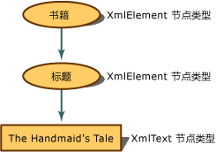

# <a name="mapping-the-object-hierarchy-to-xml-data"></a>将对象层次结构映射到 XML 数据
当 XML 文档在内存中时，概念上的表示形式是树。 编程时可使用对象层次结构访问树节点。 下面的示例显示 XML 内容如何成为节点。  
  
 当将 XML 读入 XML 文档对象模型 (DOM) 中时，各片段被转换为节点，这些节点保留有关自身的附加元数据，如它们的节点类型和值。 节点类型是节点的对象，确定可执行的操作以及可设置或检索的属性。  
  
 如果具有下面的简单 XML：  
  
 **输入**  
  
```xml  
<book>  
    <title>The Handmaid's Tale</title>  
</book>  
```  
  
 输入在内存中表示为具有分配的节点类型属性的下列节点树：  
  
   
book 和 title 节点树表示形式  
  
 `book` 元素成为 XmlElement 对象，下一个元素 `title` 也成为 XmlElement，而元素内容成为 XmlText 对象。 查看 XmlElement 方法和属性可以得知，这些方法和属性不同于 XmlText 对象的方法和属性。 因此，知道 XML 标记成为的节点类型至关重要，因为其节点类型确定可以执行的操作。  
  
 下面的示例读入 XML 数据并根据节点类型写出不同的文本。 将下面的 XML 数据文件用作输入文件 items.xml：  
  
 **输入**  
  
```xml  
<?xml version="1.0"?>  
<!-- This is a sample XML document -->  
<!DOCTYPE Items [<!ENTITY number "123">]>  
<Items>  
  <Item>Test with an entity: &number;</Item>  
  <Item>test with a child element <more/> stuff</Item>  
  <Item>test with a CDATA section <![CDATA[<456>]]> def</Item>  
  <Item>Test with a char entity: A</Item>  
  <!-- Fourteen chars in this element.-->  
  <Item>1234567890ABCD</Item>  
</Items>  
```  
  
 下面的代码示例读取 items.xml 文件，并显示每个节点类型的信息。  
  
```vb  
Imports System  
Imports System.IO  
Imports System.Xml  
  
Public Class Sample  
    Private Const filename As String = "items.xml"  
  
    Public Shared Sub Main()  
  
        Dim reader As XmlTextReader = Nothing  
  
        Try  
            ' Load the reader with the data file and   
            'ignore all white space nodes.   
            reader = New XmlTextReader(filename)  
            reader.WhitespaceHandling = WhitespaceHandling.None  
  
            ' Parse the file and display each of the nodes.  
            While reader.Read()  
                Select Case reader.NodeType  
                    Case XmlNodeType.Element  
                        Console.Write("<{0}>", reader.Name)  
                    Case XmlNodeType.Text  
                        Console.Write(reader.Value)  
                    Case XmlNodeType.CDATA  
                        Console.Write("<![CDATA[{0}]]>", reader.Value)  
                    Case XmlNodeType.ProcessingInstruction  
                        Console.Write("<?{0} {1}?>", reader.Name, reader.Value)  
                    Case XmlNodeType.Comment  
                        Console.Write("<!--{0}-->", reader.Value)  
                    Case XmlNodeType.XmlDeclaration  
                        Console.Write("<?xml version='1.0'?>")  
                    Case XmlNodeType.Document  
                    Case XmlNodeType.DocumentType  
                        Console.Write("<!DOCTYPE {0} [{1}]", reader.Name, reader.Value)  
                    Case XmlNodeType.EntityReference  
                        Console.Write(reader.Name)  
                    Case XmlNodeType.EndElement  
                        Console.Write("</{0}>", reader.Name)  
                End Select  
            End While  
  
        Finally  
            If Not (reader Is Nothing) Then  
                reader.Close()  
            End If  
        End Try  
    End Sub 'Main ' End class  
End Class 'Sample  
```  
  
```csharp  
using System;  
using System.IO;  
using System.Xml;  
  
public class Sample  
{  
    private const String filename = "items.xml";  
  
    public static void Main()  
    {  
        XmlTextReader reader = null;  
  
        try  
        {  
            // Load the reader with the data file and ignore   
            // all white space nodes.  
            reader = new XmlTextReader(filename);  
            reader.WhitespaceHandling = WhitespaceHandling.None;  
  
            // Parse the file and display each of the nodes.  
            while (reader.Read())  
            {  
                switch (reader.NodeType)  
                {  
                    case XmlNodeType.Element:  
                        Console.Write("<{0}>", reader.Name);  
                        break;  
                    case XmlNodeType.Text:  
                        Console.Write(reader.Value);  
                        break;  
                    case XmlNodeType.CDATA:  
                        Console.Write("<![CDATA[{0}]]>", reader.Value);  
                        break;  
                    case XmlNodeType.ProcessingInstruction:  
                        Console.Write("<?{0} {1}?>", reader.Name, reader.Value);  
                        break;  
                    case XmlNodeType.Comment:  
                        Console.Write("<!--{0}-->", reader.Value);  
                        break;  
                    case XmlNodeType.XmlDeclaration:  
                        Console.Write("<?xml version='1.0'?>");  
                        break;  
                    case XmlNodeType.Document:  
                        break;  
                    case XmlNodeType.DocumentType:  
                        Console.Write("<!DOCTYPE {0} [{1}]", reader.Name, reader.Value);  
                        break;  
                    case XmlNodeType.EntityReference:  
                        Console.Write(reader.Name);  
                        break;  
                    case XmlNodeType.EndElement:  
                        Console.Write("</{0}>", reader.Name);  
                        break;  
                }  
            }  
        }  
  
        finally  
        {  
            if (reader != null)  
                reader.Close();  
        }  
    }  
} // End class  
```  
  
 此示例的输出显示数据到节点类型的映射。  
  
 **输出**  
  
```xml  
<?xml version='1.0'?><!--This is a sample XML document --><!DOCTYPE Items [<!ENTITY number "123">]<Items><Item>Test with an entity: 123</Item><Item>test with a child element <more> stuff</Item><Item>test with a CDATA section <![CDATA[<456>]]> def</Item><Item>Test with a char entity: A</Item><--Fourteen chars in this element.--><Item>1234567890ABCD</Item></Items>  
```  
  
 通过逐行获取输入并使用从代码生成的输出，可以使用下表分析哪个节点测试生成哪些输出行，从而了解哪些 XML 数据成为哪种节点类型。  
  
|输入|输出|节点类型测试|  
|-----------|------------|--------------------|  
|\<?xml version="1.0"?>|\<?xml version='1.0'?>|XmlNodeType.XmlDeclaration|  
|\<!-- This is a sample XML document -->|\<!--This is a sample XML document -->|XmlNodeType.Comment|  
|\<!DOCTYPE Items [\<!ENTITY number "123">]>|\<!DOCTYPE Items [\<!ENTITY number "123">]|XmlNodeType.DocumentType|  
|\<Items>|\<Items>|XmlNodeType.Element|  
|\<Item>|\<Item>|XmlNodeType.Element|  
|Test with an entity: &number;|与以下实体一起测试：123|XmlNodeType.Text|  
|\</Item>|\</Item>|XmlNodeType.EndElement|  
|\<Item>|\<Item>|XmNodeType.Element|  
|与子元素一起测试|与子元素一起测试|XmlNodeType.Text|  
|\<more>|\<more>|XmlNodeType.Element|  
|stuff|stuff|XmlNodeType.Text|  
|\</Item>|\</Item>|XmlNodeType.EndElement|  
|\<Item>|\<Item>|XmlNodeType.Element|  
|与 CDATA 节一起测试|与 CDATA 节一起测试|XmlTest.Text|  
|<![CDATA[\<456>]]\>|<![CDATA[\<456>]]\>|XmlTest.CDATA|  
|def|def|XmlNodeType.Text|  
|\</Item>|\</Item>|XmlNodeType.EndElement|  
|\<Item>|\<Item>|XmlNodeType.Element|  
|Test with a char entity: &\#65;|与字符实体一起测试：A|XmlNodeType.Text|  
|\</Item>|\</Item>|XmlNodeType.EndElement|  
|\<!-- Fourteen chars in this element.-->|\<--Fourteen chars in this element.-->|XmlNodeType.Comment|  
|\<Item>|\<Item>|XmlNodeType.Element|  
|1234567890ABCD|1234567890ABCD|XmlNodeType.Text|  
|\</Item>|\</Item>|XmlNodeType.EndElement|  
|\</Items>|\</Items>|XmlNodeType.EndElement|  
  
 您必须知道分配的节点类型，因为节点类型控制哪些操作有效，以及可以设置和检索哪些属性。  
  
 当 PreserveWhitespace 标志将数据加载到 DOM 中时，就会控制空格的节点创建。 有关详细信息，请参阅[加载 DOM 时处理空格和有效空格](../../../../docs/standard/data/xml/white-space-and-significant-white-space-handling-when-loading-the-dom.md)。  
  
 若要向 DOM 添加新节点，请参阅[将节点插入 XML 文档中](../../../../docs/standard/data/xml/inserting-nodes-into-an-xml-document.md)。 若要从 DOM 中删除节点，请参阅[从 XML 文档中删除节点、内容和值](../../../../docs/standard/data/xml/removing-nodes-content-and-values-from-an-xml-document.md)。 若要修改 DOM 中的节点内容，请参阅[修改 XML 文档中的节点、内容和值](../../../../docs/standard/data/xml/modifying-nodes-content-and-values-in-an-xml-document.md)。  
  
## <a name="see-also"></a>请参阅  
 [XML 文档对象模型 (DOM)](../../../../docs/standard/data/xml/xml-document-object-model-dom.md)
