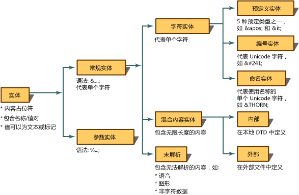

# <a name="reading-entity-declarations-and-entity-references-into-the-dom"></a>将实体声明和实体引用读入 DOM
实体是一个声明，指定了在 XML 中取代内容或标记而使用的名称。 实体包含两个部分。 首先，必须使用实体声明将名称绑定到替换内容。 实体声明是使用 `<!ENTITY name "value">` 语法在文档类型定义 (DTD) 或 XML 架构中创建的。 其次，在实体声明中定义的名称随后将在 XML 中使用。 在 XML 中使用时，该名称称为实体引用。 例如，下面的实体声明声明一个名为 `publisher` 的实体，该实体与“Microsoft Press”的内容关联。  
  
```xml  
<!ENTITY publisher "Microsoft Press">  
```  
  
 下面的示例说明如何在 XML 中将此实体声明作为实体引用使用。  
  
```xml  
<author>Fred</author>  
<pubinfo>Published by &publisher;</pubinfo>  
```  
  
 某些分析器在文档加载到内存中时自动扩展实体。 因此，当将 XML 读入内存中时，实体声明将被记住和保存。 当分析器以后遇到 `&;` 字符（用于标识常规实体引用）时，分析器将在实体声明表中查找此名称。 引用 `&publisher;` 被它所表示的内容取代。 使用以下 XML，  
  
```xml  
<author>Fred</author>  
<pubinfo>Published by &publisher;</pubinfo>  
```  
  
 扩展此实体引用并用 Microsoft Press 内容替换 `&publisher;` 将提供以下扩展的 XML。  
  
 **输出**  
  
```xml  
<author>Fred</author>  
<pubinfo>Published by Microsoft Press</pubinfo>  
```  
  
 有多种实体。 下面的关系图显示实体类型和术语的分类。  
  
   
  
 Microsoft.NET Framework 实现的 XML 文档对象模型 (DOM) 的默认值是保留实体引用，并在加载 XML 时不扩展这些实体。 这是： 在文档加载到 DOM 中**XmlEntityReference**包含引用变量节点`&publisher;`创建，DTD 中声明与表示实体中的内容的子节点。  
  
 使用`<!ENTITY publisher "Microsoft Press">`实体声明下, 图显示**XmlEntity**和**XmlText**从此声明创建的节点。  
  
   
  
 实体引用在展开与未展开时的差异使在内存中的 DOM 树中生成的节点不同。 主题中讲述的节点之间生成的差异[保留实体引用](../../../../docs/standard/data/xml/entity-references-are-preserved.md)和[实体引用是扩展但不保留](../../../../docs/standard/data/xml/entity-references-are-expanded-and-not-preserved.md)。  
  
## <a name="see-also"></a>另请参阅  
 [XML 文档对象模型 (DOM)](../../../../docs/standard/data/xml/xml-document-object-model-dom.md)
