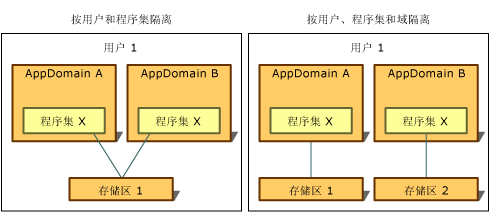

# 隔离的类型
独立存储始终仅限创建它的用户访问。 为了实现这种隔离，公共语言运行时使用操作系统识别的相同用户标识，即与存储打开时的代码运行进程相关联的标识。 虽然此标识是已验证用户标识，但模拟可能会导致当前用户的标识发生动态变化。  
  
 独立存储访问的限制条件还包括，与应用的域和程序集相关联的标识或仅与程序集相关联的标识。 运行时通过以下方式获取这些标识：  
  
-   域标识表示证明应用的证据，对于 Web 应用，这可能就是完整 URL。 对于 shell 托管代码，域标识可能基于应用目录路径。 例如，如果通过路径 C:\Office\MyApp.exe 运行可执行文件，域标识为 C:\Office\MyApp.exe。  
  
-   程序集标识是证明程序集的证据。 这可能来自加密数字签名，可以是程序集的[强名称](../../../docs/framework/app-domains/strong-named-assemblies.md)、程序集的软件发行者或程序集的 URL 标识。 如果程序集同时包含强名称和软件发行者标识，使用的是软件发行者标识。 如果程序集来自 Internet 且未签名，使用的是 URL 标识。 若要详细了解程序集和强名称，请参阅[使用程序集编程](../../../docs/framework/app-domains/programming-with-assemblies.md)。  
  
-   漫游存储与有漫游用户策略文件的用户一起移动。 文件被写入网络目录，并下载到用户登录的所有计算机中。 若要详细了解漫游用户策略文件，请参阅 <xref:System.IO.IsolatedStorage.IsolatedStorageScope.Roaming?displayProperty=nameWithType>。  
  
 通过将用户、域和程序集标识这些概念相结合，独立存储可以通过下列方式隔离数据，每种方式都有自己的使用方案：  
  
-   [按用户和程序集隔离](#UserAssembly)  
  
-   [按用户、域和程序集隔离](#UserDomainAssembly)  
  
 这两种隔离都可以与漫游用户策略文件结合使用。 有关详细信息，请参阅[独立存储和漫游](#Roaming)部分。  
  
 下图展示了存储在不同范围的隔离情况。  
  
   
独立存储的类型  
  
 请注意，除漫游存储外，独立存储始终按计算机隐式隔离，因为它使用指定计算机的本地存储设备。  
  
> [!IMPORTANT]
>  独立存储不适用于 [!INCLUDE[win8_appname_long](../../../includes/win8-appname-long-md.md)] 应用。 相反，使用 `Windows.Storage` API 中包含的 [!INCLUDE[wrt](../../../includes/wrt-md.md)] 命名空间中的应用程序数据类来存储本地数据和文件。 有关详细信息，请参阅 Windows 开发人员中心中的[应用程序数据](/previous-versions/windows/apps/hh464917(v=win.10))。  
  
   
## 按用户和程序集隔离  
 如果需要从任何应用的域都可以访问程序集使用的数据存储，按用户和程序集隔离更为合适。 在这种情况下，独立存储通常用于存储跨多个应用的数据，而不是与任何特定应用绑定的数据，如用户名或许可证信息。 若要访问按用户和程序集隔离的存储，必须信任代码在应用之间传输信息。 通常情况下，按用户和程序集隔离可用于 Intranet，但不可用于 Internet。 调用静态 <xref:System.IO.IsolatedStorage.IsolatedStorageFile.GetStore%2A?displayProperty=nameWithType> 方法并传入用户和程序集 <xref:System.IO.IsolatedStorage.IsolatedStorageScope>，即可返回采用这种隔离的存储。  
  
 下面的代码示例检索按用户和程序集隔离的存储。 可通过 `isoFile` 对象访问此存储。  
  
 [!code-cpp[Conceptual.IsolatedStorage#17](../../../samples/snippets/cpp/VS_Snippets_CLR/conceptual.isolatedstorage/cpp/source11.cpp#17)]
 [!code-csharp[Conceptual.IsolatedStorage#17](../../../samples/snippets/csharp/VS_Snippets_CLR/conceptual.isolatedstorage/cs/source11.cs#17)]
 [!code-vb[Conceptual.IsolatedStorage#17](../../../samples/snippets/visualbasic/VS_Snippets_CLR/conceptual.isolatedstorage/vb/source11.vb#17)]  
  
 有关使用证据参数的示例，请参阅 <xref:System.IO.IsolatedStorage.IsolatedStorageFile.GetStore%28System.IO.IsolatedStorage.IsolatedStorageScope%2CSystem.Security.Policy.Evidence%2CSystem.Type%2CSystem.Security.Policy.Evidence%2CSystem.Type%29>。  
  
 <xref:System.IO.IsolatedStorage.IsolatedStorageFile.GetUserStoreForAssembly%2A> 方法可用作快捷方式，如下面的代码示例所示。 此快捷方式不能用于打开漫游存储；在这种情况下，请使用 <xref:System.IO.IsolatedStorage.IsolatedStorageFile.GetStore%2A>。  
  
 [!code-cpp[Conceptual.IsolatedStorage#18](../../../samples/snippets/cpp/VS_Snippets_CLR/conceptual.isolatedstorage/cpp/source11.cpp#18)]
 [!code-csharp[Conceptual.IsolatedStorage#18](../../../samples/snippets/csharp/VS_Snippets_CLR/conceptual.isolatedstorage/cs/source11.cs#18)]
 [!code-vb[Conceptual.IsolatedStorage#18](../../../samples/snippets/visualbasic/VS_Snippets_CLR/conceptual.isolatedstorage/vb/source11.vb#18)]  
  
   
## 按用户、域和程序集隔离  
 如果应用使用需要专用数据存储的第三方程序集，可以使用独立存储来存储专用数据。 按用户、域和程序集隔离可确保，仅当使用程序集的应用在程序集创建存储时正在运行时，且仅当为其创建存储的用户运行应用时，只有给定程序集中的代码才能访问数据。 按用户、域和程序集隔离可防止第三方程序集将数据泄漏给其他应用。 如果确定要使用独立存储，但不确定要使用哪种类型的隔离，此隔离类型应为默认选择。 调用 <xref:System.IO.IsolatedStorage.IsolatedStorageFile> 的静态 <xref:System.IO.IsolatedStorage.IsolatedStorageFile.GetStore%2A> 方法并传入用户、域和程序集 <xref:System.IO.IsolatedStorage.IsolatedStorageScope>，即可返回采用这种隔离的存储。  
  
 下面的代码示例检索按用户、域和程序集隔离的存储。 可通过 `isoFile` 对象访问此存储。  
  
 [!code-cpp[Conceptual.IsolatedStorage#14](../../../samples/snippets/cpp/VS_Snippets_CLR/conceptual.isolatedstorage/cpp/source10.cpp#14)]
 [!code-csharp[Conceptual.IsolatedStorage#14](../../../samples/snippets/csharp/VS_Snippets_CLR/conceptual.isolatedstorage/cs/source10.cs#14)]
 [!code-vb[Conceptual.IsolatedStorage#14](../../../samples/snippets/visualbasic/VS_Snippets_CLR/conceptual.isolatedstorage/vb/source10.vb#14)]  
  
 另一个方法可用作快捷方式，如下面的代码示例所示。 此快捷方式不能用于打开漫游存储；在这种情况下，请使用 <xref:System.IO.IsolatedStorage.IsolatedStorageFile.GetStore%2A>。  
  
 [!code-cpp[Conceptual.IsolatedStorage#15](../../../samples/snippets/cpp/VS_Snippets_CLR/conceptual.isolatedstorage/cpp/source10.cpp#15)]
 [!code-csharp[Conceptual.IsolatedStorage#15](../../../samples/snippets/csharp/VS_Snippets_CLR/conceptual.isolatedstorage/cs/source10.cs#15)]
 [!code-vb[Conceptual.IsolatedStorage#15](../../../samples/snippets/visualbasic/VS_Snippets_CLR/conceptual.isolatedstorage/vb/source10.vb#15)]  
  
   
## 独立存储和漫游  
 漫游用户策略文件是一项 Windows 功能，可便于用户在网络上设置标识，并使用此标识登录任何网络计算机，同时应用所有个性化设置。 使用独立存储的程序集可以指定，用户的独立存储应随漫游用户策略文件一起移动。 漫游可以与按用户和程序集隔离或按用户、域和程序集隔离结合使用。 如果未使用漫游范围，即使使用漫游用户策略文件，存储也不会漫游。  
  
 下面的代码示例检索按用户和程序集隔离的漫游存储。 可通过 `isoFile` 对象访问此存储。  
  
 [!code-cpp[Conceptual.IsolatedStorage#11](../../../samples/snippets/cpp/VS_Snippets_CLR/conceptual.isolatedstorage/cpp/source9.cpp#11)]
 [!code-csharp[Conceptual.IsolatedStorage#11](../../../samples/snippets/csharp/VS_Snippets_CLR/conceptual.isolatedstorage/cs/source9.cs#11)]
 [!code-vb[Conceptual.IsolatedStorage#11](../../../samples/snippets/visualbasic/VS_Snippets_CLR/conceptual.isolatedstorage/vb/source9.vb#11)]  
  
 可以添加域范围，以创建按用户、域和应用隔离的漫游存储。 下面的代码示例展示了此操作。  
  
 [!code-cpp[Conceptual.IsolatedStorage#12](../../../samples/snippets/cpp/VS_Snippets_CLR/conceptual.isolatedstorage/cpp/source9.cpp#12)]
 [!code-csharp[Conceptual.IsolatedStorage#12](../../../samples/snippets/csharp/VS_Snippets_CLR/conceptual.isolatedstorage/cs/source9.cs#12)]
 [!code-vb[Conceptual.IsolatedStorage#12](../../../samples/snippets/visualbasic/VS_Snippets_CLR/conceptual.isolatedstorage/vb/source9.vb#12)]  
  
## 请参阅  
 <xref:System.IO.IsolatedStorage.IsolatedStorageScope>  
 [独立存储](../../../docs/standard/io/isolated-storage.md)
