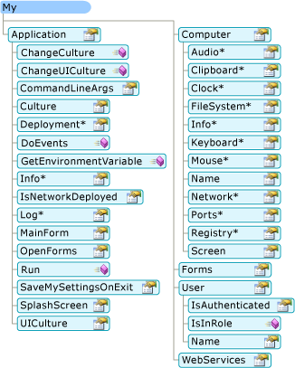

# My 对项目类型的依赖方式 (Visual Basic)
[!INCLUDE[vs2017banner](../../../visual-basic/includes/vs2017banner.md)]

`My` 只公开特定项目类型所需的那些对象。  例如，`My.Forms` 对象可用在 Windows 窗体应用程序中，但不能用在控制台应用程序中。  本主题介绍在不同的项目类型中可使用哪些 `My` 对象。  
  
## Windows 应用程序和网站中的 My  
 `My` 只公开用于当前项目类型的对象，而不公开不适用的对象。  例如，下面的图像显示的是 Windows 窗体项目中的 `My` 对象模型。  
  
   
  
 在网站项目中，`My` 公开与 Web Developer 相关的对象（如 `My.Request` 和 `My.Response` 对象），而不公开不相关的对象（如 `My.Forms` 对象）。  下面的图像显示的是网站项目中的 `My` 对象模型：  
  
   
  
## 项目详细信息  
 下表显示默认情况下为以下八种项目类型启用哪些 `My` 对象：Windows 应用程序、类库、控制台应用程序、Windows 控件库、Web 控件库、Windows 服务、空和网站。  
  
 `My.Application` 对象有三种版本，`My.Computer` 对象有两种版本，`My.User` 对象有两种版本；在该表后面的脚注中给出了有关这些版本的详细信息。  
  
||||||||||  
|-|-|-|-|-|-|-|-|-|  
|My 对象|Windows 应用程序|类库|控制台应用程序|Windows 控件库|Web 控件库|Windows 服务|空|网站|  
|`My.Application`|**是** 1|**是** 2|**是** 3|**是** 2|否|**是** 3|否|否|  
|`My.Computer`|**是** 4|**是** 4|**是** 4|**是** 4|**是** 5|**是** 4|否|**是** 5|  
|`My.Forms`|**是**|否|否|**是**|否|否|否|否|  
|`My.Log`|否|否|否|否|否|否|否|**是**|  
|`My.Request`|否|否|否|否|否|否|否|**是**|  
|`My.Resources`|**是**|**是**|**是**|**是**|**是**|**是**|否|否|  
|`My.Response`|否|否|否|否|否|否|否|**是**|  
|`My.Settings`|**是**|**是**|**是**|**是**|**是**|**是**|否|否|  
|`My.User`|**是** 6|**是** 6|**是** 6|**是** 6|**是** 7|**是** 6|否|**是** 7|  
|`My.WebServices`|**是**|**是**|**是**|**是**|**是**|**是**|否|否|  
  
 1 `My.Application` 的 Windows 窗体版本。  派生自控制台版本（参见脚注 3）；增加了对与应用程序窗口交互的支持，并提供了 [!INCLUDE[vbprvb](../../../csharp/programming-guide/concepts/linq/includes/vbprvb-md.md)] 应用程序模型。  
  
 2 `My.Application` 的库版本。  提供应用程序所需的基本功能：提供用于将信息写入 Application 日志和访问应用程序信息的成员。  
  
 3 `My.Application` 的控制台版本。  派生自库版本（参见脚注 2），并新增了用于访问应用程序命令行参数和 ClickOnce 部署信息的成员。  
  
 4 `My.Computer` 的 Windows 版本。  派生自服务器版本（参见脚注 5），并提供对客户机上有用对象（如键盘、屏幕和鼠标）的访问。  
  
 5 `My.Computer` 的服务器版本。  提供有关计算机的基本信息，如名称、时钟访问等。  
  
 6 `My.User` 的 Windows 版本。  此对象与线程的当前标识相关联。  
  
 7 `My.User` 的 Web 版本。  此对象与应用程序当前的 HTTP 请求的用户标识相关联。  
  
## 请参阅  
 <xref:Microsoft.VisualBasic.ApplicationServices.ApplicationBase>   
 <xref:Microsoft.VisualBasic.Devices.Computer>   
 <xref:Microsoft.VisualBasic.Logging.Log>   
 <xref:Microsoft.VisualBasic.ApplicationServices.User>   
 [自定义 My 中可用的对象](../../../visual-basic/developing-apps/customizing-extending-my/customizing-which-objects-are-available-in-my.md)   
 [条件编译](../../../visual-basic/programming-guide/program-structure/conditional-compilation.md)   
 [\/define](../../../visual-basic/reference/command-line-compiler/define.md)   
 [My.Forms 对象](../../../visual-basic/language-reference/objects/my-forms-object.md)   
 [My.Request 对象](../../../visual-basic/language-reference/objects/my-request-object.md)   
 [My.Response 对象](../../../visual-basic/language-reference/objects/my-response-object.md)   
 [My.WebServices 对象](../../../visual-basic/language-reference/objects/my-webservices-object.md)