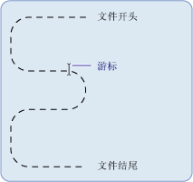

# .NET Framework 文件 I/O 和文件系统基础知识 (Visual Basic)
[!INCLUDE[vs2017banner](../../../../visual-basic/includes/vs2017banner.md)]

使用 <xref:System.IO> 命名空间中的类与驱动器、文件和目录一起工作。  
  
 <xref:System.IO> 命名空间包含 <xref:System.IO.File> 和 <xref:System.IO.Directory> 类，它们提供用于操作文件和目录的 [!INCLUDE[dnprdnshort](../../../../csharp/getting-started/includes/dnprdnshort-md.md)] 功能。 由于这些对象的方法是静态或共享成员，因此可直接使用，无需首先创建类的实例。 与这些类相关联的是 <xref:System.IO.FileInfo> 和 <xref:System.IO.DirectoryInfo> 类，使用 `My` 功能的用户将对它们很熟悉。 若要使用这些类，必须通过在受影响的代码开头包含 `Imports` 语句，完全限定名称或导入相应的命名空间。 有关详细信息，请参阅 [Imports 语句（.NET 命名空间和类型）](../../../../visual-basic/language-reference/statements/imports-statement-net-namespace-and-type.md)。  
  
> [!NOTE]
>  此部分中的其他主题使用 `My.Computer.FileSystem` 对象，而不使用 `System.IO` 类与驱动器、文件和目录一起工作。 `My.Computer.FileSystem` 对象的主要目的是用在 [!INCLUDE[vbprvb](../../../../csharp/programming-guide/concepts/linq/includes/vbprvb-md.md)] 程序中。 `System.IO` 类旨在供任何支持 [!INCLUDE[dnprdnshort](../../../../csharp/getting-started/includes/dnprdnshort-md.md)] 的语言使用，其中包括 [!INCLUDE[vbprvb](../../../../csharp/programming-guide/concepts/linq/includes/vbprvb-md.md)]。  
  
## 流的定义  
 [!INCLUDE[dnprdnshort](../../../../csharp/getting-started/includes/dnprdnshort-md.md)] 使用流来支持从文件中读取和写入文件。 可以将流视为一维连续数据集，具有开始和结束，并且其中的游标指示流中的当前位置。  
  
   
  
## 流操作  
 流中包含的数据可能来自内存、文件或 TCP/IP 套接字。 流具有可应用于它们的基本操作：  
  
-   读取。 可以从流读取数据，将数据从流传输到数据结构，如字符串或字节数组。  
  
-   **编写**。 可以将数据写入流中，将数据从数据源传输到流。  
  
-   **查找**。 可以查询和修改流中的位置。  
  
 有关详细信息，请参阅 [Composing Streams](../Topic/Composing%20Streams.md)。  
  
## 流的类型  
 在 [!INCLUDE[dnprdnshort](../../../../csharp/getting-started/includes/dnprdnshort-md.md)] 中，流由 <xref:System.IO.Stream> 类表示，这形成了所有其他流的抽象类。 不能直接创建 <xref:System.IO.Stream> 类的实例，但必须使用它执行的一个类。  
  
 存在许多类型的流，但就处理文件输入/输出 (I/O) 而言，最重要的类型是 <xref:System.IO.FileStream> 类（提供从文件读取和写入文件的方式）和 <xref:System.IO.IsolatedStorage.IsolatedStorageFileStream> 类（提供在独立存储中创建文件和目录的方法）。 处理文件 I/O 时可使用的其他流包括：  
  
-   <xref:System.IO.BufferedStream>  
  
-   <xref:System.Security.Cryptography.CryptoStream>  
  
-   <xref:System.IO.MemoryStream>  
  
-   <xref:System.Net.Sockets.NetworkStream>。  
  
 下表列出了通常使用流完成的任务：  
  
|||  
|-|-|  
|到|请参阅|  
|读取和写入数据文件|[如何：对新建的数据文件进行读取和写入](../Topic/How%20to:%20Read%20and%20Write%20to%20a%20Newly%20Created%20Data%20File.md)|  
|从文件中读取文本|[如何：从文件读取文本](../Topic/How%20to:%20Read%20Text%20from%20a%20File.md)|  
|将文本写入文件|[如何：向文件写入文本](../Topic/How%20to:%20Write%20Text%20to%20a%20File.md)|  
|从字符串中读取字符|[如何：从字符串中读取字符](../Topic/How%20to:%20Read%20Characters%20from%20a%20String.md)|  
|向字符串写入字符|[如何：向字符串写入字符](../Topic/How%20to:%20Write%20Characters%20to%20a%20String.md)|  
|加密数据|[加密数据](../Topic/Encrypting%20Data.md)|  
|解密数据|[解密数据](../Topic/Decrypting%20Data.md)|  
  
## 文件访问权限和属性  
 可以控制文件创建、打开，以及与 <xref:System.IO.FileAccess>、<xref:System.IO.FileMode> 和 <xref:System.IO.FileShare> 枚举分享的方式，枚举中包含 <xref:System.IO.FileStream> 类的构造函数使用的标志。 例如，打开或新建 <xref:System.IO.FileStream> 时，<xref:System.IO.FileMode> 枚举允许指定是否打开文件供追加用、如果指定的文件不存在是否创建新文件、是否覆盖文件等。  
  
 <xref:System.IO.FileAttributes> 枚举可启用特定于文件的信息收集。 <xref:System.IO.FileAttributes> 枚举返回文件的存储属性，如是否压缩、加密、隐藏、只读、是否为存档、目录、系统文件或临时文件。  
  
 下表列出涉及文件访问和文件特性的任务：  
  
|||  
|-|-|  
|**若要**|**请参阅**|  
|打开并追加文本到日志文件|[如何：打开并追加到日志文件](../Topic/How%20to:%20Open%20and%20Append%20to%20a%20Log%20File.md)|  
|确定文件特性|<xref:System.IO.FileAttributes>|  
  
## 文件权限  
 可使用 <xref:System.Security.Permissions.FileIOPermission> 类控制对文件和目录的访问权限。 这对处理 Web 窗体的开发人员来说可能特别重要，这些窗体默认在名为 ASPNET 的特殊本地用户帐户上下文中运行，该帐户作为 [!INCLUDE[vstecasp](../../../../csharp/language-reference/preprocessor-directives/includes/vstecasp-md.md)] 和 [!INCLUDE[dnprdnshort](../../../../csharp/getting-started/includes/dnprdnshort-md.md)] 安装的一部分创建。 此类应用程序请求对资源的访问权限时，ASPNET 用户帐户的权限有限，这可能会阻止用户执行从 Web 应用程序写入到文件等操作。 有关详细信息，请参阅[安全权限](http://msdn.microsoft.com/zh-cn/b03757b4-e926-4196-b738-3733ced2bda0)和 <xref:System.Security.Permissions.FileIOPermission>。  
  
## 独立的文件存储  
 独立存储是一种尝试，为解决在用户或代码可能缺少必要权限的情况下处理文件时所产生的问题。 独立存储向每个用户分配数据隔离舱，它包含一个或多个存储区。 可以按用户和程序集使存储区彼此独立。 只有创建存储区的用户和程序集才有权访问存储区。 存储区充当完整的虚拟文件系统，可以在一个存储区中创建并操作目录和文件。  
  
 下表列出了通常与独立文件存储相关联的任务。  
  
|||  
|-|-|  
|到|请参阅|  
|创建独立存储区|[如何：获取独立存储的存储区](../Topic/How%20to:%20Obtain%20Stores%20for%20Isolated%20Storage.md)|  
|枚举独立存储区|[如何：枚举独立存储的存储区](../Topic/How%20to:%20Enumerate%20Stores%20for%20Isolated%20Storage.md)|  
|删除独立存储区|[如何：删除独立存储中的存储区](../Topic/How%20to:%20Delete%20Stores%20in%20Isolated%20Storage.md)|  
|在独立存储中创建文件或目录|[如何：在独立存储中创建文件和目录](../Topic/How%20to:%20Create%20Files%20and%20Directories%20in%20Isolated%20Storage.md)|  
|在独立存储中查找文件|[如何：在独立存储中查找现有文件和目录](../Topic/How%20to:%20Find%20Existing%20Files%20and%20Directories%20in%20Isolated%20Storage.md)|  
|在独立存储中从文件读取或写入文件|[如何：在独立存储中读取和写入文件](../Topic/How%20to:%20Read%20and%20Write%20to%20Files%20in%20Isolated%20Storage.md)|  
|在独立存储中删除文件或目录|[如何：在独立存储中删除文件和目录](../Topic/How%20to:%20Delete%20Files%20and%20Directories%20in%20Isolated%20Storage.md)|  
  
## 文件事件  
 <xref:System.IO.FileSystemWatcher> 组件允许监视系统上或任何你对其具有网络访问权限的计算机上的文件和目录所作的更改。 例如，如果修改了文件，可能想要向用户发送更改警报。 发生更改时，会引发一个或多个事件并将其存储在缓冲区中，然后移交给 <xref:System.IO.FileSystemWatcher> 组件进行处理。  
  
## 另请参阅  
 [编写流](../Topic/Composing%20Streams.md)   
 [文件和流 I-O](../Topic/File%20and%20Stream%20I-O.md)   
 [异步文件 I/O](../Topic/Asynchronous%20File%20I-O.md)   
 [在 .NET Framework 文件 I/O 和文件系统中使用的类 (Visual Basic)](../../../../visual-basic/developing-apps/programming/drives-directories-files/classes-used-in-net-framework-file-io-and-the-file-system.md)