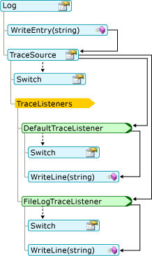
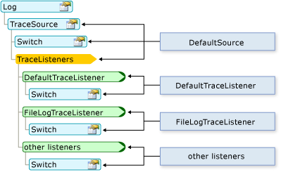

# <a name="working-with-application-logs-in-visual-basic"></a>使用 Application 日志 (Visual Basic)
使用 `My.Applicaton.Log` 和 `My.Log` 对象可以轻松将日志记录和跟踪信息写入日志。  
  
## <a name="how-messages-are-logged"></a>如何记录消息  
 首先，通过日志的 <xref:System.Diagnostics.TraceSource.Switch%2A> 属性的 <xref:Microsoft.VisualBasic.Logging.Log.TraceSource%2A> 属性检查消息的严重性。 默认情况下，只有严重性级别为“信息”及以上的消息才会传递到日志的 `TraceListener` 集合中指定的跟踪侦听器。 然后，各侦听器会将消息的严重性与侦听器的 <xref:System.Diagnostics.TraceSource.Switch%2A> 属性进行比较。 如果消息的严重性足够很高，则侦听器将写出消息。  
  
 下图演示如何将写入 `WriteEntry` 方法的消息传递到日志的跟踪侦听器的 `WriteLine` 方法：  
  
   
  
 可以通过更改应用程序的配置文件来更改日志和跟踪侦听器的行为。 下图演示日志和配置文件各个部分之间的对应关系。  
  
   
  
## <a name="where-messages-are-logged"></a>记录消息的位置  
 如果程序集没有配置文件，则 `My.Application.Log` 和 `My.Log` 对象会将消息写入应用程序的调试输出（通过 <xref:System.Diagnostics.DefaultTraceListener> 类实现）。 此外，`My.Application.Log` 对象会将消息写入程序集的日志文件（通过 <xref:Microsoft.VisualBasic.Logging.FileLogTraceListener> 类实现），`My.Log` 对象会将消息写入 ASP.NET 网页的输出（通过 <xref:System.Web.WebPageTraceListener> 类实现）。  
  
 在调试模式下运行应用程序时，可在 Visual Studio 的“输出”窗口中查看调试输出。 若要打开“输出”  窗口中，请单击“调试” 菜单项，指向“Windows” ，然后单击“输出” 。 在“输出”  窗口中，在“显示输出来源”  框中选择“调试”  。  
  
 默认情况下， `My.Application.Log` 将日志文件写入用户应用程序数据的路径。 可以通过 <xref:Microsoft.VisualBasic.Logging.FileLogTraceListener.FullLogFileName%2A> 对象的 <xref:Microsoft.VisualBasic.Logging.Log.DefaultFileLogWriter%2A> 属性获取路径。 路径的格式如下：  
  
 `BasePath`\\`CompanyName`\\`ProductName`\\`ProductVersion`  
  
 `BasePath` 的典型值如下所示：  
  
 C:\Documents and Settings\\`username`\Application Data  
  
 `CompanyName`、 `ProductName`和 `ProductVersion` 的值来自应用程序的程序集信息。 日志文件名称的格式为 *AssemblyName*.log，其中 *AssemblyName* 是程序集的文件名称（不含扩展名）。 如果需要多个日志文件（如原始日志不可用或应用程序尝试写入日志时），日志文件名称的格式为 *AssemblyName*-*iteration*.log，其中 `iteration` 为一个正 `Integer`。  
  
 可以通过添加或更改计算机和应用程序的配置文件来重写默认行为。 有关详细信息，请参阅 [Walkthrough: Changing Where My.Application.Log Writes Information](../../../../visual-basic/developing-apps/programming/log-info/walkthrough-changing-where-my-application-log-writes-information.md)。  
  
## <a name="configuring-log-settings"></a>配置日志设置  
 `Log` 对象具有默认的实现，即使没有应用程序配置文件 app.config 也可工作。若要更改默认设置，必须添加包含新设置的配置文件。 有关更多信息，请参见 [Walkthrough: Filtering My.Application.Log Output](../../../../visual-basic/developing-apps/programming/log-info/walkthrough-filtering-my-application-log-output.md)。  
  
 日志配置部分位于 `<system.diagnostics>` 节点当中，该节点位于 app.config 文件的 `<configuration>` 节点之下。 日志信息在以下几个节点中定义：  
  
-   `Log` 对象的侦听器在名为 DefaultSource 的 `<sources>` 节点中定义。  
  
-   `Log` 对象的严重性筛选器在名为 DefaultSource 的 `<switches>` 节点中定义。  
  
-   日志侦听器在 `<sharedListeners>` 节点中定义。  
  
 以下代码示例演示了 `<sources>`、 `<switches>`和 `<sharedListeners>` 节点：  
  
```xml  
<configuration>  
  <system.diagnostics>  
    <sources>  
      <source name="DefaultSource" switchName="DefaultSwitch">  
        <listeners>  
          <add name="FileLog"/>  
        </listeners>  
      </source>  
    </sources>  
    <switches>  
      <add name="DefaultSwitch" value="Information" />  
    </switches>  
    <sharedListeners>  
      <add name="FileLog"  
        type="Microsoft.VisualBasic.Logging.FileLogTraceListener,  
          Microsoft.VisualBasic, Version=8.0.0.0, Culture=neutral,   
          PublicKeyToken=b03f5f7f11d50a3a, processorArchitecture=MSIL"  
        initializeData="FileLogWriter"  
      />  
    </sharedListeners>  
  </system.diagnostics>  
</configuration>  
```  
  
## <a name="changing-log-settings-after-deployment"></a>在部署后更改日志设置  
 开发应用程序时，其配置设置存储在 app.config 文件中，如上面的示例所示。 部署应用程序后，仍然可以通过编辑配置文件来配置日志。 在基于 Windows 的应用程序中，此文件的名称为 *applicationName*.exe.config，并且它必须位于可执行文件所在的相同文件夹中。 对于 Web 应用程序，这是与项目关联的 Web.config 文件。  
  
 应用程序首次执行创建类实例的代码时，它会检查配置文件以获取有关对象的信息。 对于 `Log` 对象，首次访问 `Log` 对象时会发生这种情况。 对于任何特定的对象，系统将仅检查一次配置文件，即应用程序首次创建对象时。 因此，可能需要重启应用程序以使更改生效。  
  
 在已部署的应用程序中，在应用程序未运行之前，可以通过重新配置 switch 对象启用跟踪代码。 通常，此过程将要求启用和禁用 switch 对象、更改跟踪级别，以及重启应用程序。  
  
## <a name="security-considerations"></a>安全注意事项  
 将数据写入日志时应注意以下事项：  
  
-   **避免泄露用户信息。** 确保应用程序仅将批准的信息写入日志。 例如，应用程序日志中可以包含用户名，但不能包含用户密码。  
  
-   **确保日志位于安全的位置。** 任何包含潜在敏感信息的日志都应存储在安全的位置。  
  
-   **避免误导性信息。** 一般情况下，应用程序应先验证用户输入的所有数据，然后再使用这些数据。 其中包括将数据写入应用程序日志。  
  
-   **避免拒绝服务。** 如果应用程序将太多的信息写入日志，则可能填满日志或导致难以查找重要的信息。  
  
## <a name="see-also"></a>请参阅  
 <xref:Microsoft.VisualBasic.Logging.Log?displayProperty=nameWithType>  
 [记录来自应用程序的信息](../../../../visual-basic/developing-apps/programming/log-info/logging-information-from-the-application.md)
