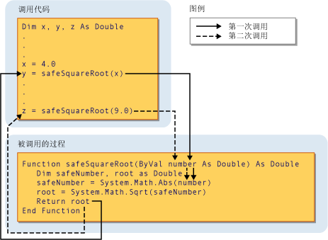

# 过程参数和自变量 (Visual Basic)
在大多数情况下，一个过程需要已在其中调用它的情况有关的一些信息。 执行重复或共享任务过程每个调用使用不同的信息。 此信息包含变量、 常量和调用它时传递给过程的表达式。  
  
 A*参数*表示过程需要您提供时调用它的值。 过程声明定义其参数。  
  
 你可以定义不使用参数、 一个参数，或者多个过程。 指定的参数的过程定义的一部分被称作*参数列表*。  
  
 *参数*调用过程时，该过程参数表示所提供的值。 在调用该过程时，调用代码将提供自变量。 指定的参数的过程调用的一部分被称作*自变量列表*。  
  
 下图显示代码调用过程`safeSquareRoot`从两个不同的位置。 第一次调用将变量的值传递`x`(4.0) 到参数`number`，和中的返回值`root`(2.0) 分配给变量`y`。 第二个调用将传递到的文本值 9.0 `number`，并将返回值 (3.0) 赋给变量`z`。  
  
   
传递自变量传递给参数  
  
 有关详细信息，请参阅[参数之间的差异和自变量](./differences-between-parameters-and-arguments.md)。  
  
## 参数数据类型  
 通过定义参数的数据类型`As`其声明中的子句。 例如，以下函数接受一个字符串和整数。  
  
 [!code-vb[VbVbcnProcedures#32](./codesnippet/VisualBasic/procedure-parameters-and-arguments_1.vb)]  
  
 如果类型检查开关 ([Option Strict 语句](../../../../visual-basic/language-reference/statements/option-strict-statement.md)) 是`Off,``As`子句是可选的只不过如果任何一个参数使用它，则所有参数必须都使用它。 如果类型检查无效`On`、`As`子句是必需的所有过程参数。  
  
 如果希望具有数据类型不同于其对应的参数，如提供的参数调用代码`Byte`到`String`参数，它必须执行下列操作之一：  
  
-   提供具有扩大到参数数据类型; 的数据类型的唯一参数  
  
-   设置`Option Strict Off`以允许隐式收缩转换; 或  
  
-   使用转换关键字显式转换的数据类型。  
  
### 类型参数  
 A*泛型过程*还定义了一个或多个*类型参数*除了其普通的参数。 泛型过程允许调用代码调用该过程，以便它可以定制数据类型的每个单个调用要求每次传递不同的数据类型。 请参阅 [Generic Procedures in Visual Basic](../../../../visual-basic/programming-guide/language-features/data-types/generic-procedures.md)。  
  
## 请参阅  
 [过程](./index.md)  
 [Sub 过程](./sub-procedures.md)  
 [Function 过程](./function-procedures.md)  
 [属性过程](./property-procedures.md)  
 [运算符过程](./operator-procedures.md)  
 [如何：为过程定义参数](./how-to-define-a-parameter-for-a-procedure.md)  
 [如何：将自变量传递给过程](./how-to-pass-arguments-to-a-procedure.md)  
 [按值和按引用传递自变量](./passing-arguments-by-value-and-by-reference.md)  
 [过程重载](./procedure-overloading.md)  
 [在 Visual Basic 中的类型转换](../../../../visual-basic/programming-guide/language-features/data-types/type-conversions.md)
